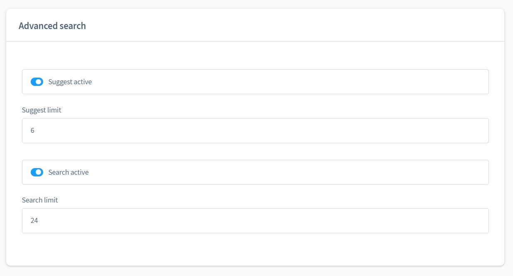
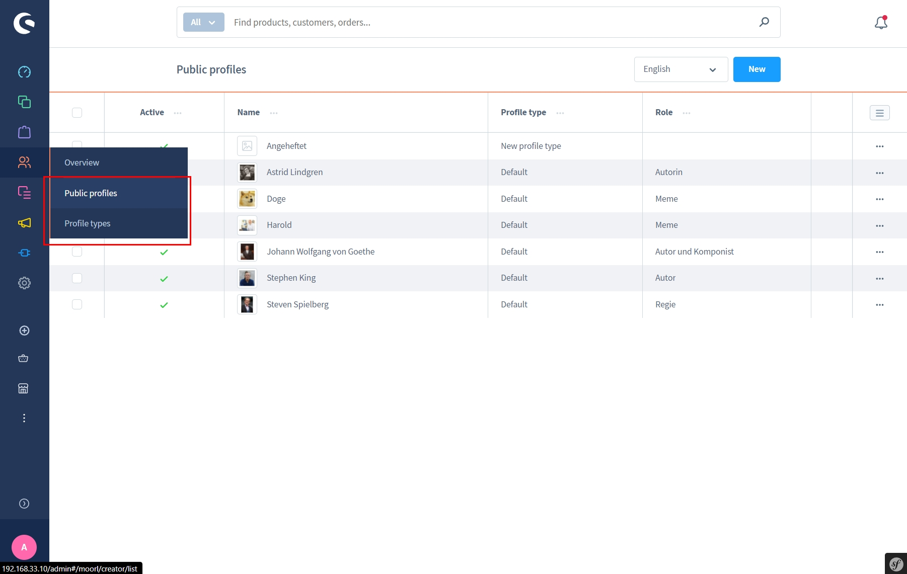
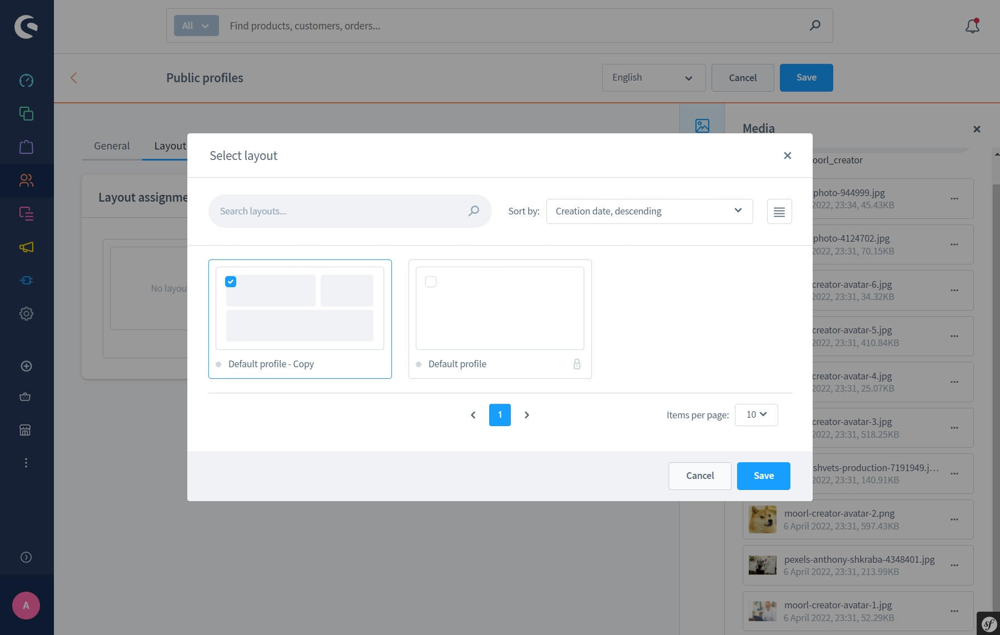
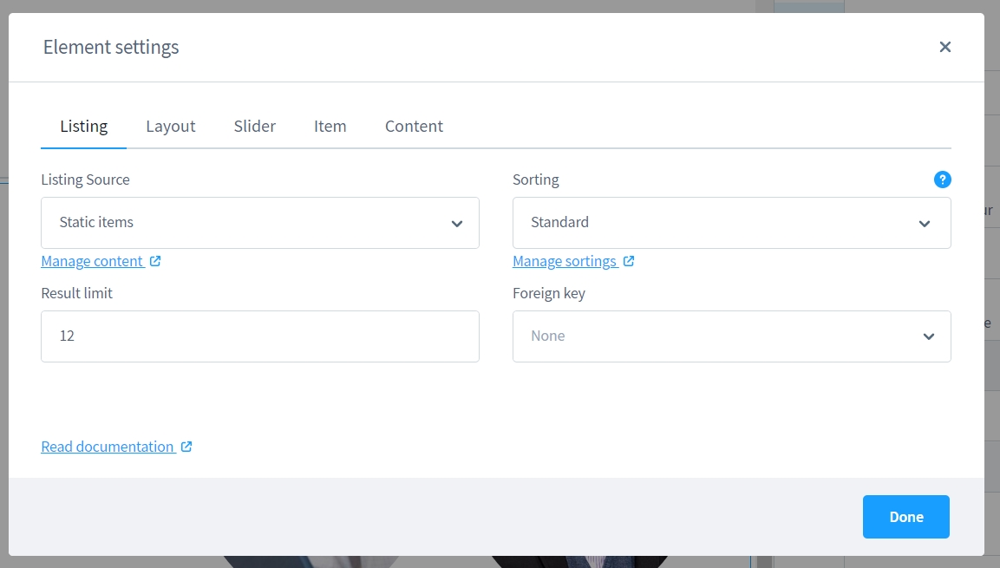
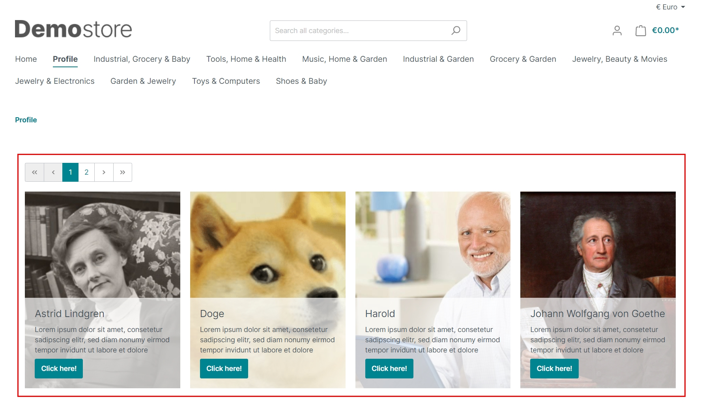
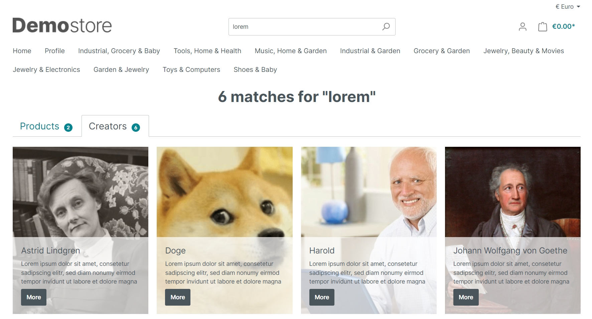

# Öffentliche Profile

[Hier geht's zur Demo](https://https://demo.moori.net/Profile/)

---

Dieses Plugin stellt eine neue Entität vom Typ `Creator` bereit. 
Damit lassen sich öffentliche Profile erstellen und per CMS gestalten. 
Zu diesem Plugin folgen weitere Add-Ons.

**Add-Ons:**

1. [Blog mit Wordpress Import](../MoorlMagazine/index.md)
2. [Get-The-Look!](../MoorlGetTheLook/index.md)

## Wofür ist dieses Plugin gut?

Das Shopware 6 _Öffentliche Profile_ Plugin stellt Personen (Autoren, Influencer, Künstler) 
in den Vordergrund und ermöglicht dir einen Social Proof für deine Shopseiten.

Die Profile können für mehrere Zwecke genutzt werden. Durch die maximal gegebenen Integrität 
durch die CMS Seiten, kannst du entscheiden, welche Inhalte auf der Profilseite erscheinen.

## Installation

_Hinweis: Falls du Probleme mit dem Plugin hast, bitte beachte 
folgende  [Hinweise](../faq.md) im FAQ Bereich._

1.  Installiere
    [Foundation](../MoorlFoundation/index.md)

2.  Optional: In dieser App ist ein
    [Demo Paket](../MoorlFoundation/demo-assistant.md)
    Enthalten.

## Einstellungen

### Basiskonfiguration

In der Basiskonfiguration kannst du generelle Einstellungen vornehmen. Hier wird z.B. eine
Standardkategorie für `Alle Profile` festgelegt.

Außerdem kannst du die Shopware interne Suche erweitern und die Suchergebnisse frei gestalten.

### Verwaltung von Profilen

Die Verwaltung findest du unter "Kunden - Öffentliche Profile und Profiltypen".

#### Profil bearbeiten

In dem Profil kannst du generelle Informationen zu der Person festlegen, dazu gehören ein
Name, eine Kurzbeschreibung und eine detaillierte Beschreibung.

Die Bildzuweisungen für Avatar und Banner kannst du bequem aus der Medien-Sidebar beziehen.

Es ist ebenfalls möglich eine CMS Zuweisung zu erstellen. Die Inhalte der CMS Seite können
individuell für das Profil angepasst werden.

Das Plugin liefert ein Standard-Layout für den schnellen Start.

#### Profiltypen

Die Profiltypen gruppieren deine Profile. So kannst du global für alle Profile aus einer Gruppe
die Sichtbarkeit einstellen, einen technischen Namen für unterschiedliche SEO Urls definieren und
eine Fallback CMS Seite bestimmen.

Das ist sinnvoll, wenn du den Blog nutzt, aber auch Personen in deinem Shop präsentierst, die
keinen Bezug zum Blog haben.

### CMS Seiten

Das Plugin unterstützt vollständig die CMS Funktionen von Shopware. Es wird eine neue CMS Seite 
zur Verfügung gestellt.

Zu dem Listing Element gibt es weitere [Infos hier](../MoorlFoundation/listing.md).

### Seo Einstellungen

Hier kannst du bestimmen, wie die SEO Url zu der Detail-Seite deines Profiles aufgebaut wird.
Die Basiseinstellung berücksichtigt bereits den Profiltyp.

## Beispiele

Ein Listing Element mit Pagination.

Die Schnellsuche und Suche in Shopware, kann über die Einstellungen des Plugins oder global im Foundation
Plugin deaktiviert werden.

