# Form Builder 2

---

This plugin is based on a fundamental redevelopment of the
[Form Builder](../MoorlFormBuilder/index.md) and offers maximum
flexibility and integrity for Shopware 6.

## Note for all customers who already own the Form Builder

This plugin has a fundamentally different structure and does not offer the possibility to migrate the previous forms.
migrate the previous forms.

Unfortunately, it is also not possible to duplicate/transfer the subscriptions after consultation with Shopware.

As I do not want to create a disadvantage for my existing customers, the Form Builder will continue to be
will continue to be provided with updates. But no new functions will be developed.

For all interested parties with active subscriptions I offer a 50% discount for Basis and Add-Ons.
The migration of the forms will also be taken care of on request.
However, there may be differences in appearance, I will not match these.

## Add-Ons

This plugin has been shortened in its basic version by some functions, so that it can be offered at an affordable price.
affordable price. All further functions can be obtained.

It is also possible to create your own add-ons, a developer documentation will follow soon.

1. classic add-on*: Contains all functions of the [Form Builder](../MoorlFormBuilder/index.md).
2. slides & popup add-on*: Provides new sections for more beautiful forms
3. customer add-on**: Customised forms for registration and customer area
4. custom products add-on**: Additional information on products incl. price calculation
5. Order Add-On**: Additional order details incl. price calculation on the shopping basket
6. product enquiry add-on**: Product-specific enquiry forms
7. customer-specific add-ons on request

(\* In development, \*\* In concept phase)

## What is this plugin good for?

The Shopware 6 _Form Builder 2_ plugin makes it child's play to create complex forms with independent
task areas.

It is modular, so processes and individual fields can be expanded as desired.

## Installation

Note: If you have any problems with the plugin, please note
the following [notes](../faq.md) in the FAQ section.

1. install
   [Foundation](../MoorlFoundation/index.md)
2. install Form Builder 2 in the Plugin Manager
3. go to: Contents | Form Builder 2

Here you can create or import a new form.

## Example forms for download

- [Simple contact form](examples/simple-contact-form.json)

## Settings

### Basic configuration

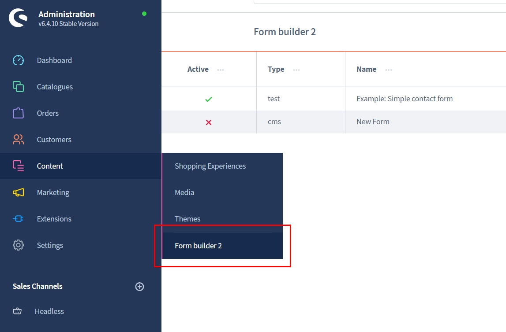

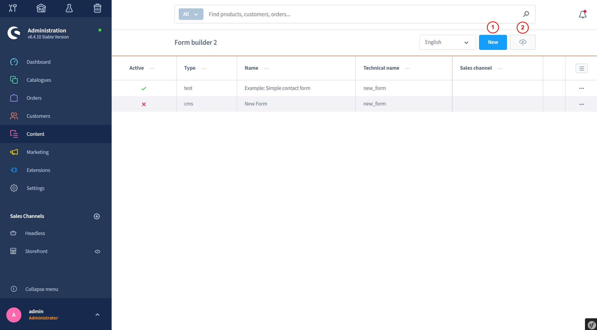

1. create new form
2. import

1. form settings
2. save form
3. export
4. structure area of the form elements
5. settings area (form/element)

1. context menu for creating, deleting or duplicating elements
2. general element settings

### Settings in detail

#### Assignments of elements and forms

You can generally configure the visibility of forms and elements here.

Show a form/element...

- show only in a certain period of time
- only display in a certain sales channel
- show only for a selected delivery country
- show only for a selected shipping method or payment method
- Display only for a selected customer group

A product-specific form...

- can be assigned to a product stream

An element of the group Sections...

- can be assigned to a background image here

Some of these assignments are only available in the Form Builder 2 Add-Ons!

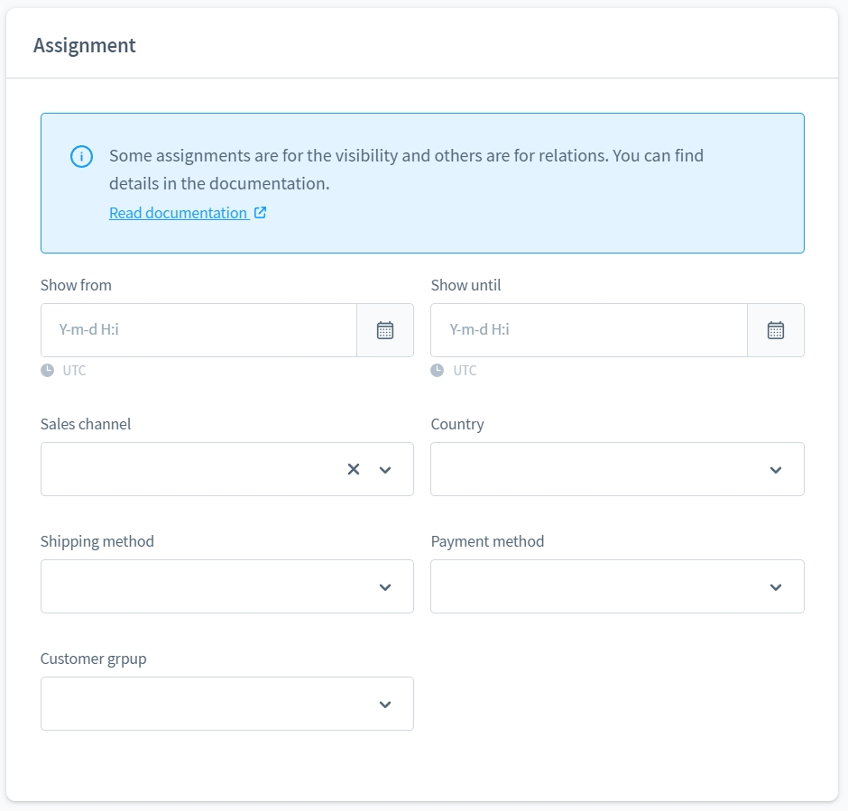

#### Layout and stylesheet settings

You can assign stylesheet attributes to each form/element.

The CSS options vary depending on the type of form/element.

### Settings for elements

#### Field configuration

All elements from the Field and Multi-Field group can have additional properties in this configuration.

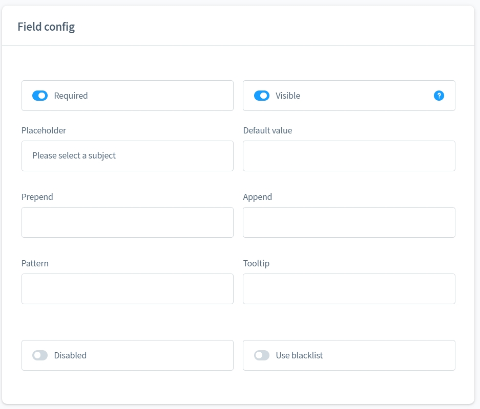

#### Selection Configuration

All elements from the Multi-Field group can receive database-specific values. Add-ons offer more possibilities here.

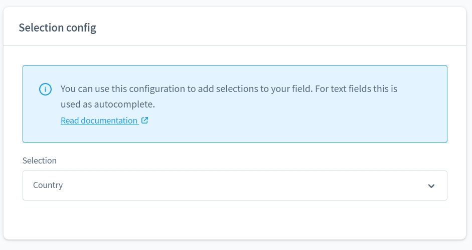

#### Responsive behaviour

If the parent element is from the Rows group, all elements contained in it can be given responsive properties.
The rule "Mobile-First" applies here, the properties are always passed on.

The distribution is as follows.

Viewport (xs to xxl) | Inherited (Yes/No) | Display (Yes/No) | Width | Sorting/Arrangement

#### Configuration Upload Field

#### Configuration Date

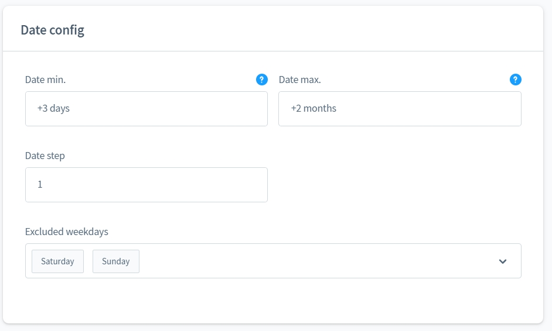

#### Configuration Time

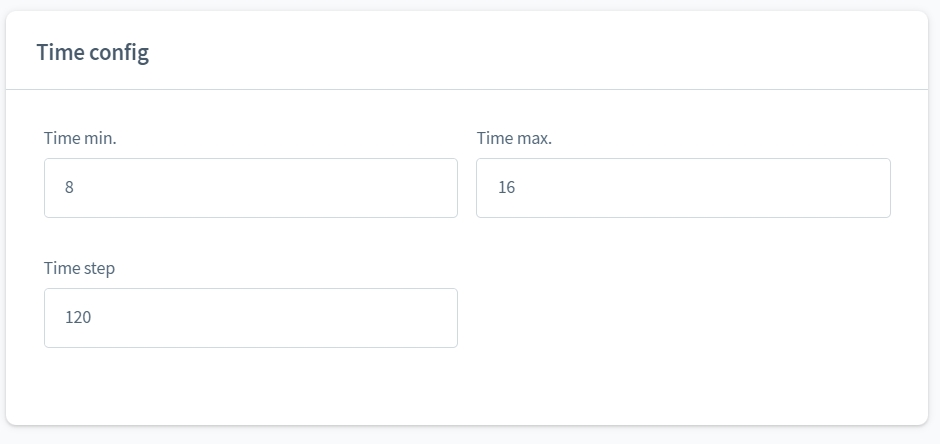

#### Configuration number

#### Configuration HTML (language related)

#### Configuration Card Section

### Settings for forms

#### Configuration e-mail

Here you can configure the e-mail recipient. If no value is entered, the shop's standard e-mail address will be used.
of the shop is used.

The function "Send copy" and "Recipient according to selection condition" are available in the Classic Add-On!

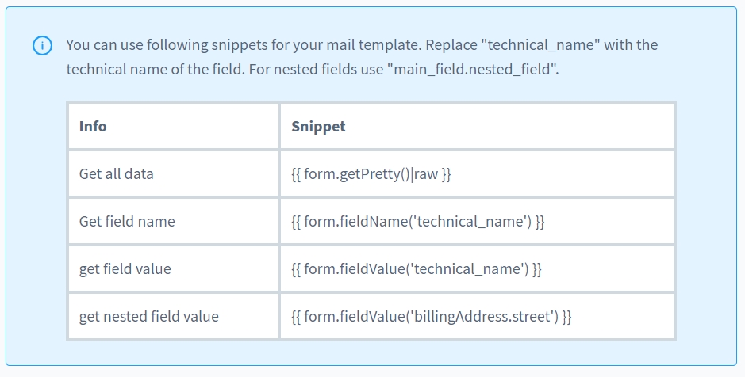

## CMS settings

The form does not have its own block, but can be accessed via the "Replace element" icon!

After the CMS element has been inserted, you can assign forms of type CMS or Test to the CMS page.

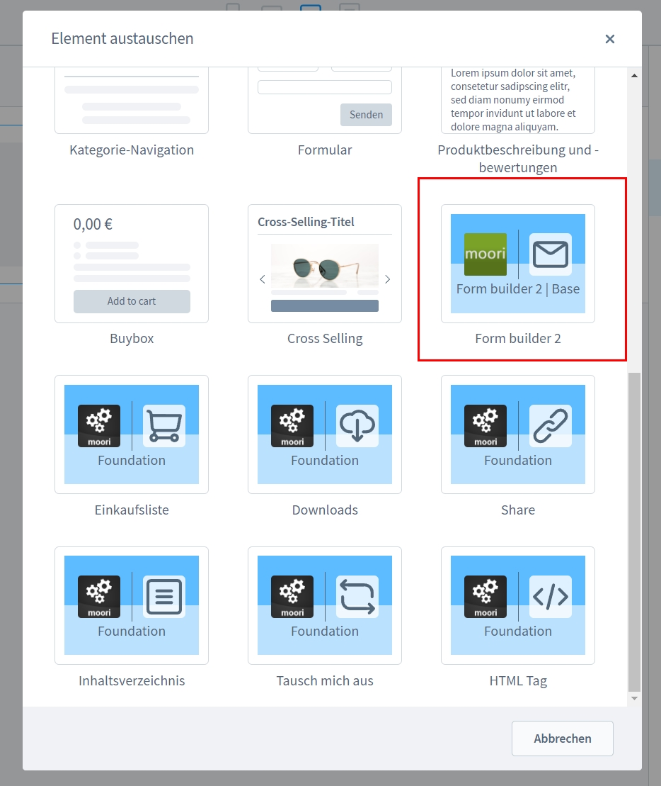

## Output in the storefront

### Form validation

The example form is of type "Test" the client-side validation is deactivated.
The Form Builder 2 supports recursive server-side validation of the input fields!

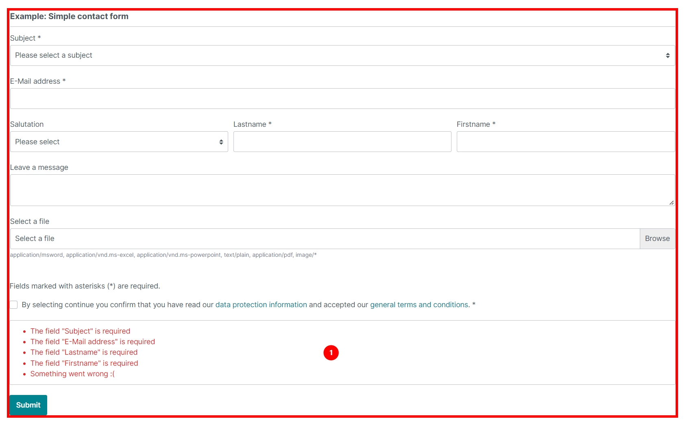

The client-side validation is active again. Now the form is validated twice.

### Sending an e-mail

In this example I show you how the e-mail is sent in the standard.

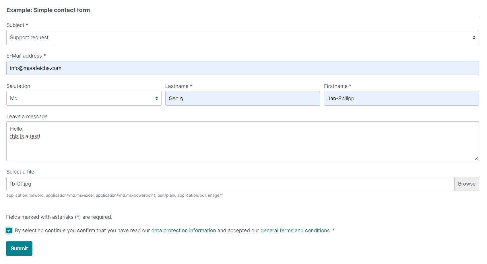

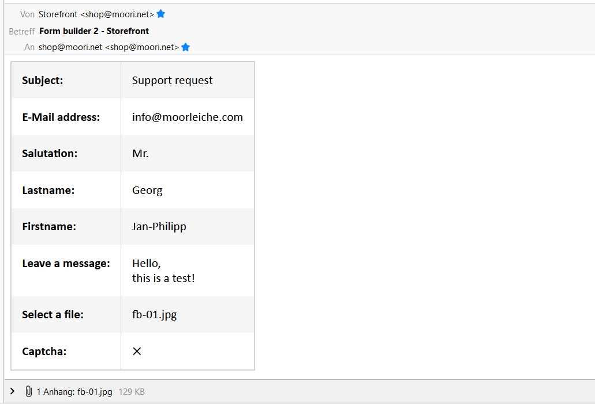

## Security

- HTML tags are masked to prevent harmful scripts.
