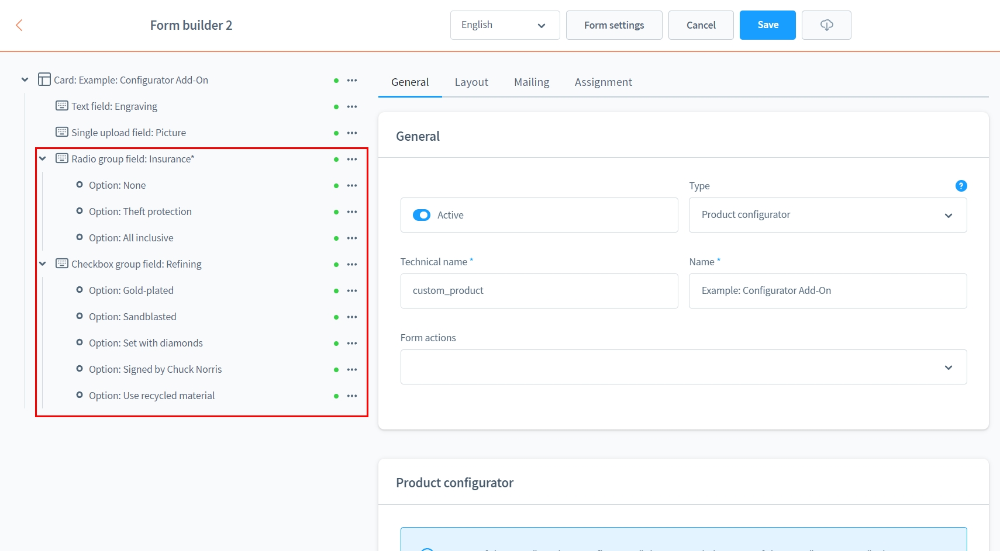
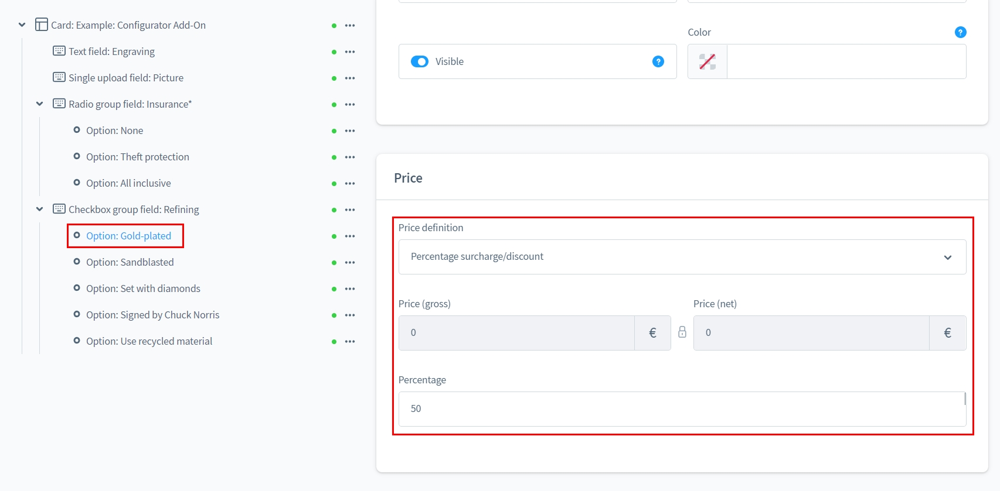
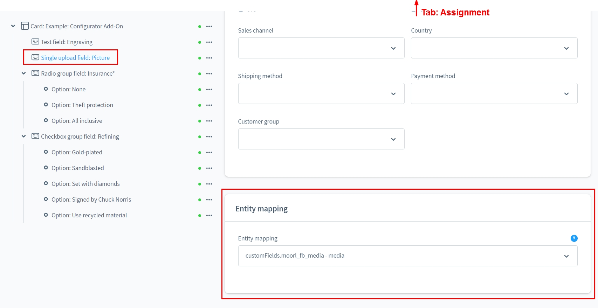
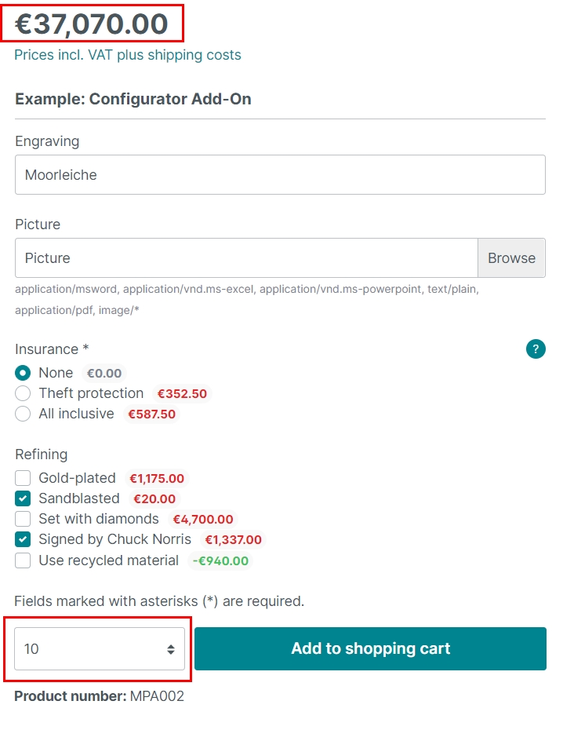
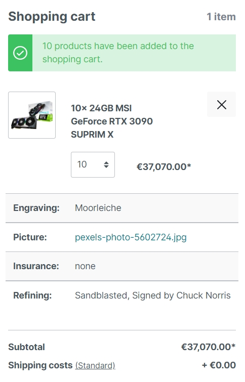
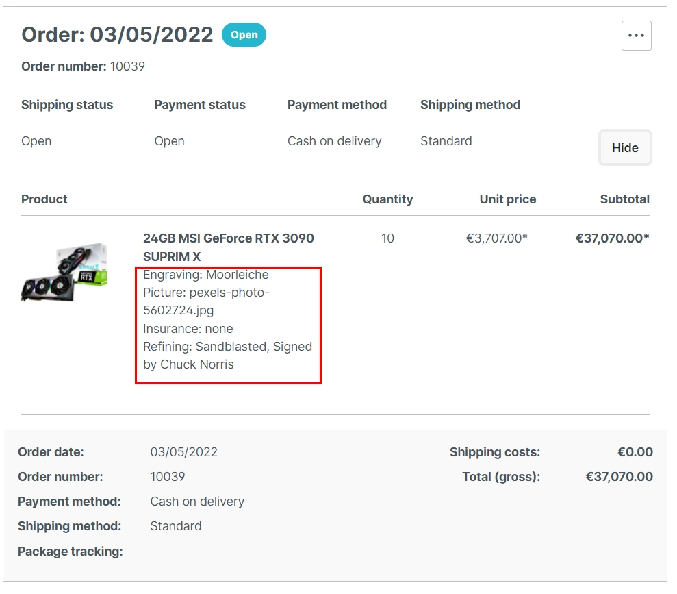
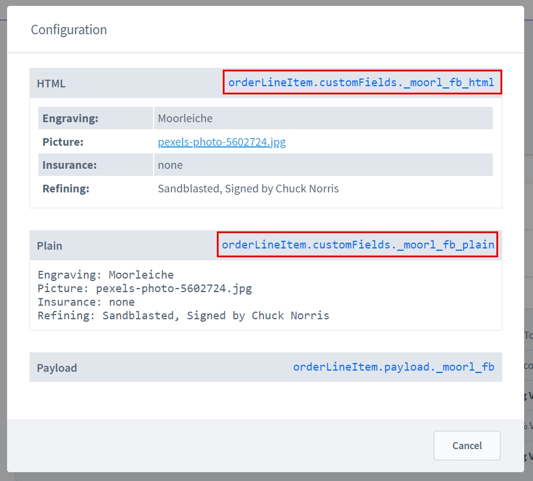

#Product-Configurator Add-On for "Form Builder 2"

---

With this add-on for [Form Builder 2](../MoorlForms/index.md) you can make products
individually configurable and influence the price!

##Note for all customers who already own the Form Builder

This plugin has a fundamentally different structure and does not offer the possibility to migrate the previous forms.
migrate the previous forms.

Unfortunately, it is also not possible to duplicate/transfer the subscriptions after consultation with Shopware.

As I do not want to create a disadvantage for my existing customers, the form construction kit will continue to be
will continue to be provided with updates. But no new functions will be developed.

For all interested parties with active subscriptions I offer a 50% discount for Basis and Add-Ons.
The migration of the forms will also be taken care of on request.
However, there may be differences in appearance, I will not match these.

##Example forms for download

- [Product Configurator Add-On](examples/custom-products-add-on.json)

##New form of the type "Product Configurator

With this form you can on the one hand influence the product prices via the options and on the other hand you can use the mapping.
on the other hand you can use the mapping to save the configuration in custom-fields
e.g. for further technical processing of the data.

Example form.

The assigned entity is of the type "order_line_item", this is similar to the name of the database table.
The payload and the custom fields of your product configuration are stored there!

Before you start with the price configuration, you must...

1. assign a dynamic product group.
2. assign a tax rate.

The dynamic product group tells you for which products the form will be activated.

It is also possible to combine several forms for the products! However, make sure
that you always use individual technical names for your input fields!

##Price definitions

You can define price definitions for the options.

Absolute prices can be added to the product price.

Unfortunately it is not possible to enter negative prices, but I am already working on a solution to this problem.

Percentage prices are relative to the price of the product. You can also define negative percentage prices.

###Mapping

If the data from the "order_line_item" entity is relevant for further technical processing, you can map the input fields to database fields.
you can map the input fields to database fields!

###Storefront

In this example you can see the product configurator in action!

Here you can select a text, an upload and various options.

The price is updated according to the selection the customer makes.

The number of products is also taken into account.

The configuration is finished, off to the shopping cart!

Small adjustments can be made at any time before the order is completed!

The configuration is displayed in text form in the order overview.

###Admin

If you do not use the mapping, you can still access the configuration at any time.

To do this, go to the order overview and select "Show configuration" in the context menu.

Transfer the placeholders marked in red into all your e-mail and document templates, so that the
configuration is still visible to the customer.

Since the custom fields for order items are not visible in the admin, here is a screenshot from the
the database to show that the field has been saved correctly.