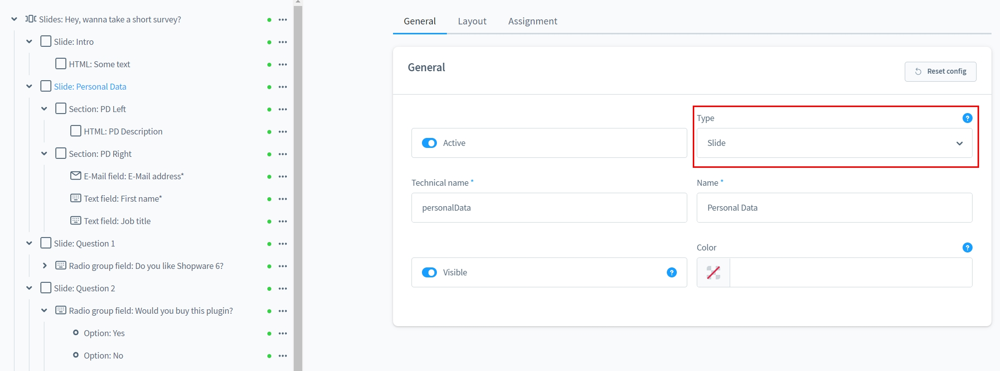
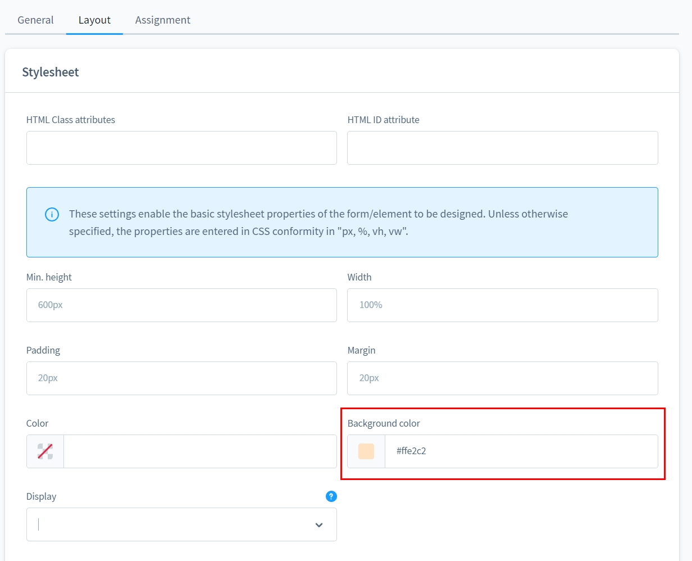
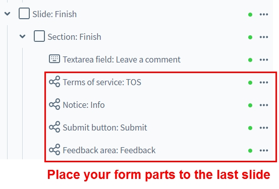
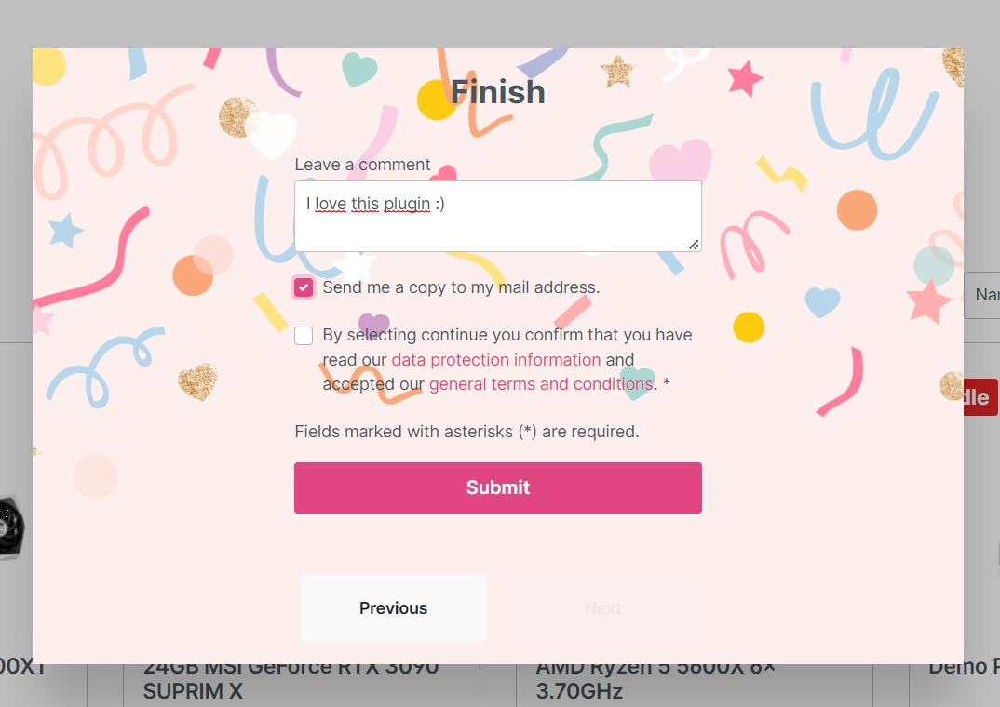

# Form Builder 2 | Slides Add-On

With this add-on for [Form Builder 2](../MoorlForms/index.md) you can split forms into several steps in a visually appealing way. This plugin is the perfect addition to the Popup Add-On!

## Note for all customers who already have the Form Builder

This plugin has a fundamentally different structure and does not offer the possibility to migrate the previous forms.
migrate the previous forms.

Unfortunately, it is also not possible to duplicate/transfer the subscriptions after consultation with Shopware.

As I do not want to create a disadvantage for my existing customers, the form construction kit will continue to be
will continue to be provided with updates. But no new functions will be developed.

For all interested parties with active subscriptions I offer a 50% discount for Basis and Add-Ons.
The migration of the forms will also be taken care of on request.
However, there may be differences in appearance, I will not match these.

## New element of type "Slides"

This element is very demanding in configuration, but also powerful in application.

## Configuration

Name the back and forward buttons.

The stylesheet settings are essential for the element, here you can make the following
configurations here:

1. animations for the transitions
2. the minimum height (recommended)
3. the slides are similar to bootstrap rows, here I recommend to set the horizontal and vertical alignment to "centre".

Note: The CSS properties are transferred to the slide elements within the slide.
This way the properties are consistent and you can e.g. adjust the background colour per slide!

The element of the type "Slide" is the sub-element and can be used as often as you like.

Since the CSS properties are set by the parent element, you can optionally adjust these settings.

You can define a background image in the tab "Assignment".

Each slide element supports responsive sub-elements, use this setting to align the fields.

You can freely position the main components of the form.

## Output in the storefront

In this example I used the pop-up form. But the slides are also suitable for
CMS elements as well!

