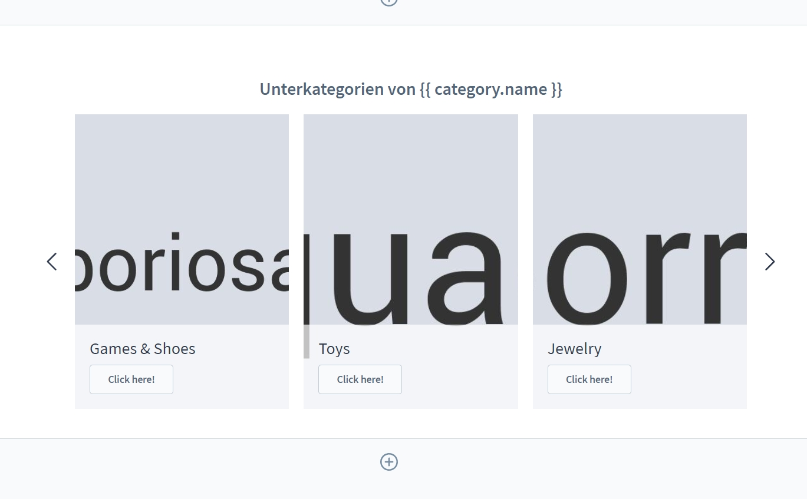
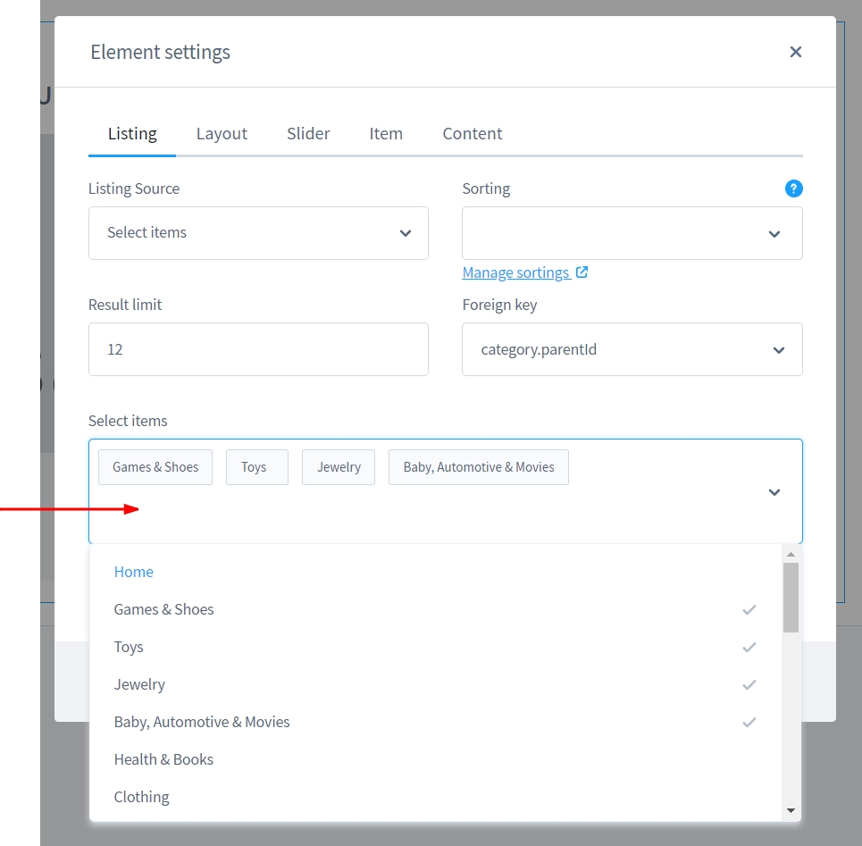
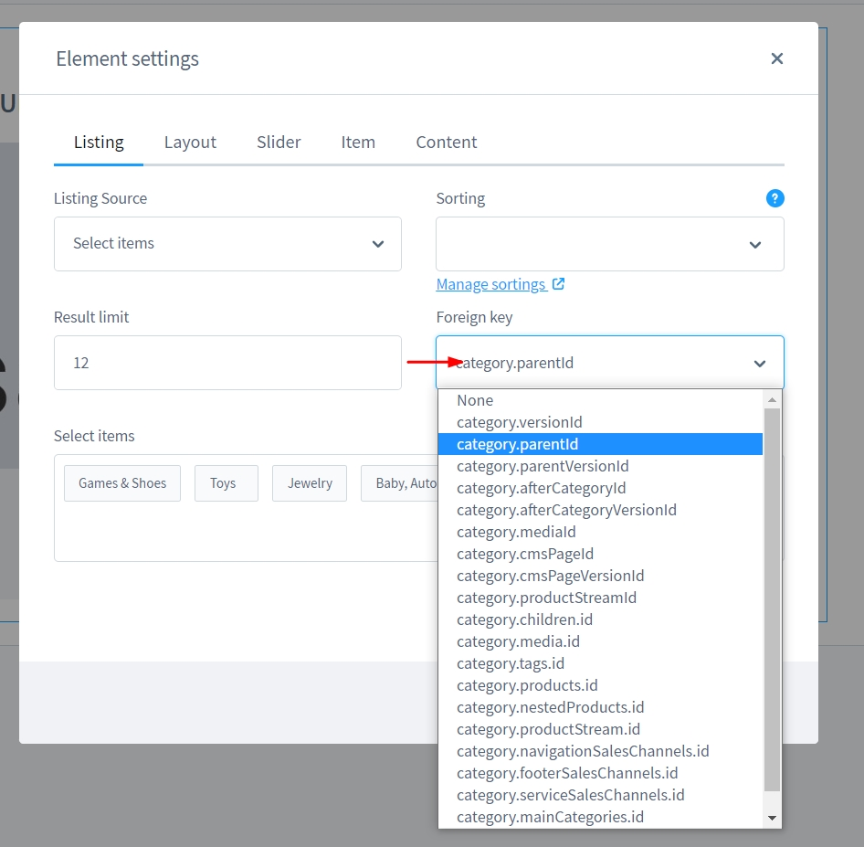
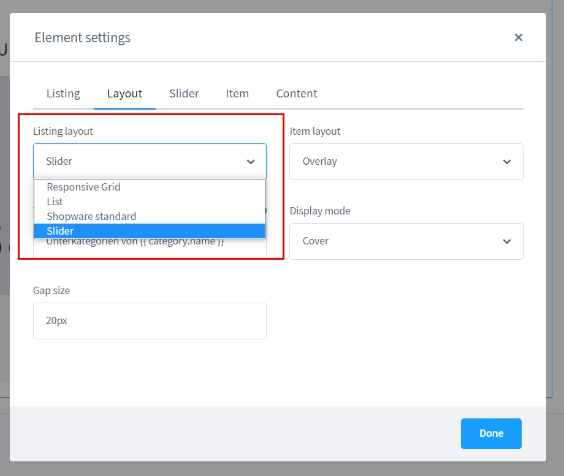
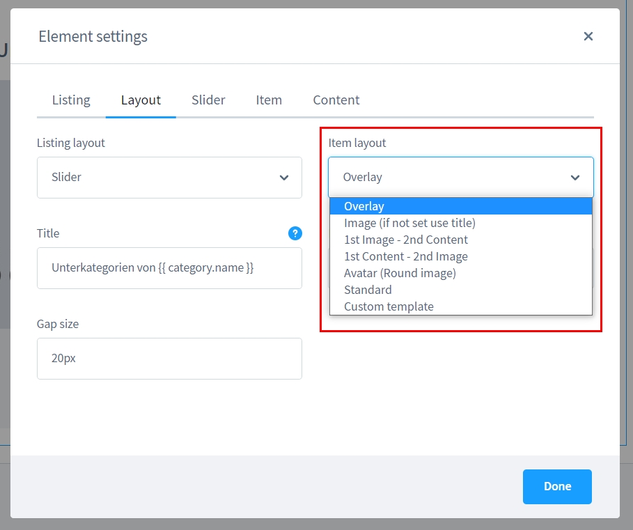
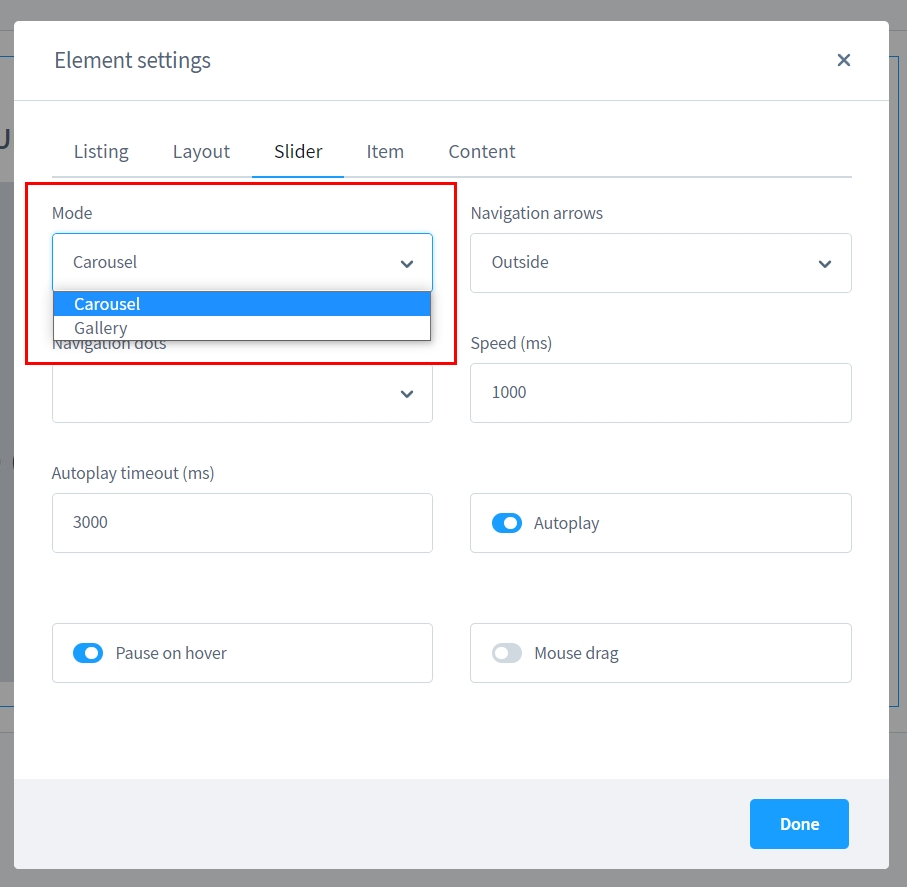
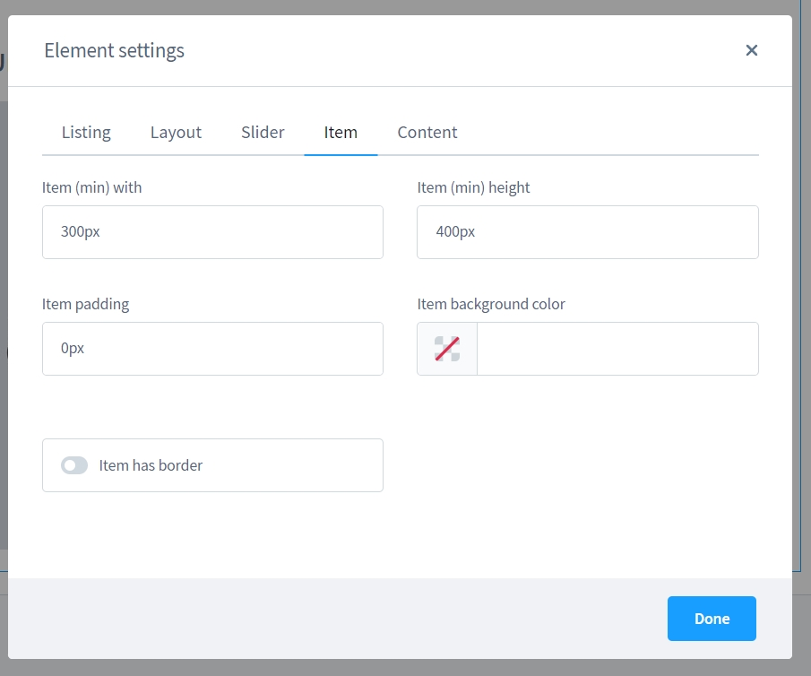

# Foundation Listings and Slider

available from Shopware 6.4

All moori plugins with listings get a CMS with these or similar settings.

_Note: If you don't find the element in the admin,
please note the following [Notes](../faq.md)_

## What is the Listing Element

The Listing element is a CMS element with several functions.
There can be listings with pagination, static listings and listings with individually selected elements.
selected elements.

The foreign key can also be used to create specific listings based on the currently displayed page in the storefront.
page currently displayed in the storefront. In this example, the foreign key refers to
the subcategories of a displayed category.

## The settings

### Listing source

The source determines where the elements of the listing are loaded from.

- Dynamic: Not all elements have dynamic listings, a dymanic listing can, for example, be loaded from
  listing can be compared to a product listing, for example. This selects a pagination
  and search filters can be used.

- Static: Static listings are oriented according to the sorting. With this you can e.g.
  create a static listing in the blog plugin with the sorting "New posts".

- Select: Individual elements can also be selected for the listing.

### Foreign key

The foreign key can be used to filter the elements. This is an alternative
to mapping CMS fields.

### Listing layout

There are different layouts. The listing is displayed according to the selection.

### Element Layout

The element itself can also have a desired layout. Here you can also
your own Twig template.

### Slider mode

If the "Slider" listing layout is selected, you can configure it again in detail.
configure it again.

There are two different modes for the slider.

If you select the "Gallery" mode, you can also set transition animations.

### Element settings

Here you can make general settings for the element.

### Content settings

The Call-To-Action area also contains various settings. This leaves nothing to be desired!

