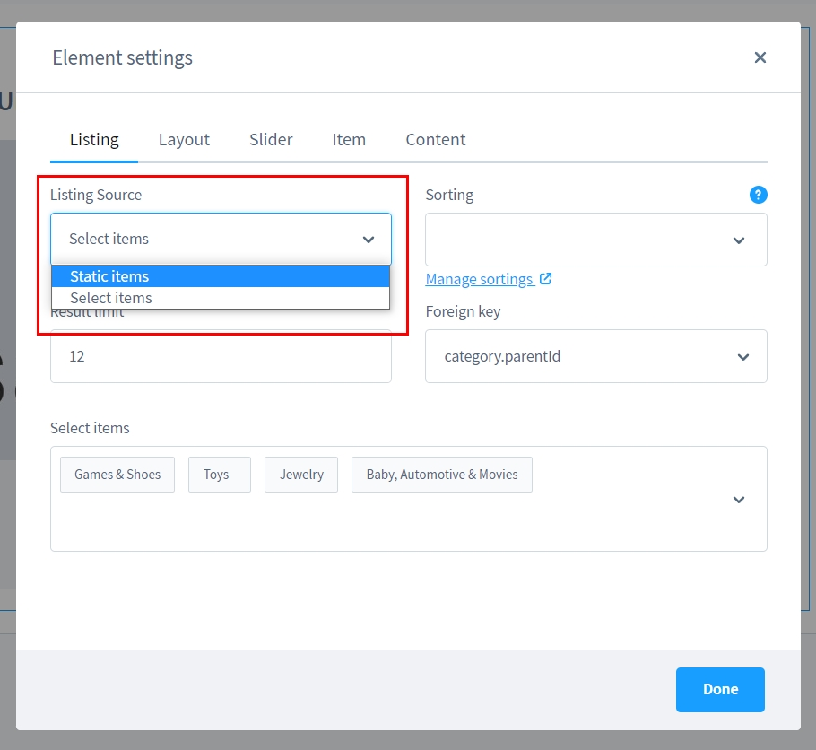
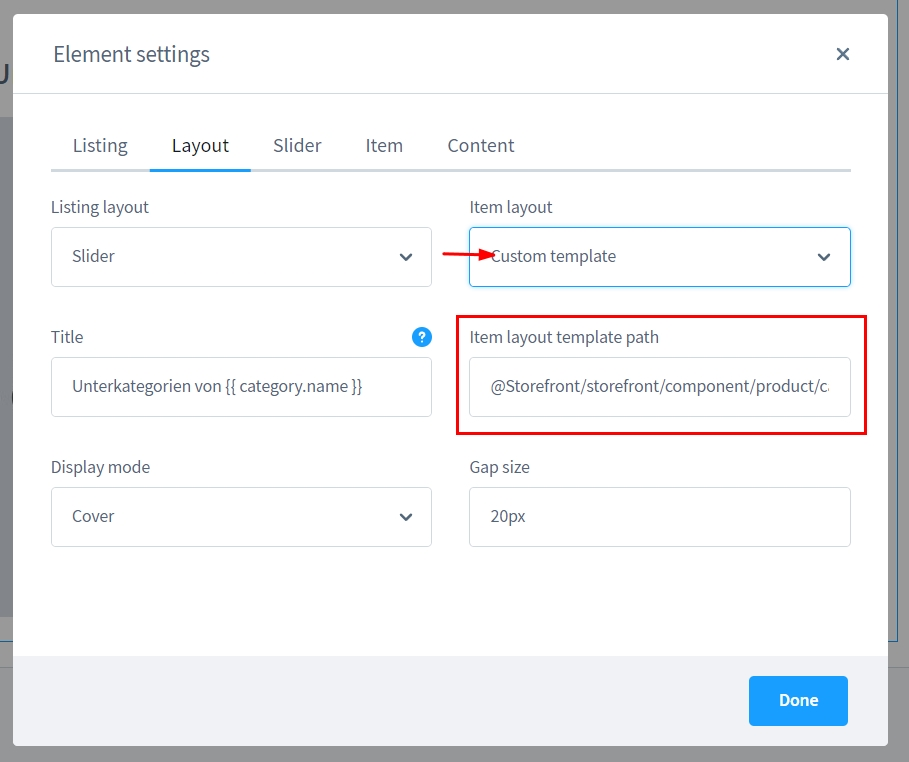
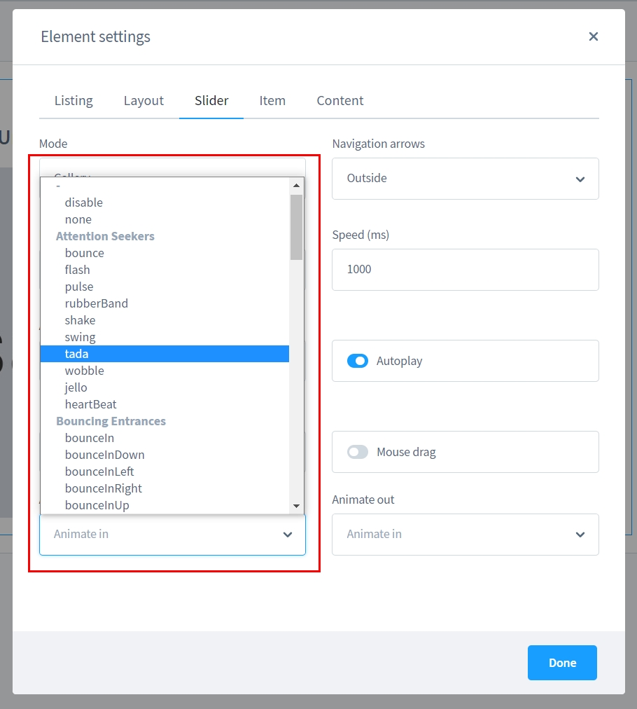

# Foundation | Listings und Slider

verfügbar ab Shopware 6.4

Alle moori Plugins mit Listings erhalten ein CMS mit diesen oder ähnlichen Einstellungen.

_Hinweis: Falls du das Element nicht im Admin findest, 
beachte folgende  [Hinweise](../faq.md)_

## Was ist das Listing Element

Das Listing Element ist ein CMS Element mit mehreren Funktionen.
Es können Listings mit Pagination, statische Listings und Listings mit einzeln ausgewählten
Elementen geben.

Durch den Fremdschlüssel können auch spezifische Listings anhand der aktuell dargestellten
Seite im Storefront erstellt werden. In diesem Beispiel bezieht sich der Fremdschlüssel auf
die Unterkategorien einer angezeigten Kategorie.

## Die Einstellungen

### Listing Quelle

Die Quelle bestimmt woher die Elemente des Listing geladen werden.

- Dynamisch: Nicht alle Elemente haben dynamische Listings, ein dymanisches
  Listing kann man z.B. mit einem Produklisting vergleichen. Diese entählt eine Pagination
  und es lassen sich Suchfilter nutzen.
  
- Statisch: Statische Listings orientieren sich nach der Sortierung. Damit kann man z.B. 
  im Blog Plugin ein statisches Listing mit der Sortierung "Neue Beiträge" erstellen.
  
- Auswählen: Es können auch einzeln Elemente für das Listing ausgewählt werden.

### Fremdschlüssel

Durch den Fremdschlüssel lassen sich die Elemente filtern. Dies ist eine Alternative
zum Mapping von CMS Feldern.

### Listing Layout

Es gibt unterschiedliche Layouts. Das Listing wird entsprechend der Auswahl dargestellt.

### Element Layout

Auch das Element selbst kann ein gewünschtes Layout haben. Hier kann man außerdem auch 
ein eigenes Twig Template einbinden.

### Slider Modus

Sofern das Listing Layout "Slider" ausgewählt ist, kannst du diesen nochmals detailliert
konfigurieren.

Es gibt zwei unterschiedliche Modi für den Slider.

Wenn man den Modus "Galerie" auswählt, kann man zusätzlich Übergangsanimationen einstellen.

### Element Einstellungen

Hier lassen sich generelle Einstellungen am Element vornehmen.

### Inhalt Einstellungen

Der Call-To-Action Bereich beinhaltet ebenfalls diverse Einstellungen. So bleiben keine Wünsche offen!

