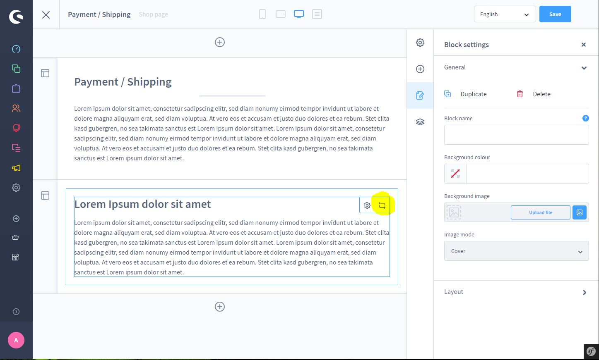
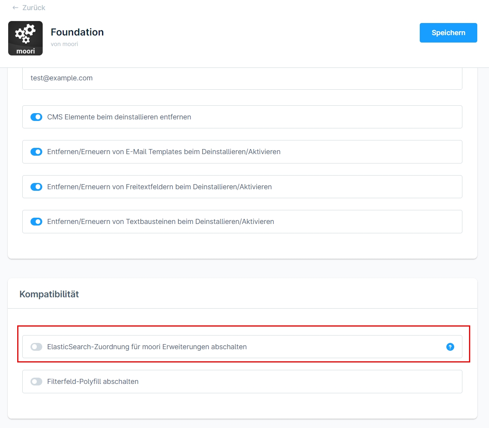

# Fehlermeldungen - Ursachen und Lösungsansätze

## 🤔 Leider ist etwas schief gelaufen

Um einen Fehler richtig zu deuten, benötige ich eine Fehlermeldung oder eine Logdatei. Der einfachste Weg geht mit dem Plugin `FroshTools`, dort steht dir ein Logviewer zur Verfügung.

Für einen reibungslosen Support installiere bitte dieses Plugin: [Frosh Tools](https://store.shopware.com/frosh12599847132f/tools.html).


Hier erfährst du außerdem die grundlegenden Schritte zum debuggen von Fehlern:

[https://docs.shopware.com/de/shopware-6-de/tutorials-und-faq/fehlermeldungen-debuggen](https://docs.shopware.com/de/shopware-6-de/tutorials-und-faq/fehlermeldungen-debuggen)

## 💡 Goldene Regel: Cache leeren, Plugin deaktivieren/aktivieren

Die meisten Probleme lassen sich in wenigen Schritten beheben. Probiere sofern es möglich ist, den Cache zu leeren und die Plugins zu deaktivieren und wieder aktivieren. Dabei gehen keine Daten verloren.

## ❌ Absolute No-Gos: Plugin und Datenbanktabellen manuell löschen

Sofern du kein Profi in Shopware bist, solltest du diese Aktionen niemals machen:

- Plugin via FTP löschen
- Datenbanktabellen des Plugins manuell löschen
- Sofern du Anspruch auf Support hast, schreibe immer sofort ein Ticket

## ⚠️ Viel los auf dem Shop? Testsystem!

Wenn du dir keine Ausfälle auf deinem Liveshop erlauben kannst, gehe immer auf Nummer sicher und erstelle dir ein Testsystem. Wenn es schnell gehen soll, kannst du ein Pluign zum erstellen von Testsystemen im Shopware Community Store erwerben.

## Häufige Fehlermeldungen

### Required plugin/package "moorl/foundation" is missing...

Du erhälst beim Versuch das Plugin zu installieren folgende Fehlermeldung?

```text
Required plugin/package "moorl/foundation 1.4.*" is missing or not installed and activated
Required plugin/package "moorl/foundation 1.5.*" is missing or not installed and activated
Required plugin/package "moorl/foundation 1.6.*" is missing or not installed and activated
```

Dann fehlt dir das Foundation Plugin. Hier kannst du das Plugin holen:

[https://store.shopware.com/moorl50852475974f/foundation-plugin.html](https://store.shopware.com/moorl50852475974f/foundation-plugin.html)

### Could not execute "composer require" for plugin...

Seit Shopware 6.5 können Plugins Pakete über composer installieren. Nicht alle Plugins nutzen dieses Feature, jedoch sind davon viele moori Plugins betroffen.

Du kannst diesen Fehler vermeiden, indem du...

1. Bei einem Shopware Major Update alle Plugins deaktivierst
2. Die Plugins im deaktiviertem Zustand aktualisierst und erst dann wieder aktivierst
3. Bei manuellem Upload (ZIP Archiv) nach jedem Uplaod das Plugin aktualisierst

Sollte es jedoch zu einer Fehlermeldung kommen, kannst du diesen so beheben:

```text
Could not execute "composer require" for plugin "MoorlSignIn (moorl/sign-in:2.5.9). Output: ./composer.json has been updated Running composer update moorl/sign-in --with-dependencies Loading composer repositories with package information Dependency shopware/core is also a root requirement. Package has not been listed as an update argument, so keeping locked at old version. Use --with-all-dependencies (-W) to include root dependencies. Updating dependencies Your requirements could not be resolved to an installable set of packages. Problem 1 - Root composer.json requires moorl/foundation 1.5.28 (exact version match: 1.5.28 or 1.5.28.0), found moorl/foundation[1.5.29] but it does not match your constraint and is therefore not installable. Make sure you fix the constraint as packages installed from symlinked path repos are updated even in partial updates and the one from the lock file can thus not be used. Installation failed, reverting ./composer.json and ./composer.lock to their original content.
```

In dieser Fehlermeldung sind Probleme aufgezeichnet:

- Problem 1 - Root composer.json requires moorl/foundation 1.5.28


Lösung:

1. Notiere dir, welche composer Pakete in den Problemen erwähnt werden.
2. Öffne die Datei `composer.json`, welche sich im Hauptverzeichnis des Shop befindet
3. Lösche die Zeilen mit den erwähnten Paketen
4. Nachdem du die Datei gespeichert hast, solltest du deine Plugins wieder aktualisieren können


### Umgebungsvariable COMPOSER_HOME ist falsch konfiguriert

Sofern du diese oder eine ähnliche Fehlermeldung erhältst, dann ist entweder der Pfad zur composer home falsch, oder composer hat keine Lese- bzw Schreibrechte auf deinem Webserver.

```text
Could not execute "composer require" for plugin "MoorlFoundation (moorl/foundation:1.6.2). Output: Composer could not detect the root package (shopware/production) version, defaulting to '1.0.0'. See https://getcomposer.org/root-version ./composer.json has been updated Composer could not detect the root package (shopware/production) version, defaulting to '1.0.0'. See https://getcomposer.org/root-version Running composer update moorl/foundation
```

Öffne dazu die `.env` oder `.env.local` im Hauptverzeichnis deines Shops und passe die Umgebungsvariable an.

### Table: custom_field_set Entry already exists...

```text
Table: custom_field_set Entry already exists [{"id":"98caa393862baa83506fabb17618d81b","name":"moorl_video"...
```

Bitte notiere dir den Namen des Eintrags in der Datenbank. In diesem Fall ist es `moorl_video`. Dieser Fehler kann nur einen Query direkt in der Datenbank behoben werden:

```text
DELETE FROM `custom_field_set` WHERE `name` = 'moorl_video';
```

### Fehler bei der Installation oder beim Update (Auch bei Shopware Updates)

Shopware hat für jedes Datenbank Update eine eigenständige Datei, die sog. Migration-Klassen. Dort werden die Datenbankbefehle verarbeitet.

Bei der Installation oder beim Update kann der Vorgang mit einer geringen Wahrscheinlichkeit abgebrochen werden. Dieses Problem wird dadurch verursacht, wenn man z.B. ein Backup einspielt, Daten via FTP austauscht oder Plugins manuell entfernt.

Fehler 1 `SQLSTATE[42S02]: Base table or view not found`

Das ist ein Anzeichen dafür, dass dieses Plugin schonmal installiert war, es wurde manuell gelöscht und es wurden die Tabellen in der Datenbank ebenfalls gelöscht. Jedoch wurden die Einträge in der Tabelle `migration` nicht gelöscht. Damit du das Plugin wieder normal installieren kannst, musst du die Einträge in der Migration ebenfalls löschen.

Wenn der Fehler z.B. beim Plugin `moori Foundation` auftritt, benötigst du den technischen Namen des Plugins. Hier ist es `MoorlFoundation`. Daraus erstellst du einen Datenbankbefehl zum Löschen der Daten aus der `migration`.

```text
DELETE FROM `migration` WHERE `class` LIKE 'MoorlFoundation%';
```

Fehler 2 `SQLSTATE[42S21]: Column already exists`

Dieser Fehler entsteht wie oben beschrieben, nur mit dem Unterschied, dass die `migration` Tabelle geleert wurde, aber es noch Tabellen des Plugins gibt. Da die Migration an dieser Stelle abgebrochen wurde und die Daten bereits vorhanden sind, muss dieser Schritt übersprungen werden. Führe folgenden Befehl aus und wiederhole diesen Schritt nach jedem Update versuch so oft wie notwendig!

```text
UPDATE `migration` SET
    `update` = now(),
    `message` = NULL
WHERE `class` LIKE 'MoorlFoundation%' AND `message` IS NOT NULL;
```

## Fehler in der Administration

### Es wird kein CMS Block angezeigt

Ich habe mich dazu entschlossen, dass CMS Blöcke (cms_block) keinen Bezug auf deren Inhalt haben und ausschließlich für das Layout der Erlebniswelten verwendet werden sollten.

Nachdem du ein Block in deine Seite gezogen hast, kannst du die Elemente darin einfach austauschen.




## Fehler im Storefront

### Allgemeine Anzeigefehler

Die Plugins sind im Shopware Standard Theme entwickelt worden. Anzeigefehler enstehen meist in Verbindung mit einem Drittanbieter Theme.

Die Themes aus dem Shopware Store befolgen meist die Regeln der Vererbung von Templates. 

In den Themes von [Zenit Design](https://store.shopware.com/zenit-design.html) gibt es manchmal Probleme mit Modal Fenstern, z.B. auf der Produkt-Detailseite, um diese Fehler zu beheben gibt es oftmals dazu Einstellungen im Theme.

Mit den Themes von [RH-Webdesign](https://store.shopware.com/rh-webdesign.html) und [ThemeWare](https://store.shopware.com/tc-innovations-gmbh.html) gab es bisher keine Probleme.

Individiuelle Themes sind oft sehr rudimentär aufgebaut, teste die Funktionen am besten einmal mit dem Shopware Standard Theme!

### Funktionen werden nicht wie erwartet ausgeführt

Hier liegt ein JavaScript-Fehler vor. Du kannst diese in den Entwickler-Tools deines Browsers (F12) sehen. Im Falle eines JavaScript-Fehlers solltest du erstmal alle Cookies und Webseiten Daten aus deinem Browser löschen (Hard-Reload). Ist keine Besserung in Sicht, deaktiviere Stück für Stück alle Plugins und Themes, außer die moori Plugins. Ist der Fehler weiterhin vorhanden, schreibe mir eine E-Mail oder ein Support-Ticket!

Oftmals wurden Probleme mit Tracking Plugins verzeichnet, setze am besten hier an.

## Fehler im Bezug auf ElasticSearch oder OpenSearch

### Es werden keine Produkte angezeigt, nachdem ich das Pluign aktiviert habe

Es werden keine Produkte angezeigt oder der Shop ist nicht mehr erreichbar. Folgende Fehlermeldung steht im Log von ElasticSearch:

```text
{"error":{"root_cause":[{"type":"query_shard_exception","reason":"failed to create query: [nested] failed to find nested object under path [creators]","index_uuid":"OFSjs3dPTnyefiinZNhH6g","index":"sw_product_2fbb5fe2e29a4d70aa5854ce7ce3e20b_1715904015"}],"type":"search_phase_execution_exception","reason":"all shards failed","phase":"query","grouped":true,"failed_shards":[{"shard":0,"index":"sw_product_2fbb5fe2e29a4d70aa5854ce7ce3e20b_1715904015","node":"FXYG3dBvTSmapxiPaHG5Tg","reason":{"type":"query_shard_exception","reason":"failed to create query: [nested] failed to find nested object under path [creators]","index_uuid":"OFSjs3dPTnyefiinZNhH6g","index":"sw_product_2fbb5fe2e29a4d70aa5854ce7ce3e20b_1715904015","caused_by":{"type":"illegal_state_exception","reason":"[nested] failed to find nested object under path [creators]"}}}]},"status":400} [] []
```

Das Problem ist, dass die Datenstruktur (Mapping) durch das Plugin verändert wurde, du musst also den Index für ElasticSearch neu aufbauen.

Dazu eignet sich das Plugin [Frosh Tools](https://store.shopware.com/frosh12599847132f/tools.html) sehr gut. Klicke dazu auf `Reindex`, warte anschließend eine Weile und prüfe ob der Fehler behoben wurde.


Sofern der Fehler nicht dadurch behoben werden kann, kannst du das ElastcSearch Mapping auch für alle moori Pluign in den Einstellungen von Foundation deaktivieren. Anschließend musst du erneut den Index von ElasticSearch neu aufbauen!



## Fehler in der Server Konfiguration

### Datei- und Verzeichnisrechte

Durch manuelle Anpassungen oder Uploads können die Rechte verfälscht werden. Dieser Fehler macht sich dann bemerkbar, wenn man eine weiße Seite im Storefront hat oder keine Medien hochladen kann. Auch der Cache kann davon betroffen sein. Mit diesen zwei einfachen Befehlen kannst du die Rechte wieder korrigieren.

```text
// Setze global alle Dateien auf 0755 und Verzeichnisse auf 0644
chmod -R u+rwX,go+rX,go-w /pfad/zum/hauptverzeichnes/des/shops

// Zertifikatsdateien benötigen 0660
find /pfad/zum/hauptverzeichnes/des/shops -name "*.pem" -exec chmod 0660 {} \;
```
