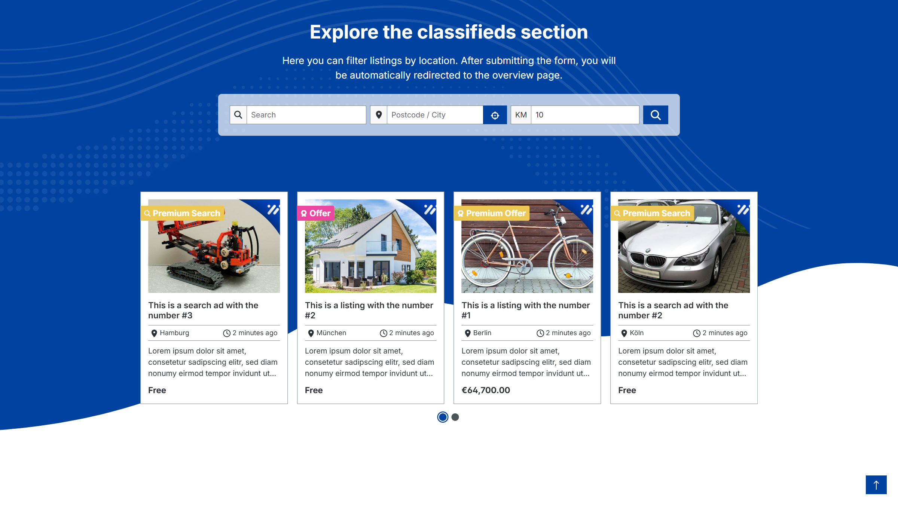

# Appflix Kleinanzeigen

Die Erweiterung ermöglicht es, Kunden eigene Anzeigen inserieren zu lassen. Erweitern Sie Ihren Shop durch User-Generated Content und profitieren Sie von einem besseren SEO-Ranking.

---

## Plugin Demo

Zu diesem Plugin steht eine Storefront-Demo zum Testen bereit. Unter folgenden Link kann das Plugin getestet werden:

- [https://demo-sw67.moori.net/AppflixCustomerMarket](https://demo-sw67.moori.net/AppflixCustomerMarket)

## Plugin erwerben

Dieses Plugin kann im offiziellen **Shopware Community Store** erworben werden.

- [Shopware Community Store](https://store.shopware.com/de/search?search=AppflixCustomerMarket)

**Wichtiger Hinweis:** Sie benötigen das Foundation Plugin, welches Ihnen kostenlos zur Verfügung steht: [moori Foundation](../MoorlFoundation/index.md)

## Quickstart

Für dieses Plugin steht ein **Demo-Paket** zum Testen bereit.

Gehen Sie zu `Einstellungen` → [`Demo Assistent`](../MoorlFoundation/demo-assistant.md) und wählen Sie dort `AppflixCustomerMarket` aus.

**Hinweis:** In einigen Fällen werden neue Kategorien und Seiten zu Ihrem Shop hinzugefügt. Bitte beachten Sie, dass die Demo-Daten ausschließlich zu Testzwecken dienen. Die darin enthaltenen Bilder können urheberrechtlich geschützt sein und dürfen nicht der Öffentlichkeit zugänglich gemacht werden.

---

## Planung

### Was kann man mit diesem Plugin machen?

1. Kunden können über den Kundenbereich eigene Kleinanzeigen schalten
2. Die Veröffentlichung einer Anzeige kann optional kostenpflichtig sein
3. Die Kontaktdaten des Verkäufers können versteckt, oder kostenpflichtig freigeschaltet werden
4. Besseres SEO-Ranking mit eigenem Kunden-Marktplatz und Community
5. Kleinanzeigen können durch kostenpflichtige Boosts besser gerankt werden (z.B. In einem Slider auf der Startseite erscheinen)

### Was kann man nicht mit diesem Plugin machen?

1. Kleinanzeigen können nicht über den Checkout erworben werden: Die Kleinanzeigen sind keine Produkte. Interessenten müssen den Verkäufer selbst kontaktieren.
2. Kleinanzeigen können nicht im Produktlisting gelistet und auch nicht in derselben Kategoriestruktur abgebildet werden.

### Sonstige Hinweise

1. Die Kleinanzeigen benötigen eine eigene Hauptkategorie, die alle Unterkategorien für die Kleinanzeigen enthält.
2. Die Eingabefelder für die Kleinanzeigen können durch benutzerdefinierte Felder und Anpassungen am Template erweitern werden.
3. Es können auch im Admin Kleinanzeigen angelegt und verwaltet werden.

## Ersteinrichtung

### Kategorien erstellen

Erstellen Sie eine Hauptkategorie für alle Kleinanzeigen und zum Einstieg zwei bis drei Unterkategorien.

Über die Hauptnavigation im Admin: `Kataloge` → `Kategorien`

Weisen Sie in jeder Kategorie die CMS Seite des Plugins hinzu: `Alle Kleinanzeigen`

### Basis Konfiguration

Über die Hauptnavigation im Admin: `Erweiterungen` → `Meine Erweiterungen` → `Appflix Kleinanzeigen` → `Konfigurieren`

- **Aktiv:** Plugin ist in diesem Verkaufskanal aktiv
- **Privater Modus:** Kontaktdaten des Verkäufers sind erst sichtbar, wenn der Kunde mindestens eingeloggt ist
- **Kategorieseite mit allen Kleinanzeigen:** Hauptkategorie für alle Kleinanzeigen (im ersten Schritt angelegt)
- **Boost Optionen:** Welche Boosts sind verfügbar?

### Anzeigentypen erstellen

Über die Hauptnavigation im Admin: `Einstellungen` → `Kleinanzeigen Typen` → `Hinzufügen`

#### Stammdaten

- **Name:** Der Name des Typs
- **Alias:** Technischer Name / Kurzform
- **Ablaufzeit:** Zeit, nachdem eine Kleinanzeige gelöscht wird
- **Beschreibung:** Kurze Beschreibung des Typs
- **Aktiv:** Typ ist aktiv
- **Priorität:** Höhere Priorität = Weiter oben gelistet
- **Farbe:** Farbliche hervorhebung des Typs
- **Icon:** Symbol des Typs, z.B. `fa7s|search` (FontAwesome 7 Solid → Suche)

#### Preise

- **Boost Startseite:** Preis um die Kleinanzeige auf der Startseite darzustellen (Es wird ein CMS-Listing Element auf der Startseite benötigt)
- **Boost Slot:** Alternative zu Boost Startseite
- **Boost Top:** Preis um die Kleinanzeige im Listing ganz oben darzustellen (Es wird ein CMS-Listing Element auf der Listing-Seite benötigt)

Die Boosts können optional über die Pluginkonfiguration deaktiviert werden. In den Listing-CMS-Elementen, die z.B. auf der Startseite oder über dem Haupt-Listing platziert werden, gibt es für alle drei Boosts einen entsprechenden Filter der aktiviert werden muss. Eine Einheit entspricht 24 Stunden.

- **Angebot:** Preis zum Freischalten der Kontaktdaten des Käufers (einmalig)
- **Veröffentlichung:** Preis zum Veröffentlichen einer Kleinanzeige (einmalig)

