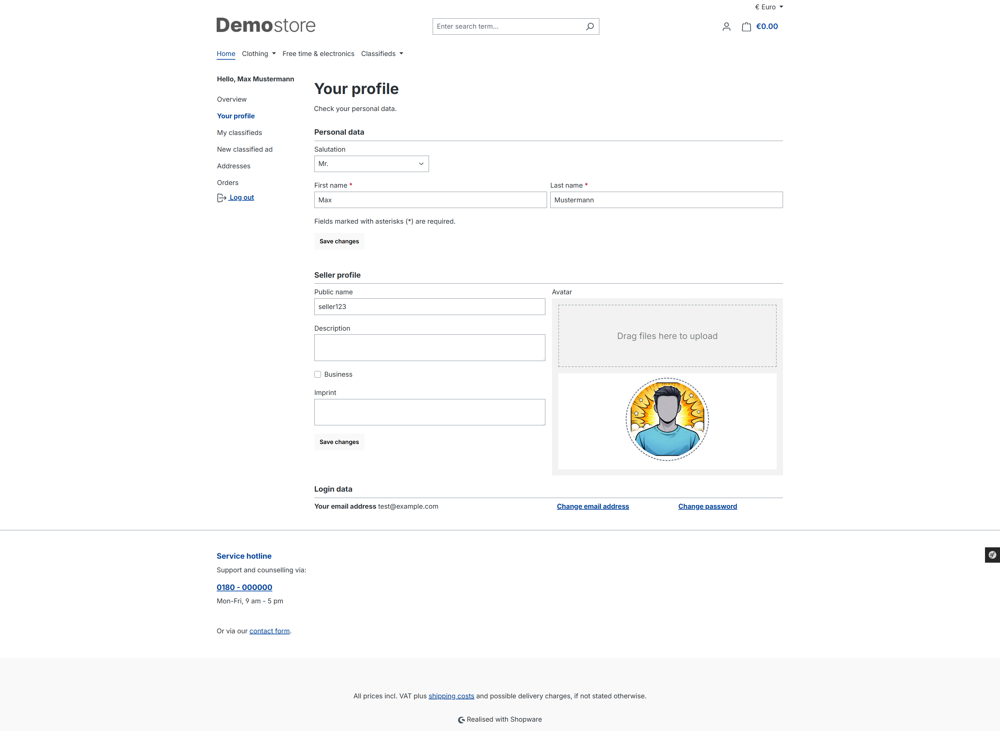
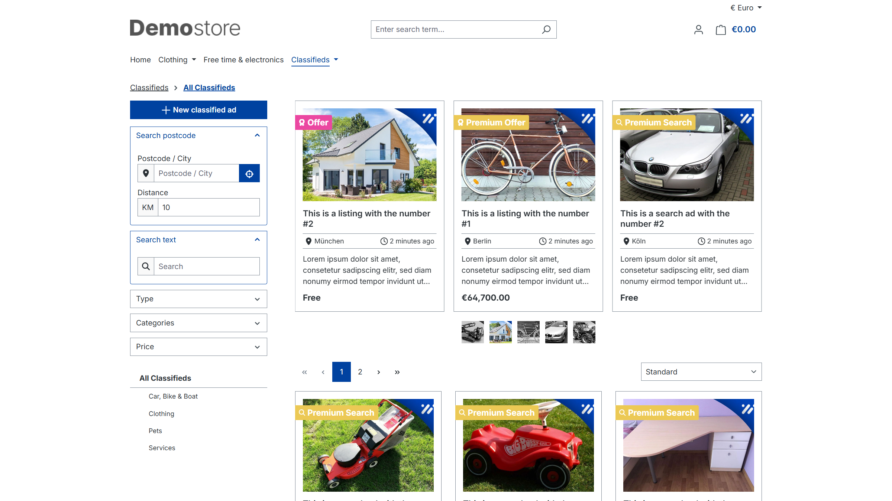
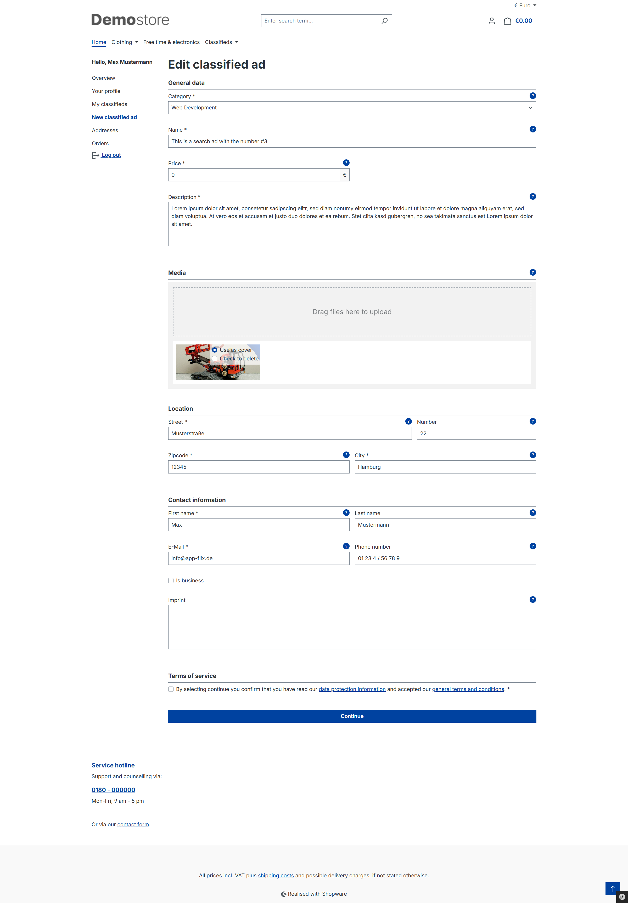
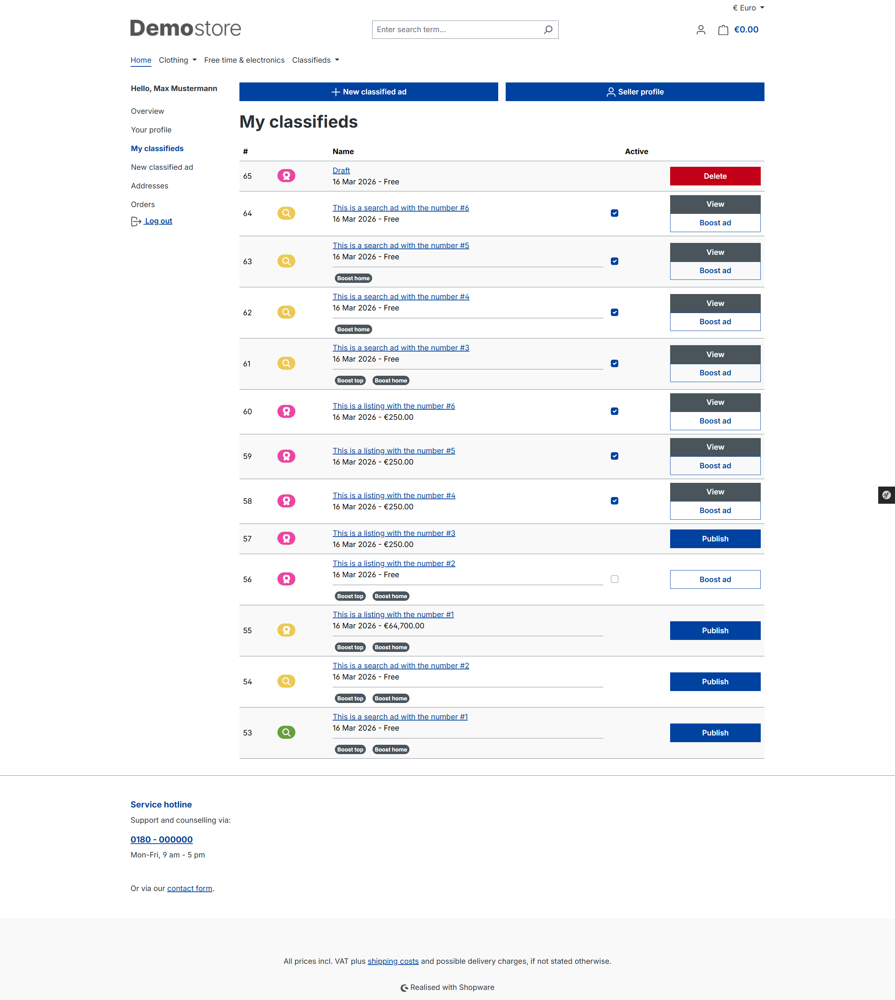

# Storefront

Der Kunde kann eigene Anzeigen erstellen. Dazu wird ein Verkäuferprofil angelegt.

Eine neue Kleinanzeige kann über das Listing aller Kleinanzeigen (Button oben links) oder im Kundenmenü unter `Neue Kleinanzeige` erstellt werden.

Der Kunde wählt zuerst den Typ der Anzeige und vervollständigt im nächsten Schritt alle weiteren Angaben.

In der Übersicht (Kundenmenü `Meine Kleinanzeigen`) kann der Kunde seine Kleinanzeigen veröffentlichen oder unvollständige Kleinanzeigen löschen. Kostenpflichtige Anzeigen und Boosts werden erst freigegeben, wenn der Kunde diese Optionen bestellt und bezahlt hat.

