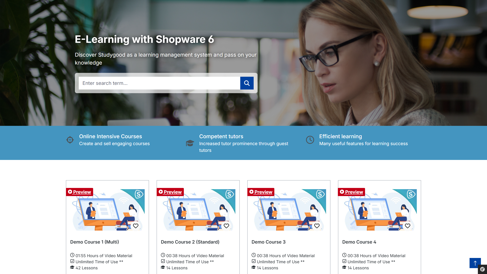

# Studygood | Your Learn Management System

The E-Learning Management System for video courses. Flexible course duration, learning materials for download, question/answer forum, internal company training and much more.

---

## Plugin Demo

A storefront demo is available for testing this plugin. The plugin can be tested at the following link:

- [https://demo-sw67.moori.net/AppflixStudygood](https://demo-sw67.moori.net/AppflixStudygood)

## Purchase the Plugin

This plugin can be purchased in the **Shopware Community Store**.

- [Shopware Community Store](https://store.shopware.com/en/search?search=AppflixStudygood)

**Important note:** You need the Foundation Plugin, which is available free of charge: [moori Foundation](../MoorlFoundation/index.md)

## Quickstart

A **demo package** is available for testing this plugin.

Go to `Settings` → [`Demo Assistant`](../MoorlFoundation/demo-assistant.md) and select `AppflixStudygood`.

**Note:** In some cases, new categories and pages will be added to your shop. Please note that the demo data is provided for testing purposes only. The images included may be protected by copyright and must not be made publicly available.

---

## Planning

### Define hosting

- **Streaming – copy protection required:** Host videos on Vimeo
- **Streaming – no copy protection required:** Host videos on YouTube
- **Self-hosted videos:** Upload via the media manager. Important: Depending on the hosting provider, there may be upload limits, in some cases allowing only a few MB.

## Initial setup

### Set up videos and media

Media management is configured here: [Embedded Media](../MoorlFoundation/embedded-media.md)

### Create a course

Via the main navigation in the admin: `Content` → `Studygood Courses` → `Add`

#### Basic information

- **Name:** The name of the course
- **Description:** Short course description. The main description is taken from the product.
- **Tutor (optional):** The creator of the course
- **Active**
- **Products:** Products that include this course. The course can be assigned to multiple products.
- **Embedded media (optional):** A video, for example a short overview of the course content

#### Event

Relevant for courses that take place live or on-site, for example via IFrame.

#### Content

An overview of the chapters and lessons.

#### Metadata

General information about the course, such as course duration or the number of documents and downloads.

### Create a chapter

A structured course consists of several chapters, which in turn contain the lessons.

A new chapter is created via `Current course` → `Content` → `Chapters` → `Add`.

- **Name:** The name of the chapter
- **Description (optional):** Short description
- **Position:** The order within the course
- **Media (optional):** A preview image for the chapter

### Edit a chapter

Once a chapter has been created, a new entry appears in the list. Click the chapter name to continue editing.

### Create a lesson

In the chapter detail view, the lessons for this chapter can now be created.

A new lesson is created via `Current chapter` → `Lessons` → `Add`.

- **Name:** The name of the lesson
- **Description (optional):** Short description
- **Position:** The order within the chapter
- **Preview:** This lesson can be viewed free of charge
- **Embedded media:** The main content of the lesson
- **Media (optional):** A preview image for the lesson

### Edit a lesson

Once a lesson has been created, a new entry appears in the list. Click the lesson name to continue editing.

- **Board:** An overview for comments and questions related to the current lesson
- **Files:** Downloads and documents can be provided for the lesson
- **Length:** The duration of the lesson is entered in seconds
- **Assessment:** Creation of a multiple-choice test for self-evaluation
- **Points:** The number of points required to pass the test

### Create a multiple-choice test (optional)

#### Questions

- **Content:** The question
- **Solution:** An explanation or solution path shown after completing the assessment
- **Media:** An image for the question
- **Points:** The number of points awarded for a correct answer

#### Answers

Once the question has been created, the answers can be created without leaving the page. To do this, click the context menu (`...`) in the list to open the created question in a modal window.

Another list appears there, where the answers for the question can be created.

- **Is true:** This answer is correct
- **Content:** The answer
- **Media:** An image for the answer

### Finalize the course

Repeat the steps until all chapters and lessons have been fully created. A path is stored in the title, allowing you to quickly jump back to the lesson or the course.

### Product assignment

Go to the product to which the course has been assigned. Then switch to the `Studygood` tab. The following information can or must be entered there.

#### Basic information

- **Default page:** The product page remains as defined in the standard setup. The courses and lessons are listed in a tab on the product detail page.
- **Course duration:** The validity period of a course in days
- **Event date (optional):** Additional information for a live event
- **Embedded media (optional):** A video, for example a short overview of the course content at product level

#### Metadata (important)

Click the `Update` button in the metadata section. This will combine the data of all courses for this product.

### Completion

The course has now been created.

## All data at a glance

Via the main navigation in the admin under `Settings` → `Extensions`, all plugin data can be accessed:

- `Studygood Boards`
- `Studygood Chapters`
- `Studygood Lessons`
- `Studygood Subscriptions`
- `Studygood Test Questions`
- `Studygood Test Answers`
- `Studygood Tutors`

## Purchasing a course

The customer adds a course to the shopping cart and places the order.

In the customer menu under `My subscriptions`, all courses are listed including the course progress. It also shows when access to the course expires.

As soon as the payment receipt has been confirmed, the customer gets access to the course content.

Subscriptions can also be created manually in the admin:

1. Via the product: `Current product` → `Studygood` → `Subscriptions`
2. Via the customer: `Current customer` → `Subscriptions`
3. Globally: `Settings` → `Extensions` → `Studygood Subscriptions`
