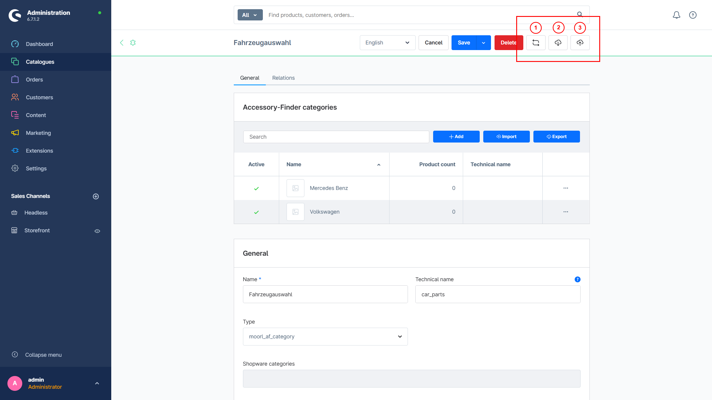

# Accessory finder | Import and Export

Starting with Shopware 6.7, there is a generic CSV import and export feature that allows you to easily create category paths and product associations.

## Checklist

The following points should be considered before using the generic import/export:

- Only accessory categories are supported. Shopware categories can be imported using Shopware’s own import/export tool.
- Import and export take place at the accessory group level; it is not possible within individual categories.
- If a new accessory group has been created, the levels must first be configured. The category path must be specified in full. Separation is done with a pipe character (“|”).
- Products are defined by their product number. If no products exist, the corresponding row in the CSV will be skipped.
- Categories and installation positions are created automatically if needed.
- Large imports and exports are only possible to a limited extent and depend on server performance. However, imports can be split into smaller chunks (e.g., 500 entries per CSV file). Using the Admin API, the process can theoretically also be automated.

The easiest approach is to create some data manually first and then perform an export.

## Buttons

The following buttons are available for import/export:



The buttons are only visible within an accessory category; for Shopware categories they are hidden.

1. Count products within the categories
2. Export a CSV
3. Import a CSV

## Example

**Note for Microsoft Office users:** The CSV file must be saved in UTF-8 format. A semicolon (“;”) is used as the separator.

```CSV
product_number;category;site
MAF005;"Mercedes Benz|C-Class|C 300 d 4MATIC";Bottom
MAF004;"Mercedes Benz|C-Class|C 300 d 4MATIC";Rear
MAF001;"Mercedes Benz|C-Class|C 300 d 4MATIC";Rear
MAF000;"Mercedes Benz|C-Class|C 300 d 4MATIC";Front
MAF003;"Mercedes Benz|C-Class|C 300 d 4MATIC";Top
MAF006;"Volkswagen|ID.|ID.3";Bottom
MAF000;"Volkswagen|ID.|ID.3";Front
MAF001;"Volkswagen|ID.|ID.3";Rear
```
