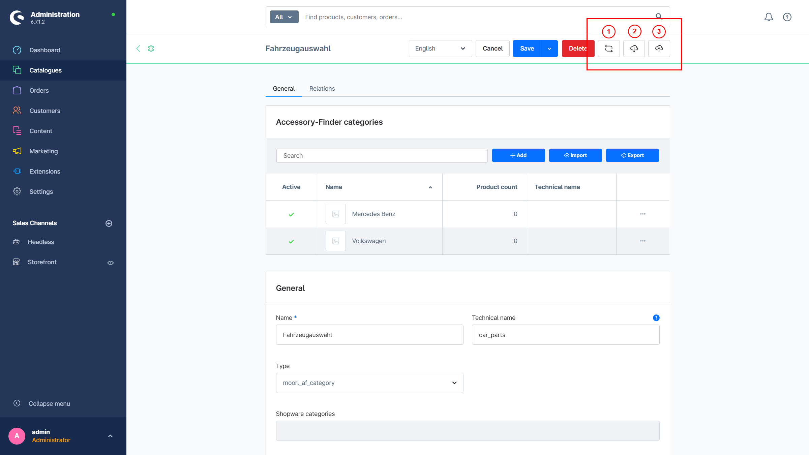

# Zubehör-Finder | Import und Export

Ab Shopware 6.7 gibt es einen generischen CSV-Import und -Export, mit dem sich auf einfache Weise Kategoriepfade und Produktverknüpfungen erstellen lassen.

## Checkliste

Folgende Kriterien sollten beachtet werden, bevor man den generischen Import/Export verwendet:

- Es werden nur Zubehör-Kategorien unterstützt. Shopware-Kategorien können mit dem Import/Export-Tool von Shopware importiert werden.
- Der Import und Export erfolgt auf Ebene der Zubehör-Gruppe; innerhalb einzelner Kategorien ist dies nicht möglich.
- Wenn eine neue Zubehör-Gruppe angelegt wurde, müssen zunächst die Ebenen konfiguriert werden. Der Kategoriepfad muss vollständig angegeben sein. Die Trennung erfolgt mit einer Pipe („|“).
- Produkte werden anhand der Produktnummer definiert. Gibt es keine Produkte, wird die jeweilige Zeile in der CSV übersprungen.
- Kategorien und Einbaustellen werden bei Bedarf automatisch angelegt.
- Große Importe und Exporte sind nur begrenzt möglich und abhängig von der Serverleistung. Es empfiehlt sich daher, Importe in kleineren Schritten durchzuführen (z. B. 500 Einträge pro CSV-Datei). Über die Admin-API lässt sich der Vorgang auch automatisieren.

Am einfachsten ist es, zunächst einige Daten manuell anzulegen und anschließend einen Export durchzuführen.

## Schaltflächen

Folgende Schaltflächen stehen für den Import/Export zur Verfügung:



Die Schaltflächen sind nur in einer Zubehör-Kategorie sichtbar; bei Shopware-Kategorien sind sie ausgeblendet.

1. Produkte innerhalb der Kategorien zählen
2. Export einer CSV
3. Import einer CSV

## Beispiel

**Hinweis für Microsoft-Office-User:** Die CSV-Datei muss im UTF-8-Format gespeichert werden. Als Trenner dient ein Semikolon („;“).

```CSV
product_number;category;site
MAF005;"Mercedes Benz|C-Klasse|C 300 d 4MATIC";Unten
MAF004;"Mercedes Benz|C-Klasse|C 300 d 4MATIC";Hinten
MAF001;"Mercedes Benz|C-Klasse|C 300 d 4MATIC";Hinten
MAF000;"Mercedes Benz|C-Klasse|C 300 d 4MATIC";Vorne
MAF003;"Mercedes Benz|C-Klasse|C 300 d 4MATIC";Oben
MAF006;"Volkswagen|ID.|ID.3";Unten
MAF000;"Volkswagen|ID.|ID.3";Vorne
MAF001;"Volkswagen|ID.|ID.3";Hinten
```
