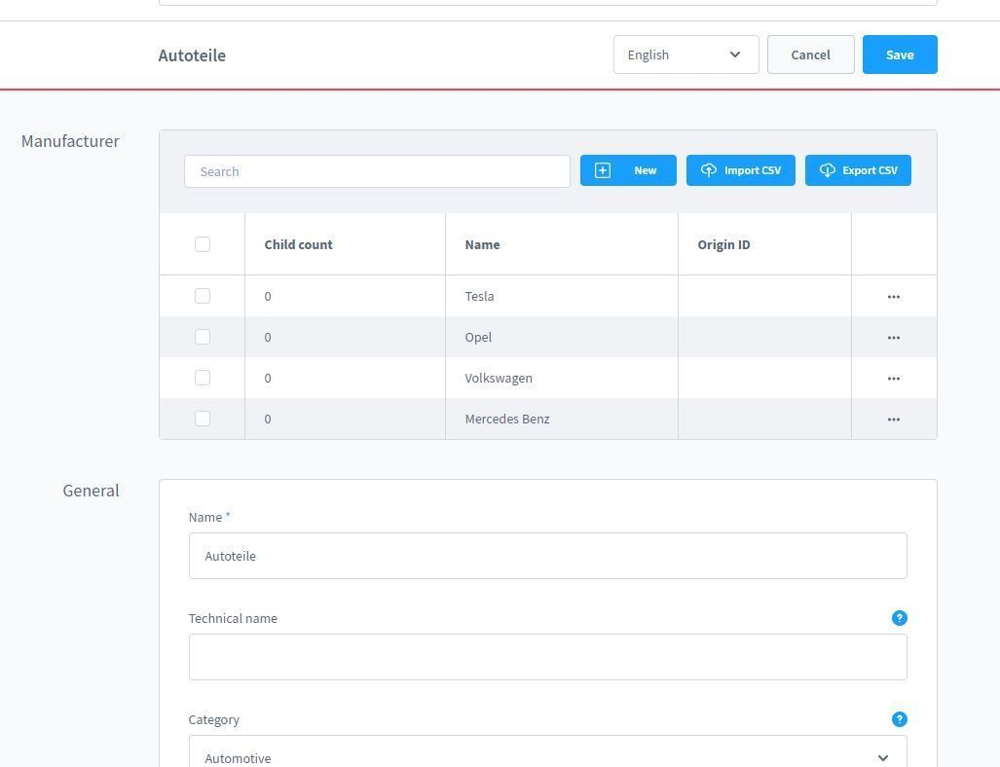
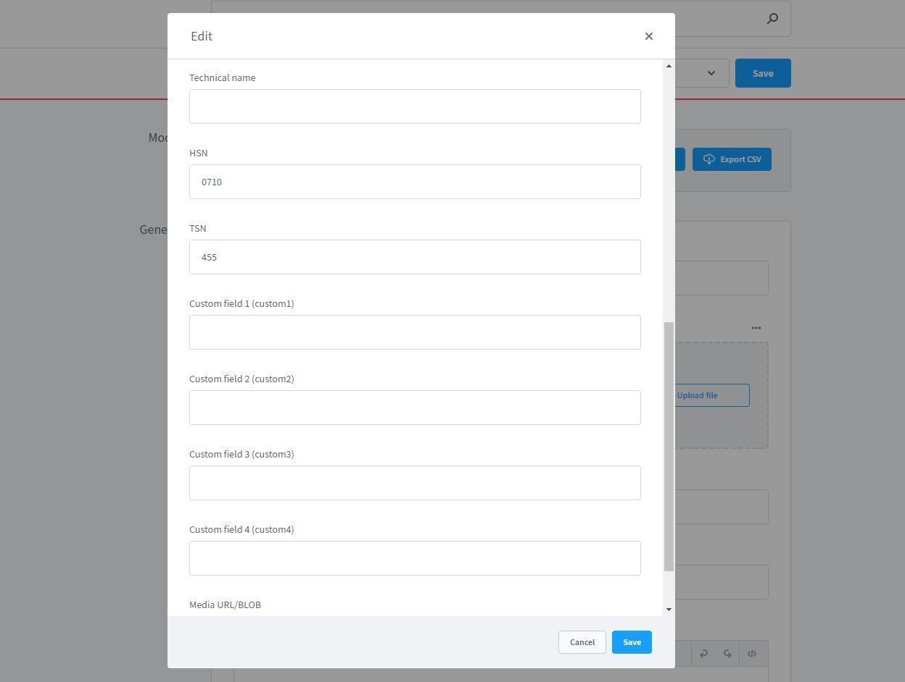
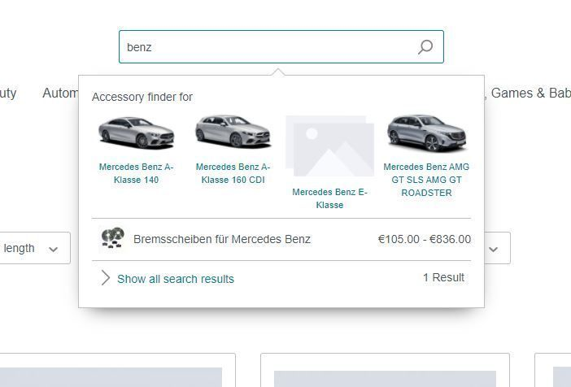
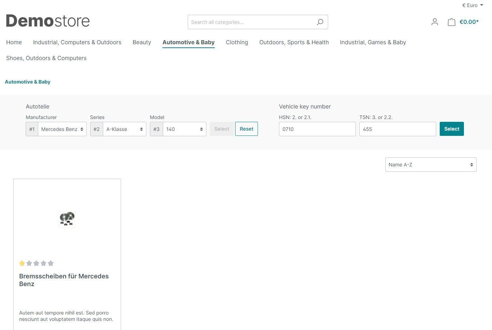

# Accessory finder | Car Parts, Printer supplies and more

- [Buy plugin in the Shopware Community Store](https://store.shopware.com/en/moorl49792082127m/accessories-finder.html)
- [Buy plugin in the moori Plugin Store](https://moori-plugin-store.com/MoorlAccessoryFinder)

_Note: This plugin requires the current version of [Foundation / Basis Plugin](../MoorlFoundation/index.md)._

[Click here for the demo](https://demo.moori.net/Zubehoer-Finder-Demo/)

---

With this plugin you create for your store a comprehensive filter option for accessories of any kind.
Your customers will find important accessories faster than with the normal store search.

**Possible areas of use:**

1. printer accessories
2. vehicle accessories
3. spare parts
4. consumables

## Highlights
- Additional search suggestions
- Freely configurable level navigation
- Matching tab in the product description of the accessory product
- CMS filter element for category lists
- Simple and customizable

## Features
- Multiple filter groups, also suitable for the same category
- Customer's filter setting is saved for the session and can be reset
- Filter as sidebar element or full width
- TSN/HSN key number search possible
- Import/export of data via CSV for fast data transfer
- Custom Twig template for adjustments in the product detail tab
- Unlimited levels for filter
- Subcategories keep the filter settings

## Installation and operation

First install the Foundation Basis plugin via the Shopware 6 plugin manager.
Then you can install the Accessories Finder.

You can find the filter groups here:

There you create a new Filtergroup:

Once the filter group is created, three layers will be created automatically,
you can easily adjust them according to your needs. Please make sure
that the level starts from 1 and has no gaps.

Now you can start directly with the maintenance of the manufacturers. With larger amounts of data
the import should be done by a professional developer.

After creating a manufacturer, click on the three dots (..) and on Edit
to get to the next level. There you can maintain as many layers as you like.

Arrived at the last level? Now you can assign the accessory products!

Alternatively you can go to the product and there in the section "Accessories Categories" you can assign
assign your compatible devices/vehicles.

A look into the frontend reveals if the assignments were successful.

To apply the filter, you now need an adjustment in the category listing.
Go to the "Sidebar" blocks and drag the "Accessory Filter" element into the template.

After you have saved the CMS page, make sure that this page has also been assigned to the
category where the accessories products are located.

This is how it should now look in the frontend:

Filter not set:

Filter set:

Give your filter group the technical name "car_parts" to activate the key search.

The plugin configuration can optionally be changed, if certain functions are not needed or there are
or there are problems with the performance.

