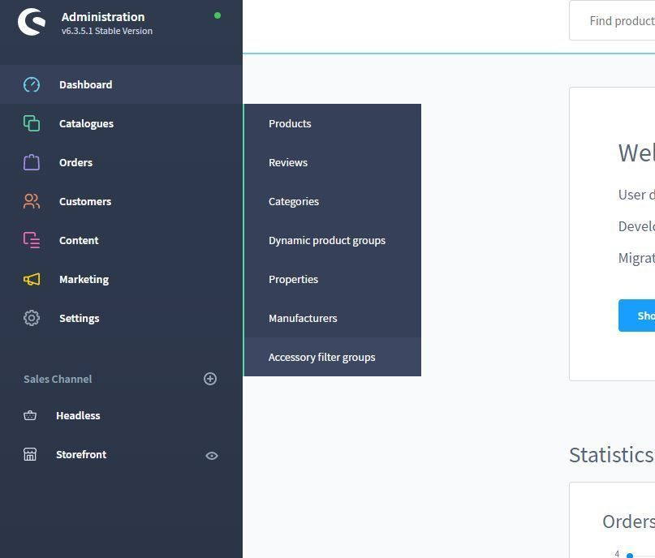
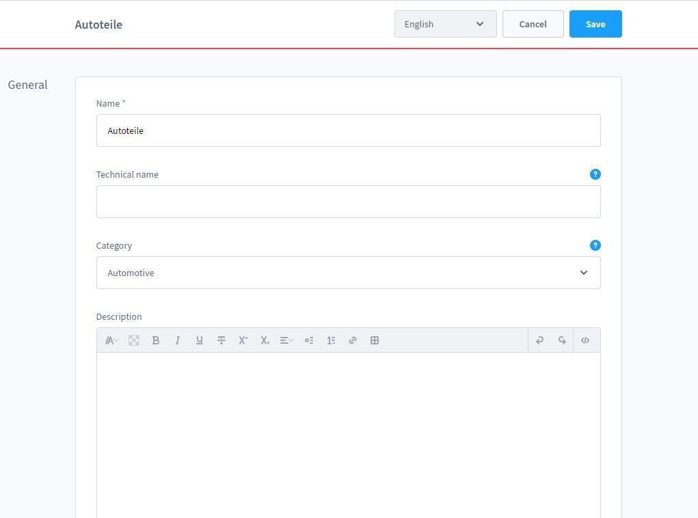
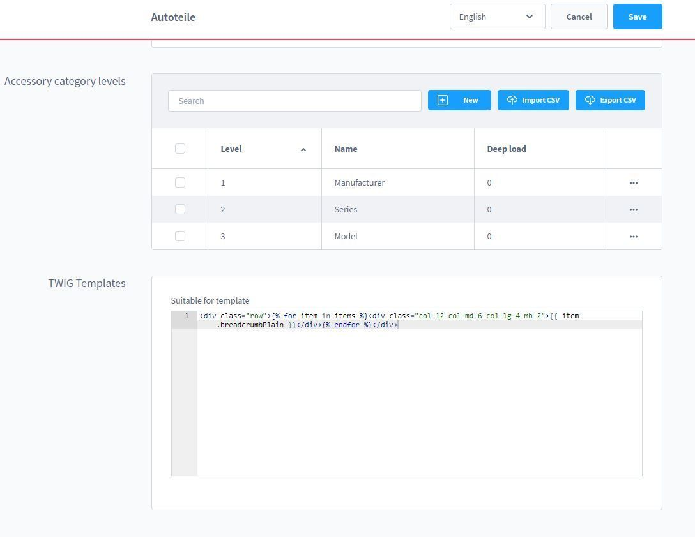
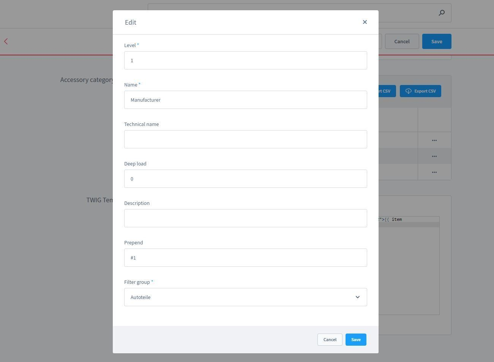
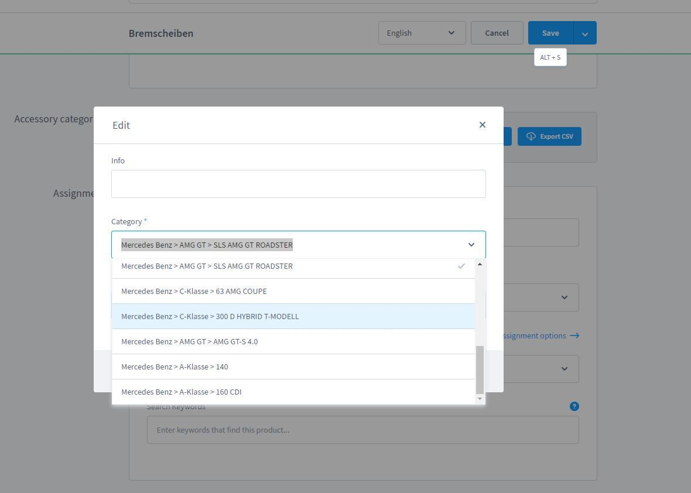
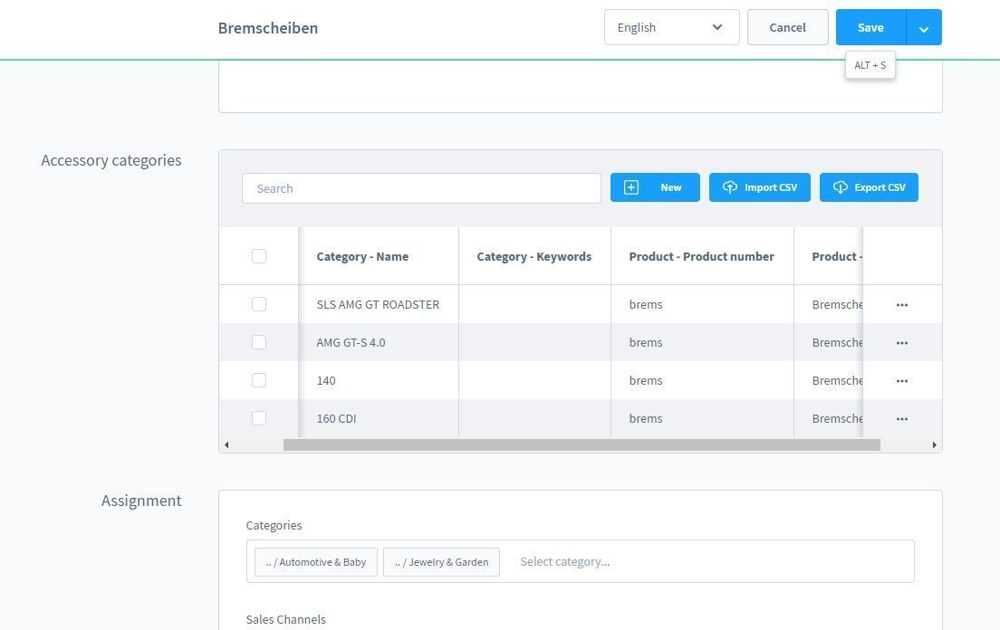
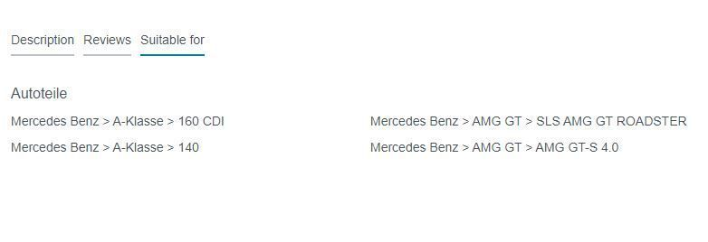
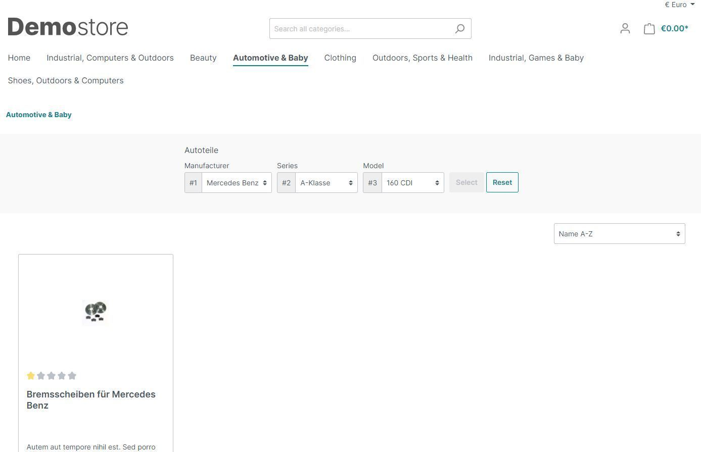
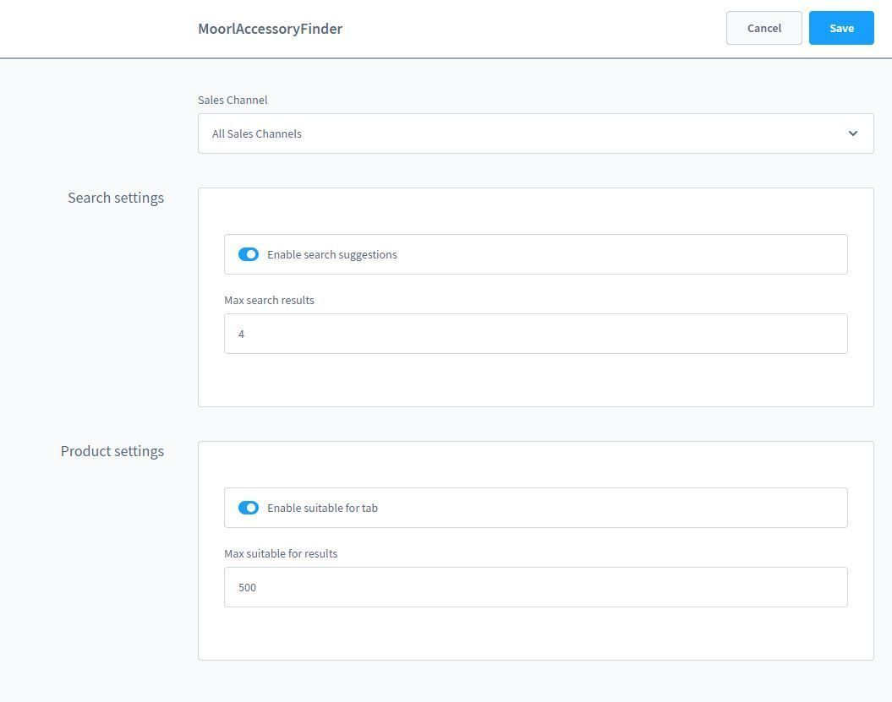

# Zubehör-Finder | Autoteile, Druckerzubehör und mehr

Mit diesem Plugin erstellen Sie sich für Ihren Shop eine umfassende Filtermöglichkeit für Zubehör jeder Art. Ihre Kunden finden wichtiges Zubehör schneller als mit der normalen Suche.

---

## Plugin erwerben

Das Plugin kann in den folgenden Stores erworben werden. Wenn Sie bereits einen Shopware-Account besitzen, nutzen Sie bitte **immer zuerst** den Link zum **Shopware Community Store**, da es bei alternativen Stores zu Problemen mit der Lizenzierung kommen kann. Ist ein Plugin **nicht** im Shopware Community Store verfügbar, wird es exklusiv in einem der alternativen Stores angeboten.

- [Shopware Community Store](https://store.shopware.com/de/search?search=MoorlAccessoryFinder) *(empfohlen)*
- [moori Plugin Store](https://moori-plugin-store.com/MoorlAccessoryFinder)
- [Shopelfen Store](https://www.shopelfen.de/) *(im Aufbau)*

**Wichtiger Hinweis:** Sie benötigen das Foundation Plugin, welches Ihnen kostenlos zur Verfügung steht: [moori Foundation](../MoorlFoundation/index.md)

## Quickstart

Für dieses Plugin steht ein **Demo-Paket** zum Testen bereit.

Gehen Sie zu **„Einstellungen → [Demo Assistent](../MoorlFoundation/demo-assistant.md)“** und wählen Sie dort **„MoorlAccessoryFinder“** aus.

Bei einigen Paketen müssen die Varianten der Produkte eventuell manuell generiert werden.

Gehen Sie dazu zu **„Katalog → Produkte → Demo Produkt → Varianten → Varianten generieren“**.

**Hinweis:** In einigen Fällen werden neue Kategorien und Seiten zu Ihrem Shop hinzugefügt. Bitte beachten Sie, dass die Demo-Daten ausschließlich zu Testzwecken dienen. Die darin enthaltenen Bilder können urheberrechtlich geschützt sein und dürfen nicht der Öffentlichkeit zugänglich gemacht werden.

**Mögliche Einsatzgebiete:**

1. Druckerzubehör
2. Fahrzeugzubehör
3. Ersatzteile
4. Verbrauchsgegenstände

## Highlights
- Zusätzliche Suchvorschläge
- Frei erstellbare Ebenen-Navigation
- Passend für Tab in der Produktbeschreibung des Zubehör-Produktes
- CMS Filter Element für Kategorie-Listen
- Simpel und individuell anpassbar

## Features
- Mehrfache Filtergruppen, auch für die selbe Kategorie geeignet
- Filtereinstellung des Kunden wird für die Sitzung gespeichert und kann zurückgesetzt werden
- Filter als Sidebar-Element oder volle Breite
- TSN/HSN Schlüsselnummer-Suche möglich
- Import/Export der Daten via CSV für schnelle Datenübernahme
- Eigenes Twig Template für Anpassungen im Produkt-Detail Tab
- Unbegrenzte Ebenen für den Filter
- Unterkategorien behalten die Filter-Einstellungen

## Installation und Bedienung

Installieren Sie zu erst das Foundation Basis Plugin über den Plugin-Manager von Shopware 6.
Anschließend können Sie den Zubehör Finder installieren.

Sie finden die Filtergruppen hier:

Dort legen Sie eine neue Filtergruppe an:

Ist die Filtergruppe angelegt werden automatisch drei Ebenen erstellt, 
diese können Sie einfach nach Ihren Bedürfnissen anpassen. Bitte achten Sie darauf, 
dass es die Ebene ab 1 beginnt und keine Lücken hat.

Nun können Sie auch direkt mit der Pflege der Hersteller beginnen. Bei größeren Datenmengen 
sollte der Import jedoch durch einen professionellen Entwickler umgesetzt werden.

Klicken Sie nach dem Erstellen eines Herstellers auf die drei Punkte (...) und auf Bearbeiten
um in die nächste Ebene zu gelangen. Dort können Sie beliebig weiter Ebenen Pflegen.

In der letzten Ebene angekommen? Nun können Sie die Zubehör-Produkte zuweisen!

Alternativ können Sie auch in das Produkt gehen und dort in der Sektion "Zubehör Kategorien"
Ihre kompatiblen Geräte/Fahrzeuge zuweisen.

Ein Blick in das Frontend verrät, ob die Zuweisungen gelungen sind.

Um den Filter anwenden zu können, brauchen Sie nun eine Anpassung im Kategorie-Listing.
Gehen die auf die Blöcke "Sidebar" und ziehen Sie das Element "Zubehör Filter" in das Template.

Nachdem Sie die CMS Seite gespeichert haben, stellen Sie sicher, ob diese Seite auch der
Kategorie zugewiesen wurde, in der sich die Zubehör-Produkte befinden.

So sollte es nun im Frontend aussehen:

Filter nicht gesetzt:

Filter gesetzt:

Geben Sie ihrer Filtergruppe den technischen Namen "car_parts" um die Schlüsselsuche zu aktivieren.

Die Pluginkonfiguration kann optional angepasst werden, falls gewisse Funktionen nicht benötigt werden
oder es Schwierigkeiten mit der Performance gibt.

