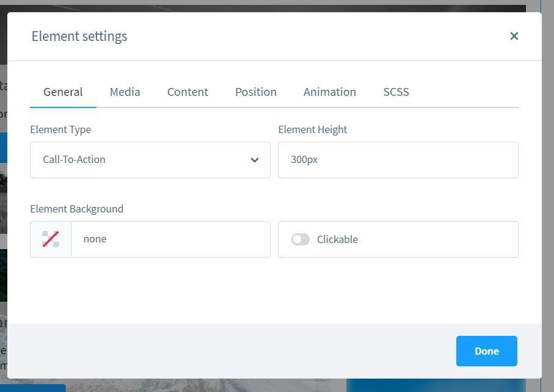
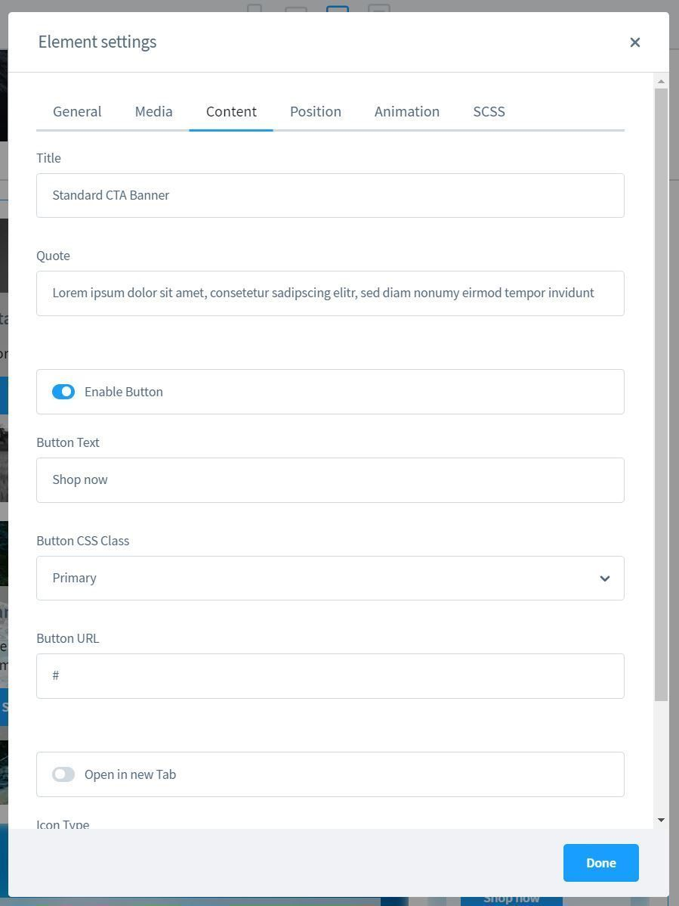
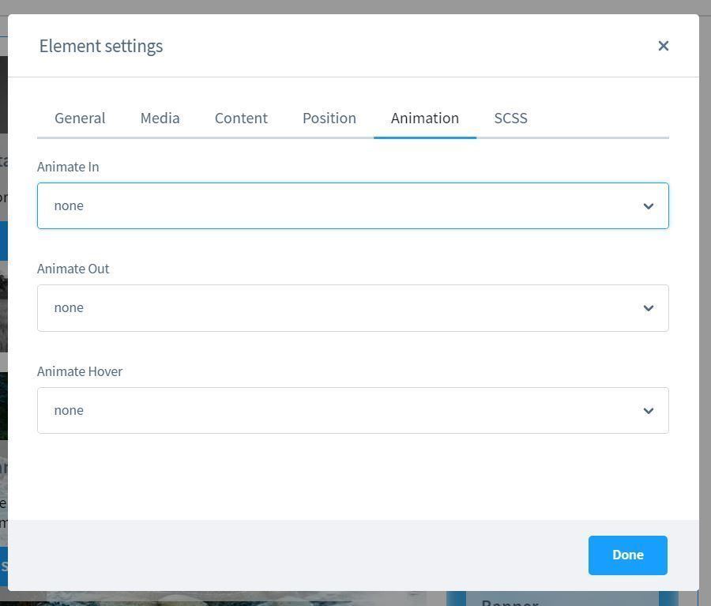

# Erlebniswelten | Call to Action Banner

[Hier geht's zur Demo](https://demo.moori.net/Call-To-Action-Banner-Demo/)

Call-To-Action Banner dürfen in keinem Online Shop fehlen - auch nicht in Shopware 6.
Einfache Bildbanner lassen sich zwar ausreichend gestalten und verlinken, jedoch hast Du
durch Text im Bild keine Vorteile in der Suchmaschinenoptimierung und wirst wahrscheinlich
Probleme mit der Mobilen Ansicht haben.

_Übrigens: Die App
[Listing Störer](../MoorlInterrupter/index.md)
ist die perfekte Ergänzung._


## Installation

1.  Installiere
    [Foundation](../MoorlFoundation/index.md)

2.  Optional: In dieser App ist ein
    [Demo Paket](../MoorlFoundation/demo-assistant.md)
    Enthalten.
    
Nun kannst du das Element in deinen CMS Seiten nutzen.

## Einstellungen

### Grundeinstellungen



- Element Typ: Wähle zwischen Call-To-Action, Custom, Kategorie-Teaser oder Produkt-Teaser
- Element Höhe: Bestimme die Mindesthöhe für das Element

### Medien und Hintergrundbilder


Du kannst Bilder und Videos im Hintergrund einfügen und hast viele Möglichkeiten dein
Hintergrund anzupassen. Außerdem gibt es einige Hover Animationen und Effekte.

### Inhalte



Hier kannst du die Inhalte pflegen, ein Icon und einen Call-To-Action Button konfigurieren.

### Ausrichtungen


Du findest hier einige Anpassungsmöglichkeiten für die Ausrichtung.

### Animationen



### Scss Compiler


Nutze ganz einfach zusätzliche Style Anpassungen mit dem eingebauten Scss Compiler.

````scss
/* Insert element SCSS here */
/* Insert background SCSS here */
.background {
}
/* Insert overlay SCSS here */
.overlay {
    /* Insert box SCSS here */
    > div {
        /* Insert heading SCSS here */
        h3 {
        }
        /* Insert button SCSS here */
        .btn {
        }
    }
}
/* Insert hover SCSS here */
&:hover {
}
````
