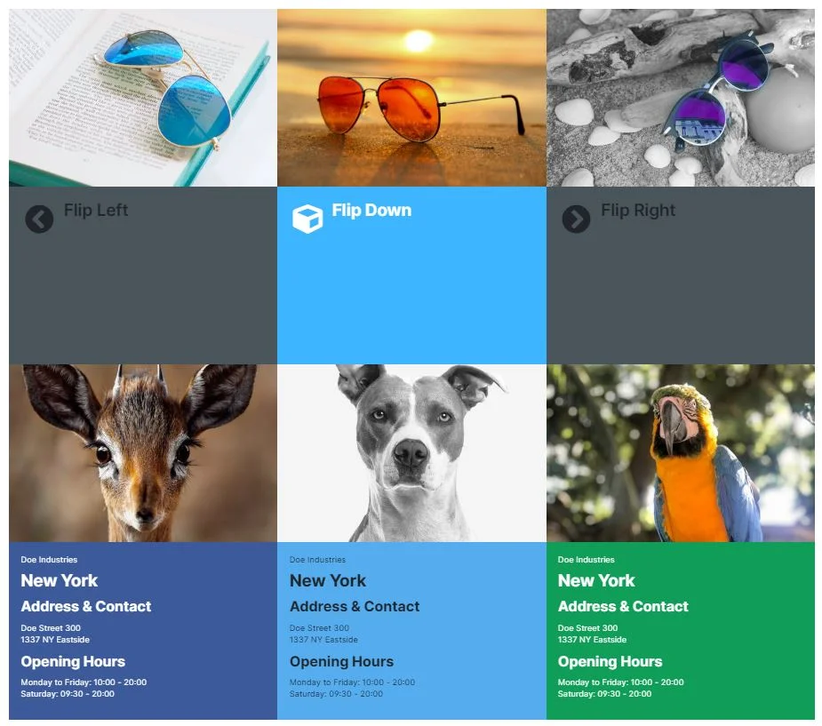

# CMS Element | Flip Box

This plugin allows you to display flip boxes with a front and back side in the shopping worlds. These boxes can be designed in the backend in many different ways.

---

## Purchase the Plugin

The plugin can be purchased from the following stores. If you already have a Shopware account, please **always use** the link to the **Shopware Community Store** first, as alternative stores may cause licensing issues. If a plugin is **not** available in the Shopware Community Store, it is offered exclusively in one of the alternative stores.

- [Shopware Community Store](https://store.shopware.com/en/search?search=MoorlCmsFlipBox) *(recommended)*
- [moori Plugin Store](https://moori-plugin-store.com/MoorlCmsFlipBox)
- [Shopelfen Store](https://www.shopelfen.de/) *(under construction)*

**Important note:** You need the Foundation Plugin, which is available free of charge: [moori Foundation](../MoorlFoundation/index.md)

