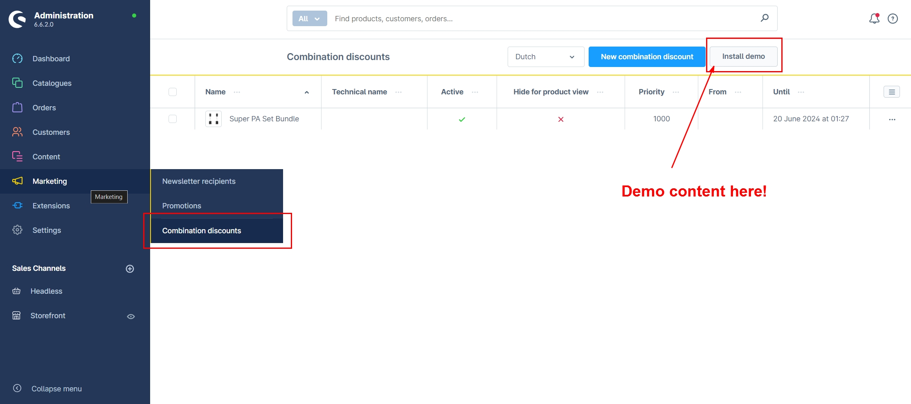
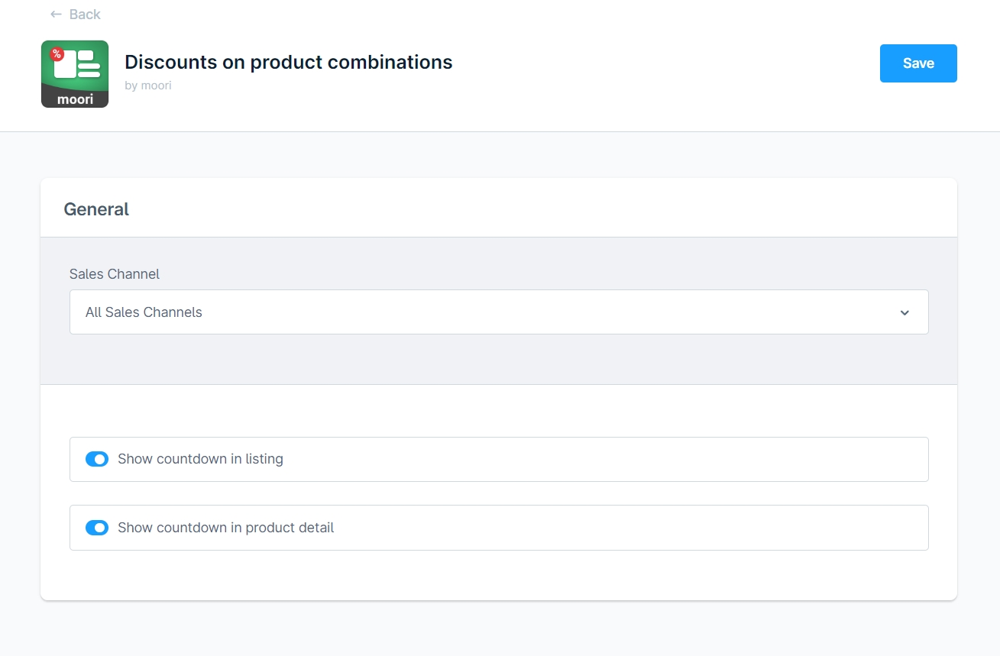
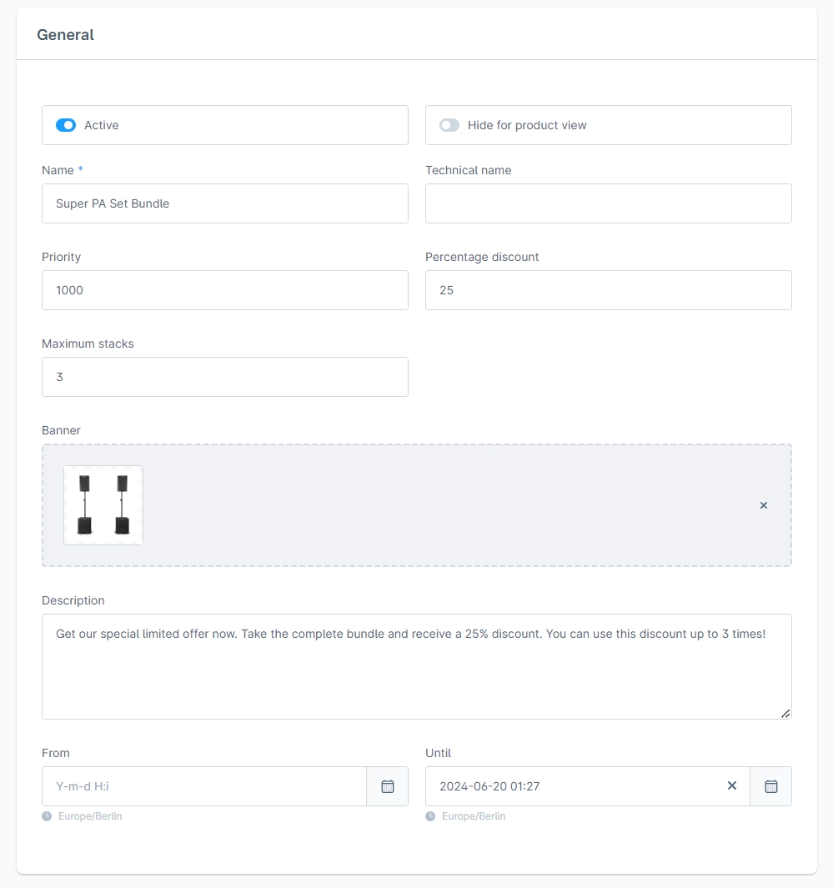
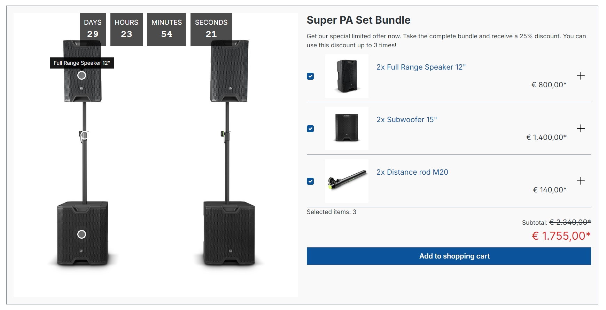
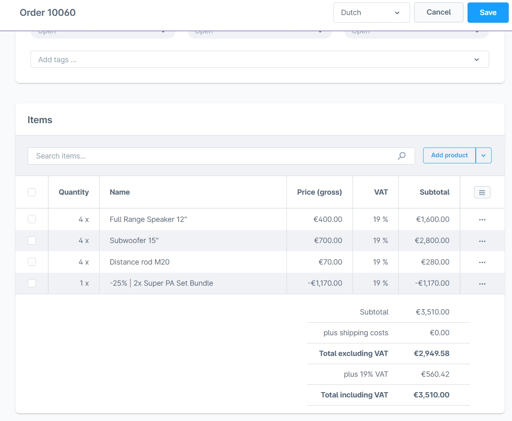

# Rabatte auf Produktzusammenstellungen

## Installation

!!! note

      Falls du Probleme mit dem Plugin hast, bitte beachte folgende [Hinweise](../) im FAQ Bereich.

1. Installiere [Foundation](../MoorlFoundation/index.md)
2. Installiere Rabatte auf Produktzusammenstellungen
3. Optional: In dieser App ist ein [Demopaket](../MoorlFoundation/demo-assistant.md) enthalten.
4. Gehe zu: Marketing | Kombinationen & Rabatte

Hier kannst du nun einen neuen Beitrag erstellen.

## Einstellungen

### Basis Konfiguration

In der Basis Konfiguration kannst du generelle Einstellungen vornehmen.

- Zeige Countdown im Listing
- Zeige Countdown/Element auf der Produktdetailseite

## Produkt Zusammenstellung erstellen

Klicke auf neue Zusammenstellung erstellen.

### Basis Einstellungen:

- Aktiv: Aktiviert die Produktzusammenstellung.
- Für Produkte verstecken: Die Produktzusammenstellung ist aktiv, kann als CMS Element eingebunden werden, wird aber nicht auf der Produktdetailseite oder im Listing angezeigt.
- Name: Der öffentliche Name.
- Technischer Name: Der interne Name.
- Priorität: Die Zusammenstellung mit höherer Priorität wird zuerst im Warenkorb berechnet. Das ist sinnvoll, falls Produkte in mehreren Zusammenstellungen vorkommen.
- Prozentualer Rabatt: Der Rabatt für die in der Liste aufgeführte Zusammenstellung aus Produkten.
- Maximal einlösbar: Der Rabatt wird auf eine begrenzte Anzahl an Zusammenstellungen berechnet.
- Banner: Wird als Banner angezeigt, dient aber auch als Cover für die Warenkorbposition des Rabatts.
- Beschreibung: Eine zusätzliche Beschreibung.
- Von- und bis Zeitangabe: Die Zusammenstellung und der Rabatt wird nur zu dieser Zeit angezeigt.

### Optionale Element-Einstellungen

Layout

- ID Attribut: Das Element kann um eine ID ergänzt werden, z.B. Für Anpassungen am Stylesheet
- Class Attribut: Das Element kann um eine CSS Klasse ergänzt werden, z.B. Für Anpassungen am Stylesheet
- Stil: Banner oder Inhalt an erster Stelle
- Banner anzeigen: Aktiviere Banner im Element. Countdown und Hotspots können ebenfalls angezeigt werden.
- Titel & Beschreibung anzeigen: Zeigt Titel & Beschreibung an
- Einkaufsliste anzeigen: Zeigt Einkaufsliste an
- Mindestbreite um nebeneinander dargestellt zu werden: Banner und Inhalt nicht mehr nebeneinander passen, dann werden sie untereinander dargestellt

Einkaufsliste

- Einzeln in den Warenkorb: Produkte können einzeln in den Warenkorb gelegt werden.
- Alle in den Warenkorb: Die gesamte Zusammenstellung kann in den Warenkorb gelegt werden.
- Icon: Typ des Icons.
- Preise anzeigen: Zeigt Preise an.
- Variantenwechsel anzeigen: Aktiviert den Variantenwechel. Diese Option macht nur Sinn, wenn keine Rabattberechnung aktiviert ist, da die Rabatte nicht auf alle Varianten berechnet werden.
- Selektion durch Auswahlfeld aktivieren: Ermöglicht die Produkte in der Einkaufliste zu selektieren.
- Links führen zu den Produktseiten: Aktiv - Klick führt zur Produktdetailseite | Inaktiv - Klick öffnet ein Fenster.

Hotspots

- Zeige Hotspots: Hotspots werden auf dem Banner angezeigt. Du kannst in der Produktliste die Postionen in % eingeben. Eine Vorschau ist aktuell noch nicht verfügbar!
- Hotspot Animation: Wähle eine Animation für die Hotspots aus.

Countdown

- Zeige Countdown: Zeigt einen Countdown an. Nur verfügbar, wenn die Zusammenstellung ein Ablaufdatum hat.
- Countdown Typ: Wähle aus verschiedenen Typen

### Liste der Zusammenstellung

Hier können die Produkte als Positionen zugewiesen oder entfernt werden.

- Aktiv: Die Position ist aktiv.
- Menge: Das Produkt wird in angegebener Menge in den Warenkorb gelegt.
- Priorität: Definiert die Reihenfolge in der Liste
- Position links (%): Der Abstand nach links für den Hotspot auf einem Banner.
- Position oben (%): Der Abstand nach oben für den Hotspot auf einem Banner.
- Produkt: Das Produkt.

## CMS Element erstellen

Optional hast du die Möglichkeit deine Zusammenstellungen als CMS Element darzustellen. Dieses Element verfügt auch über ein Shop-The-Look Feature.

Du kannst in diesem CMS Element die Element-Einstellungen der Zusammenstellung überschreiben.

## Ansicht im Storefront

### Produktdetailseite

Die Zusammenstellung wird auf der Detailseite deines Produkts angezeigt. Hier hat der Kunde die Möglichkeit, die Zusammenstellung in den Warenkorb zu legen. Optional kannst du die Darstellung auf der Produktdetailseite global in den Plugin einstellungen deaktivieren.

### Produkt-Listing

Sofern ein Countdown vorhanden ist, wird dieser in der Liste dargestellt.

### CMS Element

Im CMS Element sind alle wichtigen Informationen enthalten. Sobald die Zusammenstellung abläuft, ist das CMS Element leer.

### Warenkorb

Es wird ermittelt, wie oft eine Zusammenstellung in den Warenkorb passt. Dabei wird auch berücksichtigt, wie oft der Rabatt verwendet werden darf. Es wird automatisch eine Gutschrift basierend der Zusammenstellungen und dem prozentualen Rabattwert erstellt.

!!! note

      Sofern ein Produkt nicht mehr verfügbar ist, wird dieses Produkt aus dem Warenkorb entfernt. Somit wird auch keine Gutschrift erstellt!

## Bestellverwaltung

In der Bestellverwaltung kannst du die Gutschrift sehen. Diese ist vom Typ `credit`.

!!! note

      Wenn du die Bestellung bearbeitest, musst du die Gutschrift löschen, damit diese neu berechnet wird. Sofern Die Produktzusammenstellung aktiv ist, wird die Gutschrift erneut automatisch erstellt. Wenn du diese nicht in der Bestellung haben möchtest, dann deaktiviere die Produktzusammenstellung oder ändere die Gutschrift manuell auf den Wert 0!

