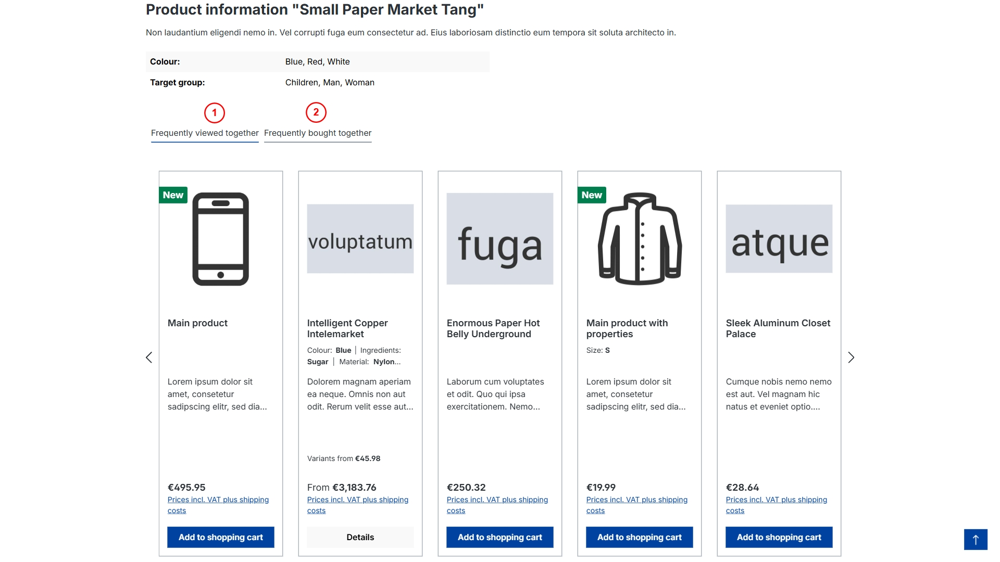
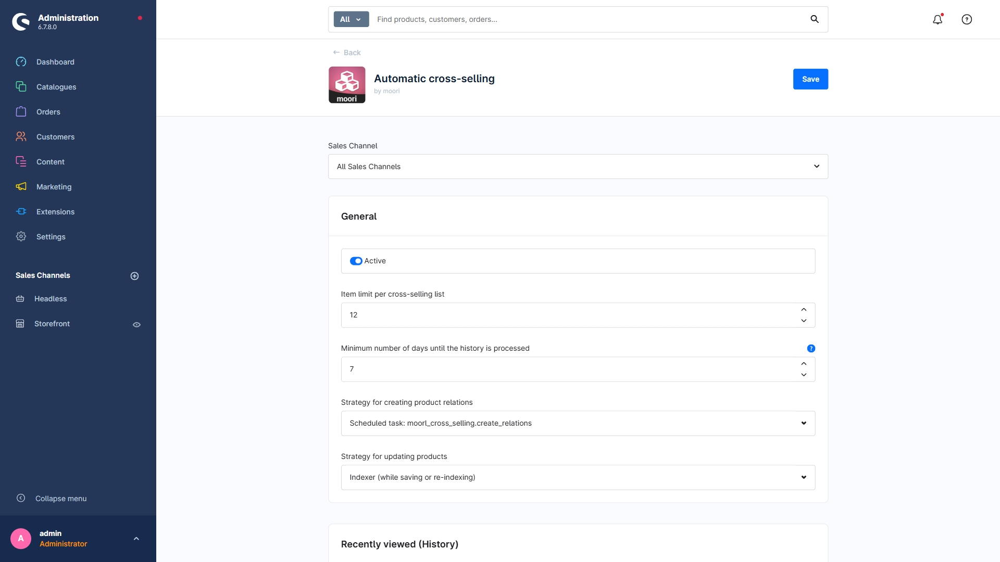
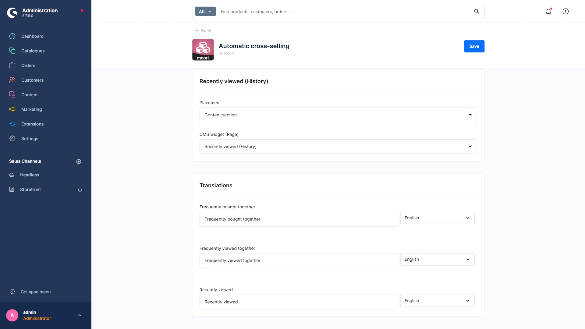
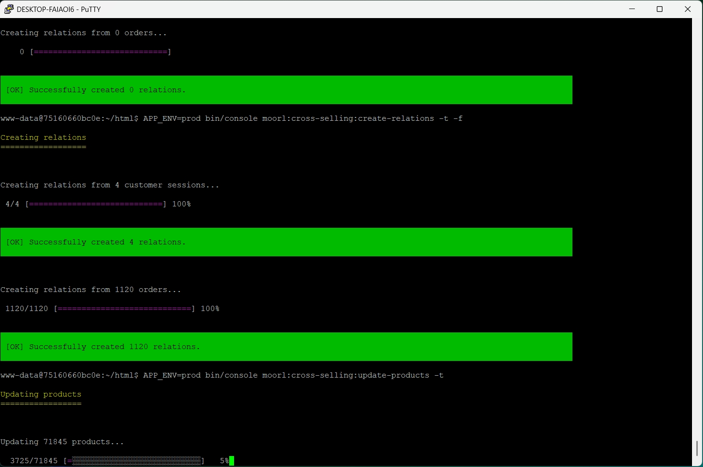
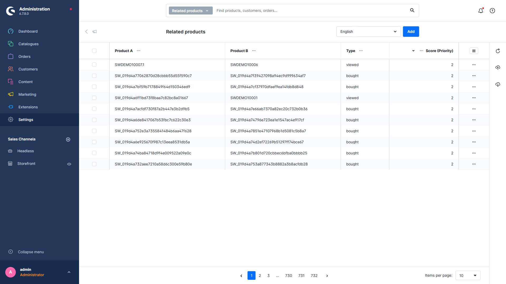
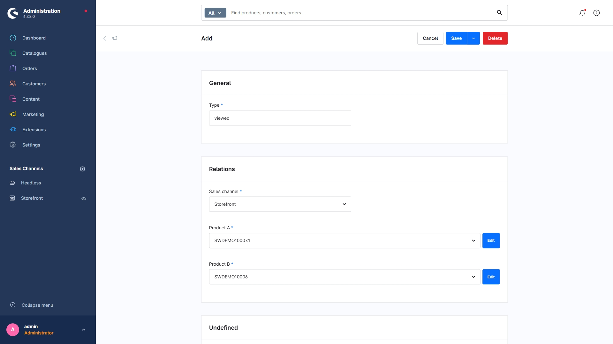
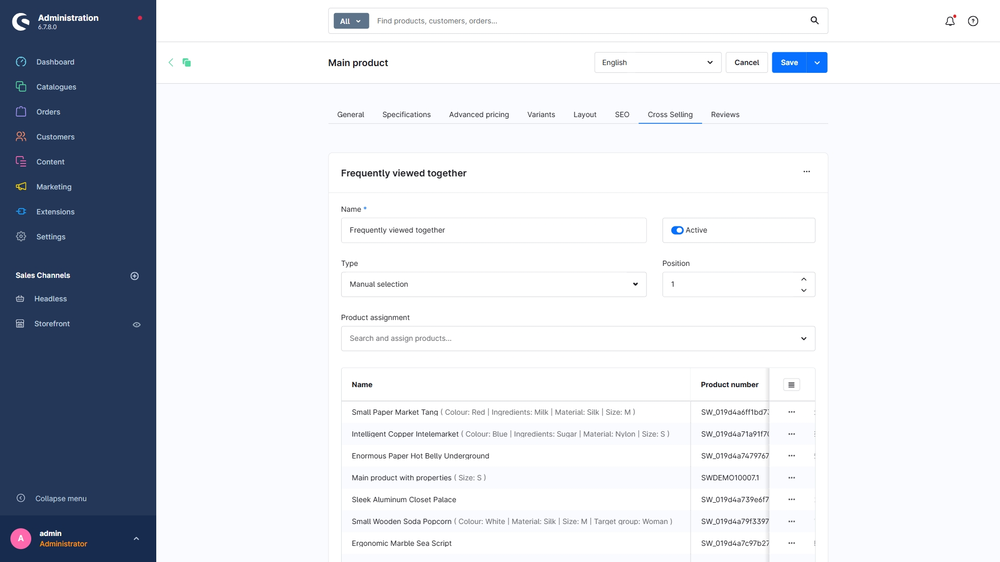
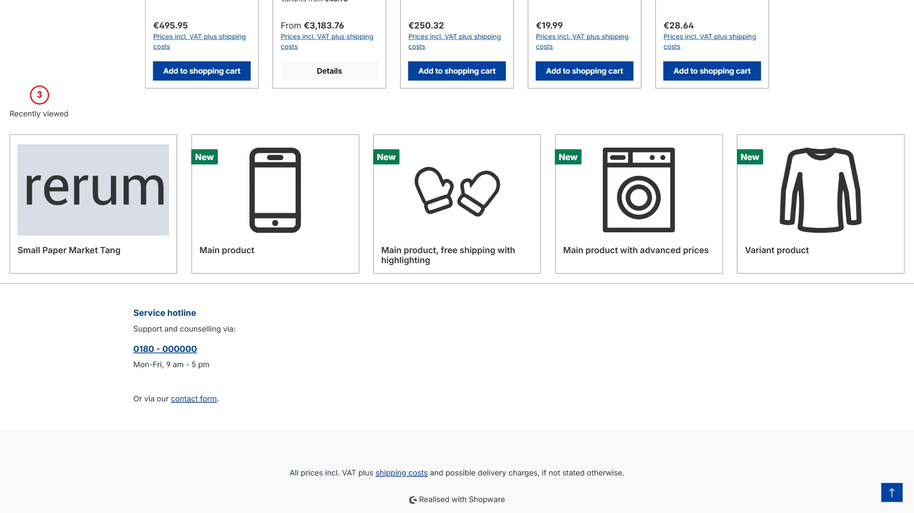

# Automatisches Cross-Selling

Dieses Plugin erfasst Seitenaufrufe auf Produktseiten und Bestellungen. Auf Grundlage der gesammelten Daten werden automatisch Cross-Selling-Listen erstellt.



---

## Plugin erwerben

Dieses Plugin kann im offiziellen **Shopware Community Store** erworben werden.

- [Shopware Community Store](https://store.shopware.com/de/search?search=MoorlCrossSelling)


**Wichtiger Hinweis:** Sie benötigen das Foundation Plugin, welches Ihnen kostenlos zur Verfügung steht: [moori Foundation](../MoorlFoundation/index.md)


---

## Ersteinrichtung

### Plugin-Konfiguration

In der Plugin-Konfiguration befinden sich alle notwendigen Einstellungen, um mit der Generierung von Cross-Selling-Listen zu starten.





#### Konfiguration

- **Aktiv**: Das Plugin ist für den aktuellen Verkaufskanal aktiv.
- **Artikelbegrenzung pro Cross-Selling-Liste**: Die generierten Listen werden auf diesen Wert begrenzt.
- **Mindestanzahl an Tagen, bis der Verlauf verarbeitet wird**: Bleibt der Kunde während dieses Zeitraums inaktiv, wird der Verlauf verarbeitet und gelöscht.
- **Strategie zum Aufbau von Produktbeziehungen**: Automatisch per geplanter Aufgabe oder über den Konsolenbefehl `bin/console moorl:cross-selling:create-relations`
- **Strategie zum Aktualisieren von Produkten**: Automatisch per Indexierung oder über den Konsolenbefehl `bin/console moorl:cross-selling:update-products`

#### Zuletzt angesehen (Verlauf)

- **Platzierung**: Wählen Sie eine Platzierung oder **Deaktiviert**.
- **CMS-Widget (Seite)**: Das CMS-Widget mit dem Slider wird per AJAX geladen. Die Einstellungen können auf der gleichnamigen CMS-Seite angepasst werden.

#### Übersetzungen

Hier werden die Titel der Cross-Selling-Listen in allen Sprachen konfiguriert. Ist keine Konfiguration vorhanden, wird die Systemsprache als Fallback verwendet.

### Konsolenbefehle

Die Erfassung und Auswertung der Daten über geplante Aufgaben und Indexierung kann viel Zeit in Anspruch nehmen. Um sofort brauchbare Listen zu erstellen, können Sie die Konsolenbefehle verwenden.



#### Schritt 1: Zusammenhänge erkennen und erstellen

In diesem Schritt werden alle Bestellungen und Kundensitzungen eingelesen und ausgewertet.

**Hinweis**: Kundensitzungen werden gemäß Plugin-Einstellung erst nach 7 Tagen Inaktivität ausgewertet. Der Grund dafür ist, dass der Verlauf des Kunden zurückgesetzt und anschließend ein neuer Verlauf erstellt wird.

Führen Sie folgenden Befehl aus:

```bash
bin/console moorl:cross-selling:create-relations
```

Über die Hauptnavigation im Admin unter `Einstellungen` → `Verbundene Produkte` können Sie prüfen, ob der Befehl die Datensätze korrekt angelegt hat.





#### Schritt 2: Cross-Selling-Listen erstellen

Mit folgendem Befehl werden die Cross-Selling-Listen erstellt:

```bash
bin/console moorl:cross-selling:update-products
```

Optional können die bestehenden Cross-Selling-Listen vor der Neuerstellung entfernt werden:

```bash
bin/console moorl:cross-selling:update-products -t
```

Sobald die Cross-Selling-Listen erstellt wurden, sind diese am Produkt sichtbar:



#### Schritt 3: Cache leeren

Anschließend wird der Cache geleert, damit die Änderungen im Storefront sichtbar werden:

```bash
bin/console cache:clear
```

## Darstellung im Storefront




1. **Häufig zusammen angesehen**: Diese Liste basiert auf allen Kundensitzungen.
2. **Häufig zusammen gekauft**: Diese Liste basiert auf allen Bestellungen.
3. **Zuletzt angesehen**: Diese Liste basiert auf der aktuellen Kundensitzung.
