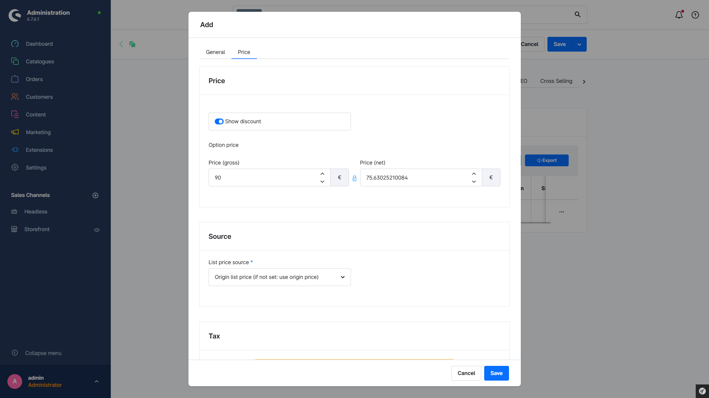
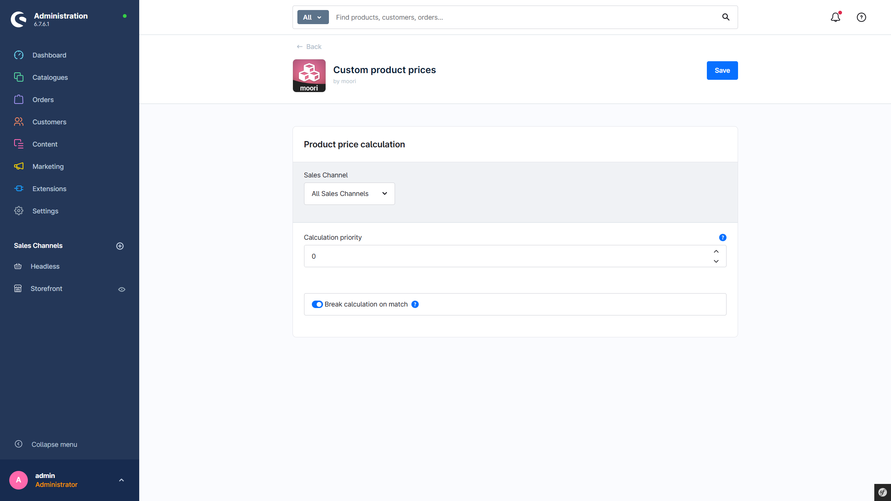
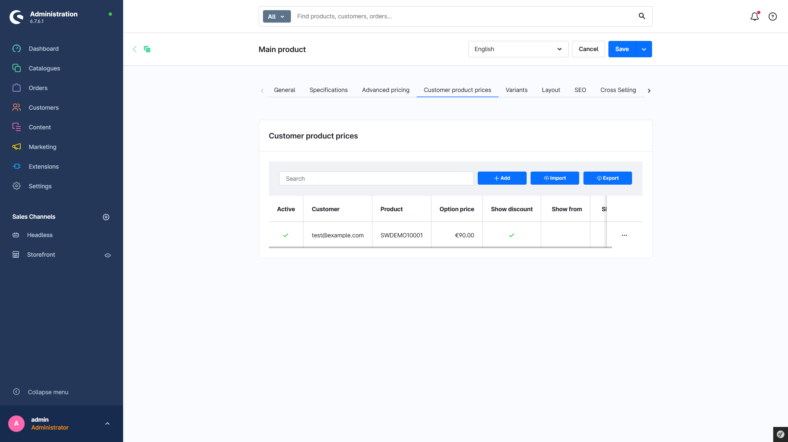
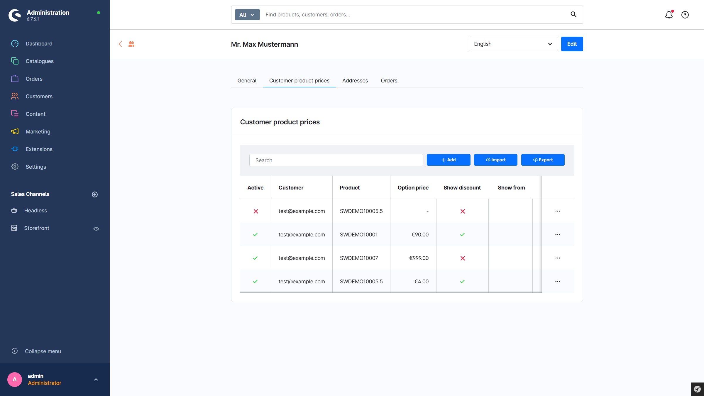
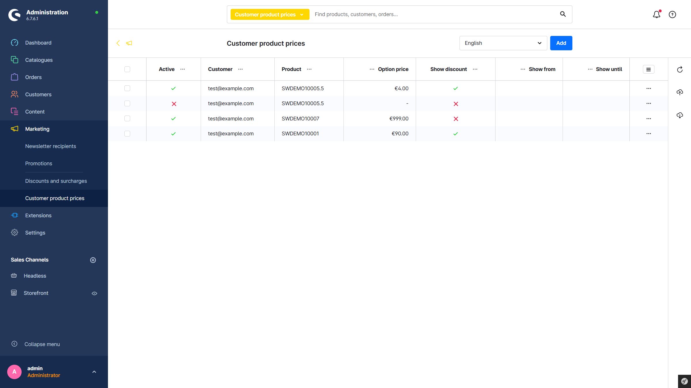
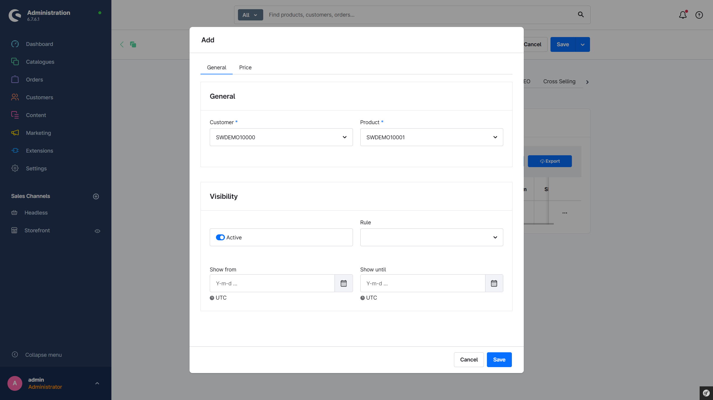

# Custom product prices

This simple and user-friendly plugin allows you to adjust product prices specifically for different customers - This allows for flexible pricing structures.

---

## Purchase the Plugin

This plugin can be purchased in the **Shopware Community Store**.

- [Shopware Community Store](https://store.shopware.com/en/search?search=MoorlCustomerPrices)

**Important note:** You need the Foundation Plugin, which is available free of charge: [moori Foundation](../MoorlFoundation/index.md)

---

## Initial Setup

### Plugin Configuration

1. Calculation priority: If other plugins are used that are involved in price calculation, the priority can be set here. The higher the priority, the earlier the price is calculated by this plugin.
2. Stop calculation after a match here: If other plugins are used that are involved in price calculation, this defines whether the calculation should continue. For example, fixed prices often have a higher priority; after that, no further price calculations should be performed.

## Setting a customer-specific price

### From the product perspective

Open a product in the admin and click on the tab `Customer-specific product prices`. There, a new entry can be created by selecting a customer and setting a price.

### From the customer perspective

Open a customer in the admin and click on the tab `Customer-specific product prices`. There, a new entry can be created by selecting a product and setting a price.

### General overview

Via the main navigation in the admin: `Marketing` → `Customer-specific product prices`, there is an overview of all created entries. Here you can create new entries or delete existing ones.

### Input form

In addition to assigning the product, the customer, and the price, you can also define a time window during which the specified price is valid. In addition to the time window, a rule can also be used.

In the price settings, a tax rate is required to correctly display the price as gross and net. Additionally, the old base price or the old list price can be used as the new list price.

