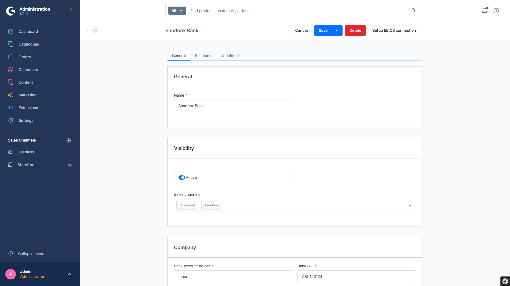

# EBICS 3.0 BankConnect

Dieses Plugin bietet eine nahtlose und unabhängige Integration zu der EBICS-Schnittstelle Ihrer Hausbank. Automatischer Abgleich von SEPA-Lastschriften und Zahlungen via Vorkasse.

---

## Plugin erwerben

Das Plugin kann in den folgenden Stores erworben werden. Wenn Sie bereits einen Shopware-Account besitzen, nutzen Sie bitte **immer zuerst** den Link zum **Shopware Community Store**, da es bei alternativen Stores zu Problemen mit der Lizenzierung kommen kann. Ist ein Plugin **nicht** im Shopware Community Store verfügbar, wird es exklusiv in einem der alternativen Stores angeboten.

- [Shopware Community Store](https://store.shopware.com/de/search?search=MoorlEbics) *(empfohlen)*
- [moori Plugin Store](https://moori-plugin-store.com/MoorlEbics)
- [Shopelfen Store](https://www.shopelfen.de/) *(im Aufbau)*

**Wichtiger Hinweis:** Sie benötigen das Foundation Plugin, welches Ihnen kostenlos zur Verfügung steht: [moori Foundation](../MoorlFoundation/index.md)

---

## Ersteinrichtung

### Checkliste

#### EBICS 3.0 bei der Bank beantragen

Folgende Geschäftsvorfälle werden benötigt:

> _Es können Einrichtungs- und monatliche Gebühren anfallen._

1. Mindestanforderungen:
   - Kurzfristige Vormerkposten (camt.052) - ServiceName: `STM`, Scope: `DE`, MsgName: `camt.052`, Container: `ZIP`
   - Tagesauszüge (camt.053) - ServiceName: `EOP`, Scope: `DE`, MsgName: `camt.053`, Container: `ZIP`

2. Optional: Lastschrift (Gläubiger ID von der Bundesbank kann später beantragt werden)
   - SEPA-Lastschrift (Basis) - ServiceName: `SDD`, ServiceOption: `COR`, MsgName: `pain.008`

3. Optional: Überweisung (Für Rückerstattungen)
    - SEPA-Überweisung - ServiceName: `SCT`, MsgName: `pain.001`

> ❗ Empfehlung: Option 3. stellt ein Sicherheitsrisiko dar, wenn das EBICS-Konto nicht im Vier-Augen-Prinzip arbeitet (VEU). Bei Nichtgebrauch explizit ausschließen!

#### Gläubiger ID beantragen

Die Gläubiger ID ist essenziell für SEPA-Lastschriften, die Beantragung läuft vollständig online. Die Bearbeitungszeit beträgt meistens zu wenige Werktage. 

<http://www.glaeubiger-id.bundesbank.de>

### Einrichtung der Bank

1. **Bankeinstellungen öffnen**  
   Navigieren Sie zu **Einstellungen → EBICS Banken**.

2. **Keyring-Passwort setzen**  
   Bevor Sie Ihre Bank einrichten, müssen Sie ein globales Passwort zur Verschlüsselung Ihrer EBICS-Dateien festlegen:
    - Klicken Sie oben rechts auf **Keyring-Passwort erstellen oder ändern**
    - Vergeben Sie ein **sechsstelliges Passwort**

3. **Bank hinzufügen**
    - Klicken Sie oben rechts auf **Hinzufügen**
    - Füllen Sie alle Pflichtfelder aus (Kunden-ID, Teilnehmer-ID, URL des EBICS-Servers etc.)

4. **Verbindung initialisieren**  
   Die Initialisierung erfolgt in mehreren Schritten:

    1. **Keyring-Datei anlegen**
        - Eine verschlüsselte Schlüsselbund-Datei wird erstellt.

    2. **INI- und HIA-Anfrage senden**
        - Ihre öffentlichen Schlüssel werden an die Bank übertragen.
        - **Fehler an dieser Stelle:** Prüfen Sie, ob Ihr EBICS-Zugang bereits freigeschaltet ist und ob Kunden-ID und Teilnehmer-ID korrekt eingetragen sind.

    3. **INI-Brief erzeugen**
        - Das Plugin erstellt ein PDF mit den Schlüssel-Hashes.
        - Dieses Dokument muss von einer berechtigten Person unterschrieben und an die Bank übermittelt werden.
        - **Hinweis:** Bei Testzugängen ist dieser Schritt häufig nicht erforderlich.

    4. **HPB-Anfrage senden**
        - Die öffentlichen Bankschlüssel werden abgerufen und in der Keyring-Datei gespeichert.
        - Nach erfolgreicher HPB-Anfrage ist die Verbindung zur Bank aktiv.

> 💡 **Tipp:** Es wird stets die letzte Fehlermeldung der Bank angezeigt.  
> Sobald keine Fehlermeldung mehr erscheint, wurde der Zugang erfolgreich eingerichtet.

5. **Optionale Felder ausfüllen**
    - Hinterlegen Sie eine Gläubiger-Identifikationsnummer, falls Sie SEPA-Lastschriften nutzen möchten
    - Weisen Sie alle relevanten Zahlungsarten zu (z. B. Vorkasse, Rechnung, SEPA-Lastschrift)

---

### Plugin-Einstellungen

- Weisen Sie den Zahlungsarten explizit ihren Verwendungszweck zu.
- Achten Sie darauf, **keine Zahlungsart doppelt** zuzuweisen.

---

## Technischer Hinweis

Das Plugin verwendet die Standard-Status von Shopware:

- `open`
- `authorized`
- `paid`
- `refunded`
- `chargeback`
- `failed`

> ❗ Benutzerdefinierte Status werden **nicht unterstützt**.

Zusätzliche Hinweise:

- Welche Geschäftsvorfälle verfügbar sind, hängt von Ihrer Bank ab.  
  Nicht unterstützte Aufträge führen zu einer Fehlermeldung.
- **Direktfreigaben** für Auszahlungen (Rückerstattungen) sind nur mit **Einzelunterschrift** möglich.  
  Für eine Freigabe nach dem Vier-Augen-Prinzip ist ein externer EBICS-Client (z. B. SFirm) erforderlich.
- **SEPA-Lastschriftmandate** können nur erstellt werden, wenn eine gültige Gläubiger-Identifikationsnummer in den Bankeinstellungen hinterlegt ist.  
  Andernfalls werden diese Bestellungen abgebrochen.
- **Logs:** Sie können sämtliche Vorgänge in den Protokolldateien unter `var/logs/moorl_ebics_*.log` nachverfolgen.
