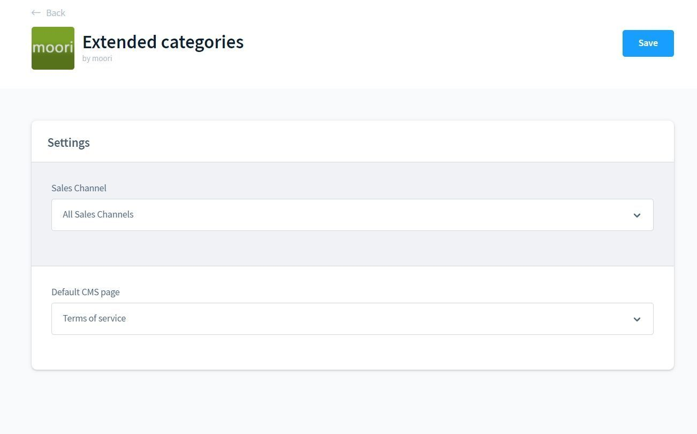
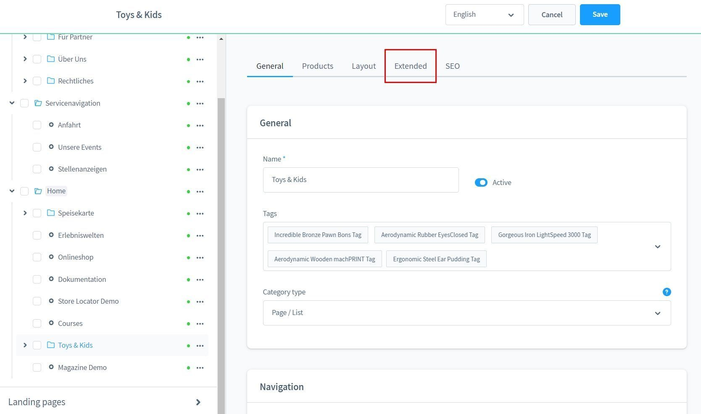

# Extended Categories

With this plugin for Shopware 6 you can control the visibility and the CMS pages of your categories
by sales channel or customer group.

## Description

Often one would like to use the category tree for several sales channels, but it is currently not possible,
that you can display different CMS pages in the category depending on the sales channel.

Sometimes you do not want to display certain categories in the current sales channel at all.

These requirements force the shop operator to duplicate and adapt the entire category structure.
On the one hand, this results in a high maintenance effort, the categories have to be maintained redundantly,
the SEO urls of the categories no longer fit and the performance of the shop decreases.

For this scenario, I have developed the plugin "Extended Categories".

As a small remedy, you can also define a standard CMS page for all categories. This is
useful, for example, if you have many category pages with the same layout.

Another little extra is that you can control category pages and their CMS content on a customer group.

Note: The category-specific content configuration (Slot-Config) is currently not
possible with this plugin. This update requires a commission in individual cases.

## Installation

Note: If you have any problems with the plugin, please note
the following [notes](../faq.md) in the FAQ section.

1. install
   [Foundation](../MoorlFoundation/index.md)
2. install "Extended Categories" in the Plugin Manager

## Configuration

In the plugin settings, you can define a standard CMS page as a fallback.

In the category settings you can reach the specific settings via the tab "Extended".

Here you will find a list with the extended category settings.

The following settings are possible here:

- Active: The category is active for the selected sales channel or customer group.
- Visible: The category is visible for the selected sales channel or customer group in the main navigation.
- Sales channel: Defines the sales channel for the extended setting
- Customer Group: Defines the customer group for the extended setting.
- CMS Page: Overwrites the CMS page for the selected sales channel or customer group.

Attention: As soon as you define a customer group or a sales channel. This category is
inactive for all further definitions. Please create further definitions for the remaining sales channels
or customer groups!
