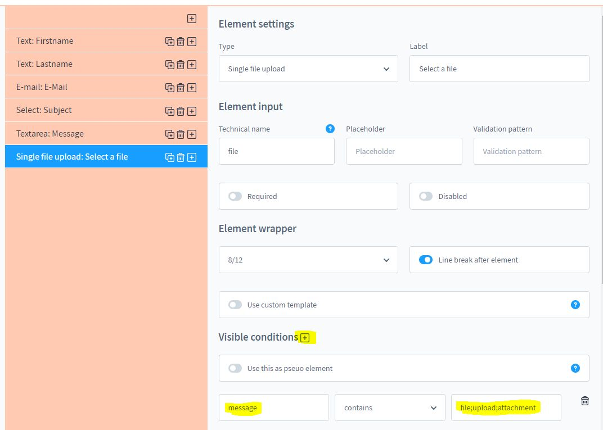
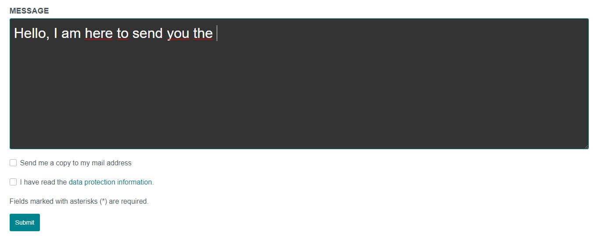
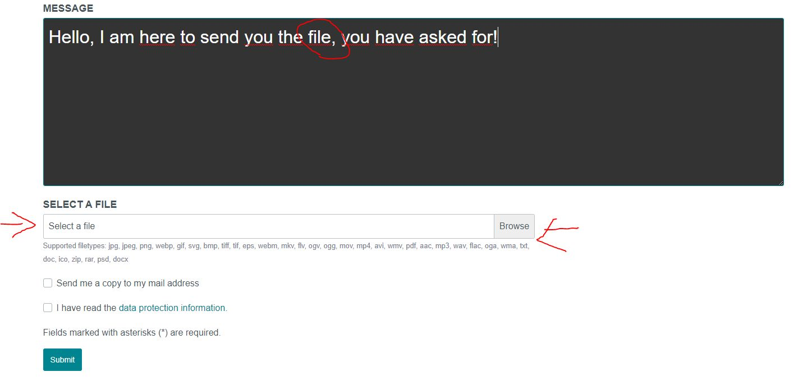
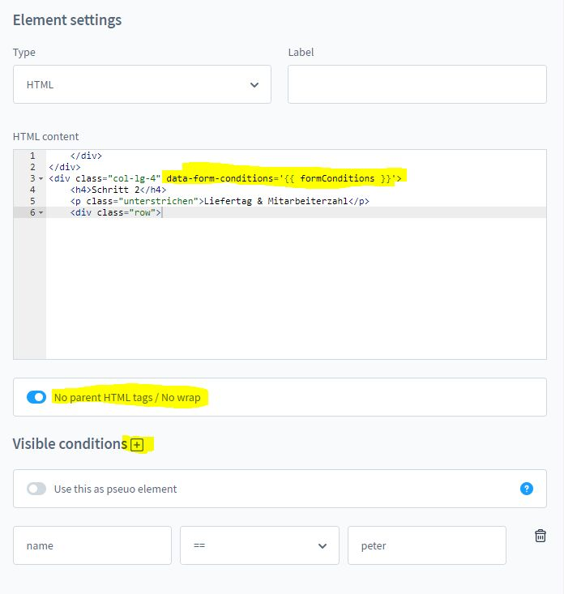
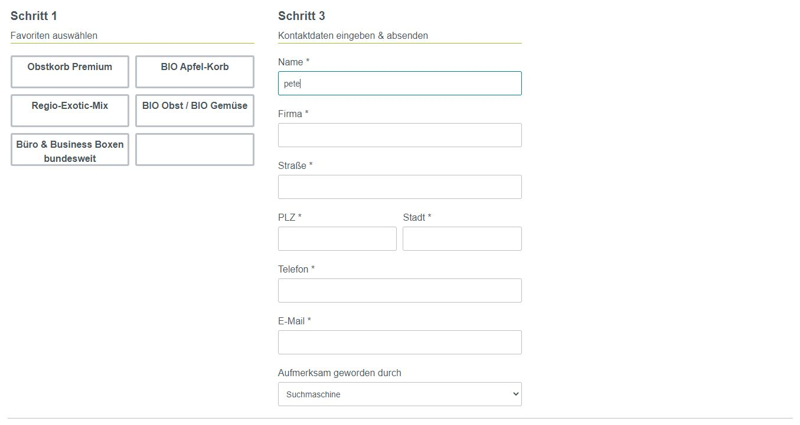
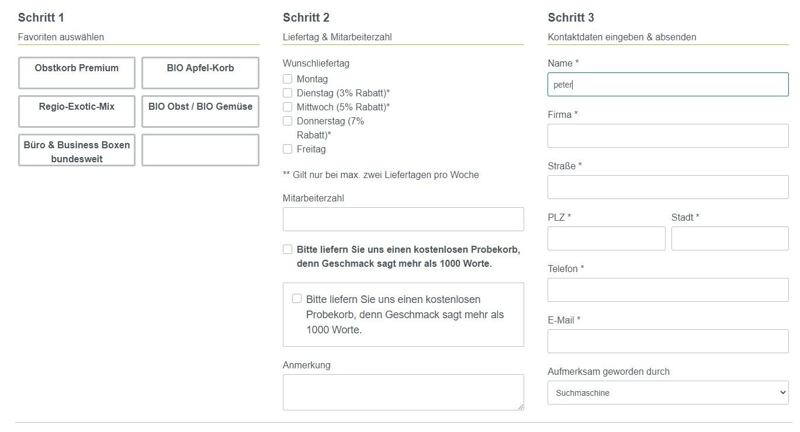

# Formular Baukasten | Interaktive Formulare

### Vorwort

Je nach Anforderung können einige Formulare schon etwas größer ausfallen.
Soetwas kann für Verwirrung sorgen und ggf. vergeht dem Kunden auch die Motivation
ein Formular bis zum Ende hin auszufüllen.

Ein interaktives Formular kann viel kleiner ausfallen, weil hier je nach Anforderung
Eingabefelder ein- oder ausgeblendet werden.

Dieses Plugin unterstützt solche Interaktive Formulare in den Grundlegenden Funktionen.
Dazu werden nachfoldend Beispiele aufegührt, wie man ein solches Formular im Admin Bereich
konfiguriert.

### Beispiel 1 - Eingabefelder

Hier zeige ich Ihnen anhand einer Konfiguration, wie man ein Upload Feld ein- oder
ausblendet anhand eines Keywords.

#### Konfiguration



#### Ergebnis

Ohne Keyword:



Mit Keyword:



### Beispiel 2 - Ganze Bereiche

Es ist auch möglich ganze Bereiche per HTML zu wrappen, dazu kann man eigenes HTML
verwenden um einen Bereich zu öffnen und zu schließen.

Dazu sind folgende Regeln zu beachten:

1. Checkbox (Keine Eltern Elemente) muss angeklickt sein

2. im HTML muss das Attribut ``data-form-conditions='{{ formConditions }}'`` eingefügt werden

#### Konfiguration



#### Ergebnis

Ohne Keyword:



Mit Keyword:



#### Spezial Feature

Es können ab Version 1.3.8 eigene Templates für das jeweilige Formular 
Element eingebunden werden. Der Pfad des Elements ist frei wählbar.

Idealerweise wird dieses Template in einem zusätzlichen Plugin abgelegt.

So könnte das Template aussehen:

````twig
<div class="form-group form-{{ formElement.type }}-{{ formElement.name }}">
    <label class="form-label"
           for="form-{{ formElement.name }}">{{ formElementLabel }} *</label>
    
        <select name="{{ formElement.name }}"
                id="form-{{ formElement.name }}"
                required
                class="form-control">
            
                <option value="" disabled selected>{{ formElement.placeholder[app.request.locale] }}</option>
            
            
                
                <option style="display: none;"
                        data-form-filter-parent="categoryId"
                        data-form-filter-keywords="{{ option.entity.categories.first.path }}"
                        value="{{ option.value }}"
                        disabled
                        selected>
                    {{ optionLabel }}
                </option>
            
        </select>
    
    
</div>
````

Dieses Template fragt mit dem Attribut `data-form-filter-parent` den Wert eines
anderen Form Elementes ab. Sobald das andere Form Element geändert wird, vergleicht
das Plugin diesen Wert mit den Keywords in `data-form-filter-keywords`. Bei einem
Treffer wird die Option sichtbar und das Element kann genutzt werden.

In diesem Beispiel werden übrigens die `CriteriaEvents` des Plugins genutzt um in dem 
Auswahlweld mit dem Namen `categoryId` Kategorien zu laden und im nachfolgendem
Element `productId` ein Auswahlfeld mit allen in dieser Kategorie befindlichen Produkten zu listen.

````php
<?php declare(strict_types=1);

namespace MyPlugin\Subscriber;

use MoorlFormBuilder\Core\Event\AutocompleteCriteriaEvent;
use MoorlFormBuilder\Core\Event\FormOptionCriteriaEvent;
use Shopware\Core\Framework\DataAbstractionLayer\Search\Filter\EqualsFilter;
use Shopware\Core\System\SystemConfig\SystemConfigService;
use Symfony\Component\EventDispatcher\EventSubscriberInterface;

class Frontend implements EventSubscriberInterface
{
    /**
     * @var SystemConfigService
     */
    private $systemConfigService;

    public function __construct(
        SystemConfigService $systemConfigService
    ) {
        $this->systemConfigService = $systemConfigService;
    }

    public static function getSubscribedEvents(): array
    {
        return [
            FormOptionCriteriaEvent::class => 'onFormOptionCriteria',
            AutocompleteCriteriaEvent::class => 'onAutocompleteCriteria'
        ];
    }

    public function onAutocompleteCriteria(AutocompleteCriteriaEvent $event) {
        $el = $event->getElement();

        if ($el['name'] == 'productName') {
            $criteria = $event->getCriteria();
            $criteria->addAssociation('categories');
            $criteria->addFilter(new EqualsFilter('active', true));
            $criteria->addFilter(new EqualsFilter('parentId', null)); // Keine Varianten anzeigen
        }
    }

    public function onFormOptionCriteria(FormOptionCriteriaEvent $event)
    {
        $el = $event->getElement();

        switch ($el['name']) {
            case 'categoryId':
                $parentId = $this->systemConfigService->get('MyPlugin.config.category');
                $criteria = $event->getCriteria();
                $criteria->addFilter(new EqualsFilter('active', true));
                $criteria->addFilter(new EqualsFilter('parentId', $parentId));
                break;
            case 'productId':
                $criteria = $event->getCriteria();
                $criteria->addAssociation('categories');
                $criteria->addFilter(new EqualsFilter('active', true));
                $criteria->addFilter(new EqualsFilter('parentId', null)); // Keine Varianten anzeigen
                break;
        }
    }
}
````
