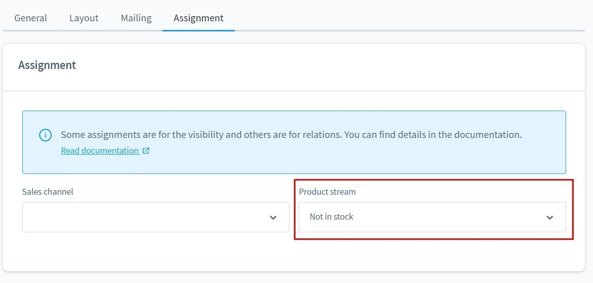

# Form Builder 2 | How-To

## Insert form into Twig template

**Basic version**

For theme developers and programmers, there is a special Twig snippet to integrate self-created forms directly into a template.

Simply use the snippet ````.

You can pass the technical name or the exact ID of the form as a parameter.

## Use SVG icons in input fields

**Basic version**

You can use SVG icons inside the input fields. The moori Foundation Plugin already provides suitable SVG icons from the FontAwesome 5 package.


Enter `icon|<pack>|<name>`.

- pack: Name of the icon package, e.g. far, fas, fab (FontAwesome 5), fa6r, fa6s, fa6b (FontAwesome 6) or solid, regular (Shopware)
- name: Name of the icon

To determine the appropriate name, go to the following pages:

- FontAwesome 5: [https://fontawesome.com/v5/search](https://fontawesome.com/v5/search)
- FontAwesome 6: [https://fontawesome.com/search](https://fontawesome.com/search)
- Shopware: [https://component-library.shopware.com/icons/](https://component-library.shopware.com/icons/)


## Fill database with forms

**Basic version**

You can write your own database entries in Shopware 6 with the help of the Form Builder 2.

Useful features are available for this purpose. To do this, go to the "Assignment" tab in the form settings and select a table.


Then you can assign an input field to a table column.


Please make sure that you mark mandatory fields accordingly.

You can find an example form here: [Entity mapping form](examples/entity-mapping-form.json)

## Individualise send button

**Basic version**

You can give the send button its own stylesheet classes.

To do this, go to the "Stylesheet" tab and insert the desired classes accordingly.


## Use Twig and context variables as default value

**Basic version**

If the customer wants to make a product enquiry, for example, it makes things a little easier if the product number is already filled in on the form. It is much better if a customer who is already logged in does not have to fill in their personal data again in the form.

To do this, you can simply insert a Twig variable in the "Default value" field.

You could use the following example variables
```html
{{ context.customer.email }}
{{ page.product.productNumber }}
```


!!! note

    All variables containing the term "context" are usually personal customer data. The plugin loads these variables asynchronously, all other variables are saved in the HTTP cache.

## Product requests only for products that are not in stock

**Product Request Add-On**

With the Product Request Add-On you can assign matching forms using the dynamic product group.


Create a new dynamic product group with the rule `stock is less than 1`.


Deactivate the "Add to cart" button, your customer can now alternatively request the product.



In the form settings you make an assignment for the dynamic product group.

## Write custom fields for newsletter subscriptions

**Classic Add-On**

With the element "Nested fields" you can use structured input fields. With this you can also write custom fields for newsletter registration, among other things.

In Shopware itself, structured input fields can also be found in the addresses for customer registration.


Use the element "Nested Fields" and use the technical name `customFields`. There you create further input elements.


In the HTML view of the form we now see how the input element is named.


If the data was entered validly, the column `custom_fields` is filled with the correct data.

!!! note

    This function only supports input of type `string` and `boolean`.