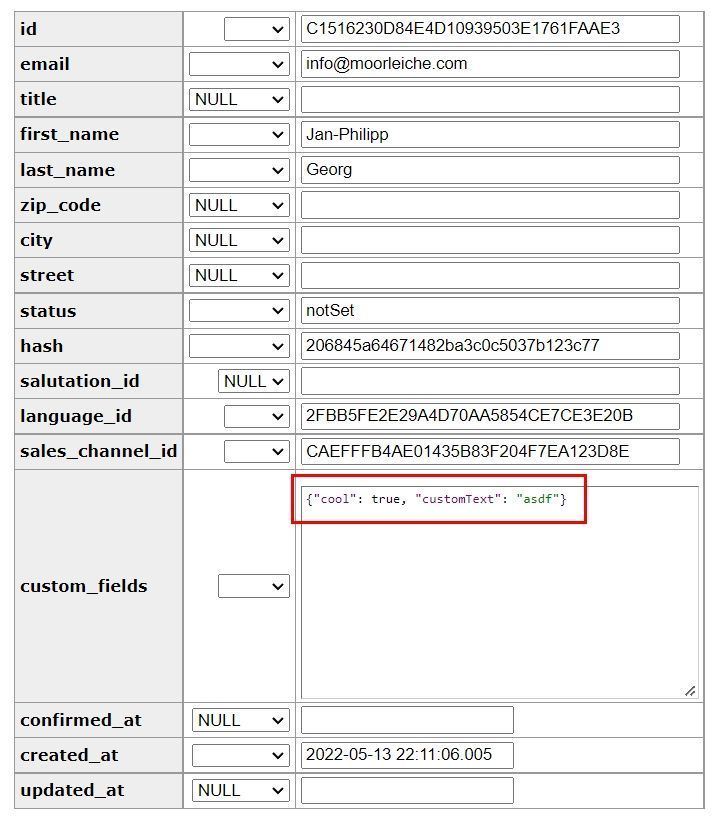

# Formular Baukasten 2 | Anleitungen

## In Eingabefeldern SVG Icons nutzen

**Basis Version**

Du kannst SVG Icons innerhalb der Eingabefelder nutzen. Dazu liefert das moori Foundation Plugin bereits passende SVG Icons aus dem FontAwesome 5 Paket.

Gib dazu `icon|<pack>|<name>` ein.

- pack: Name des Icon-Pakets, z.B. far, fas, fab (FontAwesome 5) oder solid, regular (Shopware)
- name: Name des Icons

Um den passenden Namen zu ermitteln, gehe dazu auf folgende Seiten:

- FontAwesome 5: [https://fontawesome.com/v5/search](https://fontawesome.com/v5/search)
- Shopware: [https://component-library.shopware.com/icons/](https://component-library.shopware.com/icons/)

## Produkt Anfragen nur für Produkte, die nicht lagernd sind

**Produkt-Anfrage Add-On**

Mit dem Produkt-Anfrage Add-On kannst du mithilfe der dynamischen Produktgruppe passende Formulare zuweisen.

Lege eine neue dynamische Produktgruppe mit der Regel `Lagerbestand ist kleiner als 1` an.

Deaktiviere den "In den Warenkorb" Button, dein Kunde kann nun Alternativ das Produkt anfragen.

In den Formular-Einstellungen machst du eine Zuweisung für die dynamische Produktgruppe.

## Custom-Felder für Newsletter-Anmeldungen schreiben

**Classic Add-On**

Mit dem Element "Verschachtelte Felder" lassen sich strukturierte Eingabefelder nutzen. Damit kannst du unter anderem auch Custom-Felder für die Newsletter-Anmeldung schreiben.

In Shopware selbst kommen strukturierte Eingabefelder unter anderem auch in den Adressen der Kunden-Registrierung vor.

Verwende das Element "Verschachtelte Felder" und nutze den technischen Namen `customFields`. Darin erstellst du weitere Eingabe-Elemente.

In der HTML Ansicht des Formulars sehen wir nun wie das Eingabe-Element benannt ist.

Sofern die Daten valide eingegeben wurden, ist die Spalte `custom_fields` mit den richtigen Daten befüllt.

!!! note

    Diese Funktion unterstüzt ausschließlich Eingaben vom typ `string` und `boolean`.