# Formular Baukasten 2 | Basis Version

Dieses Plugin basiert auf einer grundlegenden Neuentwicklung des
[Formular Baukastens](../MoorlFormBuilder/index.md) und bietet maximale
Flexibilität und Integrität für Shopware 6.

!!! note "Hinweis für alle Kunden, die den Formular Baukasten bereits besitzen"

    Dieses Plugin ist grundlegend anders aufgebaut und bietet keine Möglichkeit, die bisherigen Formulare zu migrieren.
          
    Leider ist es nach Absprache mit Shopware auch nicht möglich die Subscriptions zu duplizieren/übertragen.
          
    Da ich meinen bisherigen Kunden keinen Nachteil schaffen möchte, wird der Formular Baukasten weiterhin mit Updates versorgt. Aber es werden keine neuen Funktionen mehr entwickelt.
          
    Für alle Interessenten mit aktiven Subscriptions biete ich einen 50% Gutschein für Basis und Add-Ons.
    
    Der Gutschein wird individuell ausgestellt und ist nicht mit Rabattaktionen kommulierbar.

## Beispiel Formulare zum Download

- [Einfaches Kontaktformular](examples/simple-contact-form.json)
- [Entity Mapping Formular](examples/entity-mapping-form.json)

Weitere Beispiele findest du in der jeweiligen Dokumentation der Add-Ons!

## Add-Ons

Dieses Plugin wurde in seiner Basis Version um einige Funktionen gekürzt, damit es zu einem
erschwinglichen Preis angeboten werden kann. Alle weiteren Funktionen können durch Add-Ons
erlangt werden.

Es ist auch möglich eigene Add-Ons zu erstellen, dazu folgt demnächst eine Entwickler-Dokumentation.

1. [Classic Add-On](../MoorlFormsClassic/index.md): Beinhaltet alle Funktionen des [Formular Baukastens](../MoorlFormBuilder/index.md)
2. [Exit-Intent-Popups Add-On](../MoorlFormsPopup/index.md): Nutze Formulare als Popup
3. [Slides Add-On](../MoorlFormsSlides/index.md): Nutze Slides
4. [Kunden-Formulare Add-On](../MoorlFormsCustomer/index.md): Kundenspezifische Formulare für Registrierung und Kundenbereich
5. [Produkt-Konfigurator Add-On](../MoorlFormsCustomProducts/index.md): Zusätzliche Angaben zu Produkten inkl. Preiskalkulation
6. Order Add-On**: Zusätzliche Angaben zur Bestellung inkl. Preiskalkulation auf den Warenkorb
7. [Produkt-Anfrage Add-On](../MoorlFormsProduct/index.md): Produktspezifische Anfrage-Formulare
8. Kundenindividuelle Add-Ons auf Anfrage

(\* In Entwicklung, \*\* In Konzeptphase)

## Beispiel Add-On für Entwickler

[Beispiel Add-On](https://github.com/moorl/MoorlFormsExample)

## Wofür ist dieses Plugin gut?

Das Shopware 6 _Formular Baukasten 2_ Plugin ermöglicht es Kinderleicht komplexe Formulare mit eigenständigen
Aufgabenbereichen zu erstellen.

Es ist modular aufgebaut, so lassen sich Prozesse und einzelne Felder beliebig erweitern.

## Installation

!!! note

      Falls du Probleme mit dem Plugin hast, bitte beachte folgende [Hinweise](../) im FAQ Bereich.

1. Installiere
   [Foundation](../MoorlFoundation/index.md)
2. Installiere Formular Baukasten 2 im Plugin Manager
3. Gehe zu: Inhalte | Formular Baukasten 2
   
Hier kannst du nun ein neues Formular erstellen oder importieren.

## Einstellungen

### Basiskonfiguration

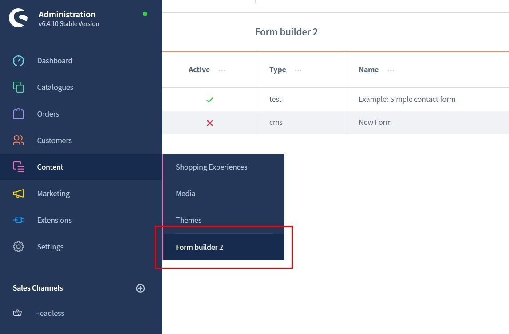

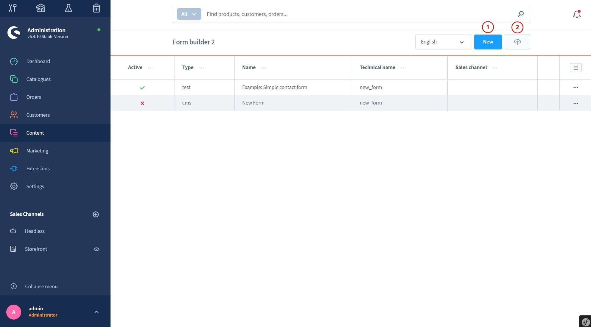

1. Neues Formular erstellen
2. Import

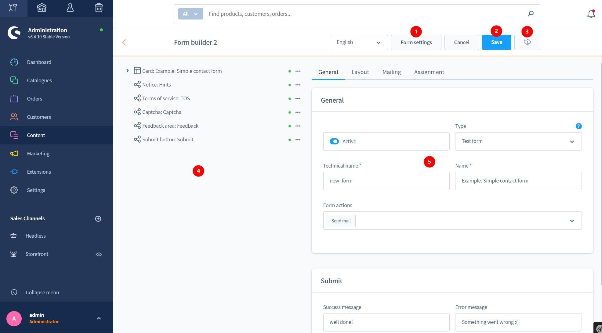

1. Formular Einstellungen
2. Formular speichern
3. Export
4. Strukturbereich der Formularelemente
5. Einstellungsbereich (Formular/Element)

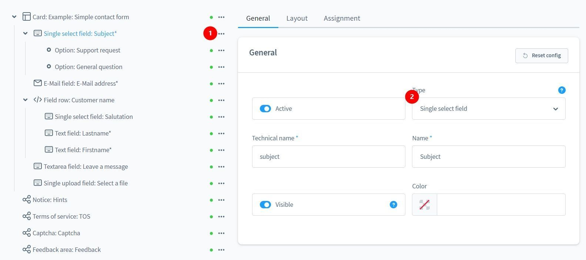

1. Kontextmenü zum Erstellen, Löschen oder Duplizieren von Elementen
2. Generelle Elementeinstellungen

### Einstellungen im Detail

#### Zuweisungen von Elementen und Formularen

Du kannst generell die Sichtbarkeit der Formulare und der Elemente hier konfigurieren.

Ein Formular/Element...

- nur in einem bestimmten Zeitraum anzeigen
- nur in einem bestimmten Verkaufskanal anzeigen
- nur für ein gewähltes Liefer-Land anzeigen
- nur für eine ausgewählte Versandart oder Zahlungsart anzeigen
- nur für eine bestimmte Kundengruppe anzeigen

Ein produktspezifisches Formular...

- kann einem Produkt-Stream zugewiesen werden

Ein Element der Gruppe Sektionen...

- kann hier einem Hintergrundbild zugewiesen werden

Einige dieser Zuweisungen sind nur in den Formular Baukasten 2 Add-Ons verfügbar!

#### Layout und Stylesheet Einstellungen

Du kannst jedem Formular/Element Stylesheet Attribute zuweisen.

Die CSS Optionen variieren je nach Typ des Formulares/Elementes.

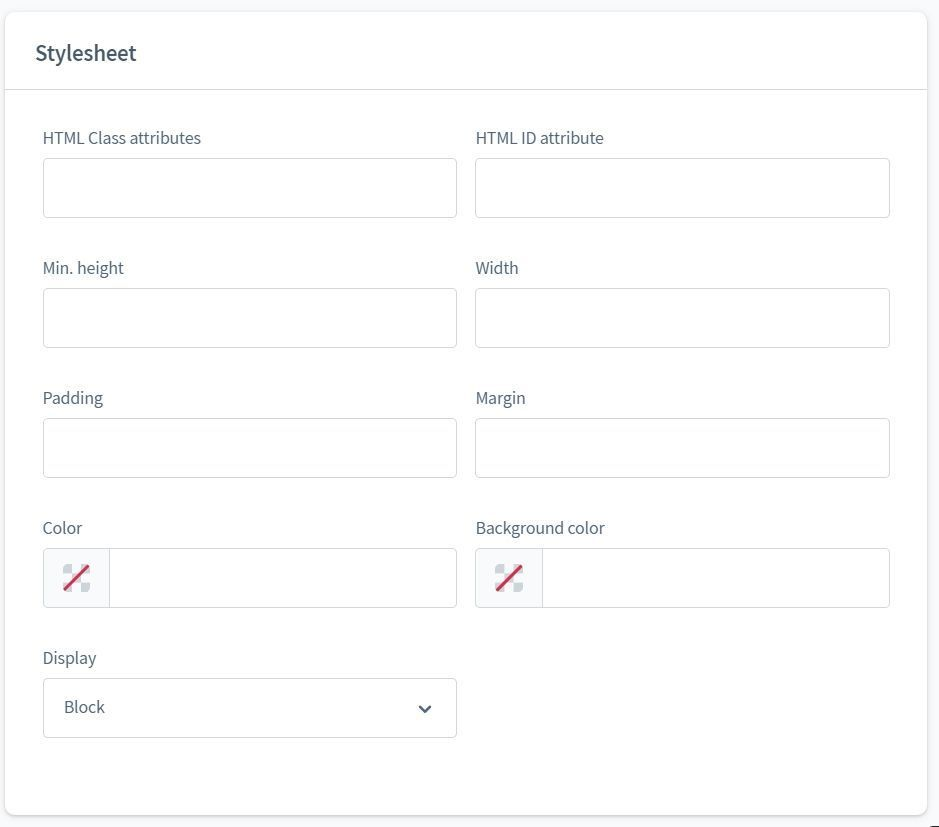

### Einstellungen für Elemente

#### Feld Konfiguration

Alle Elemente aus der Gruppe Feld und Multi-Feld können weitere Eigenschaften in dieser Konfiguration erhalten.

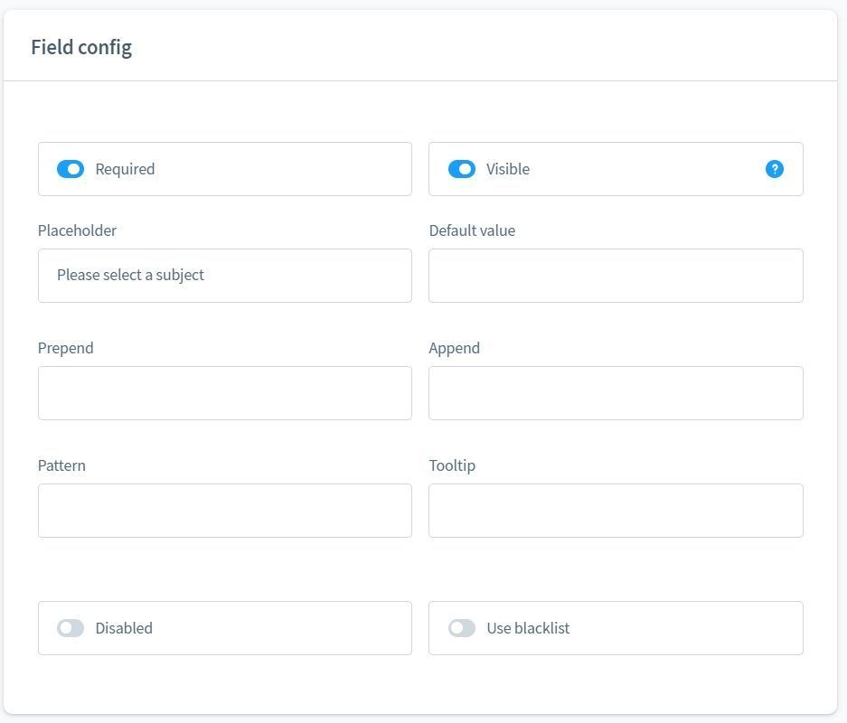

#### Auswahl Konfiguration

Alle Elemente aus der Gruppe Multi-Feld können Datenbankspezifische Werte erhalten. Durch Add-Ons werden hier mehr Möglichkeiten geboten.

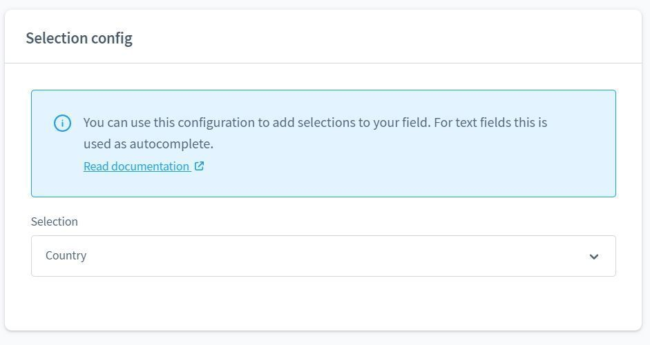

#### Responsives Verhalten

Sofern das Eltern-Element aus der Gruppe Zeilen/Rows ist, können alle darin enthaltenen Elemente responsive Eigenschaften erhalten.
Hierbei gilt die Regel "Mobile-First", es werden immer die Eigenschaften weiter vererbt.

Die Aufteilung ist wie folgt.

Viewport (xs bis xxl) | Vererbt (Ja/Nein) | Anzeigen (Ja/Nein) | Breite | Sortierung/Anordnung

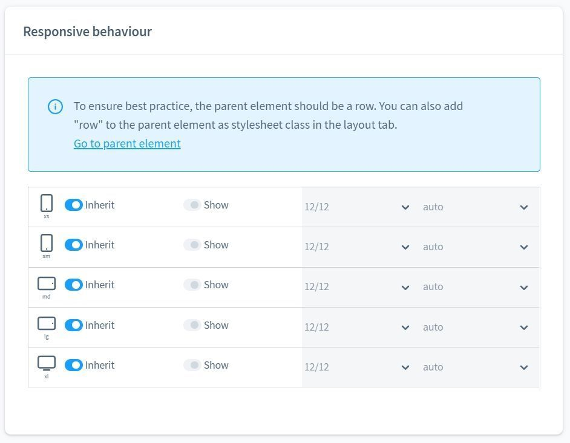

#### Konfiguration Upload Feld

#### Konfiguration Datum

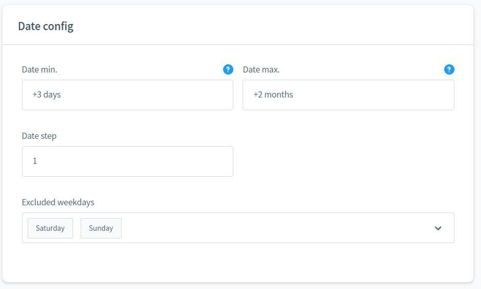

#### Konfiguration Uhrzeit

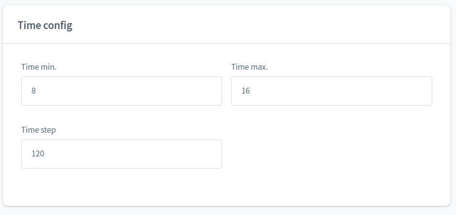

#### Konfiguration Nummer

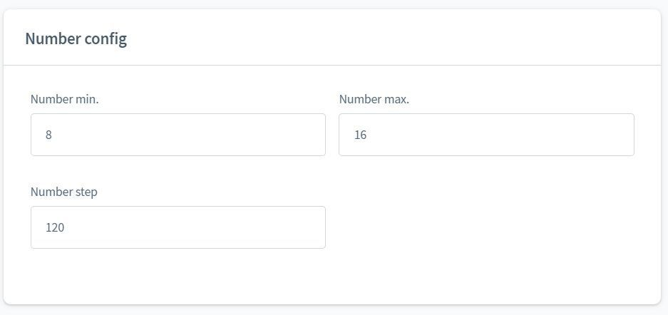

#### Konfiguration HTML (Sprachbezogen)

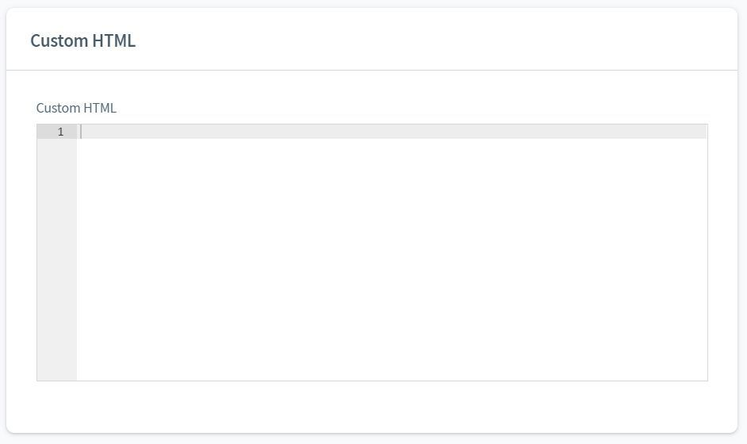

#### Konfiguration Card-Sektion

### Einstellungen für Formulare

#### Konfiguration E-Mail

Hier kann der E-Mail Empfänger konfiguriert werden. Ist kein Wert hinterlegt, wird die Standard E-Mail Adresse
des Shops genutzt.

Die Funktion "Kopie senden" und "Empfänger nach Auswahlbedingung" gibt es im Classic Add-On!

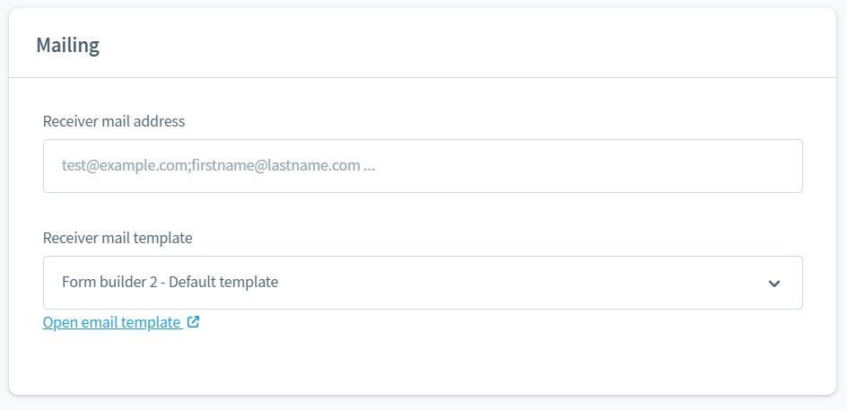

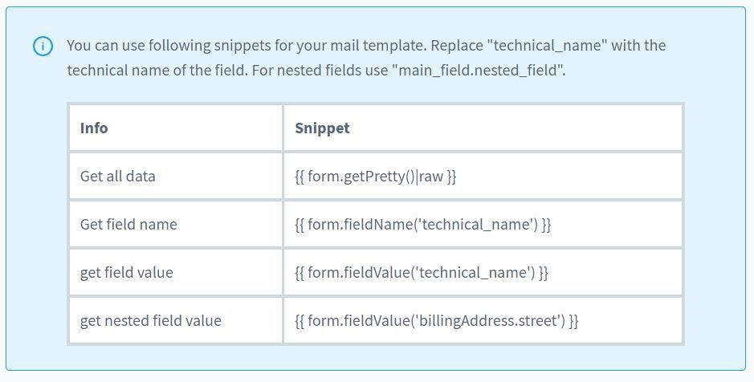

## CMS Einstellungen

Das Formular hat keinen eigenen Block, sondern ist über das "Element Austauschen"-Symbol erreichbar!

Nachdem das CMS Element eingefügt wurde, kann man Formulare vom Typ CMS oder Test der CMS Seite zuweisen.

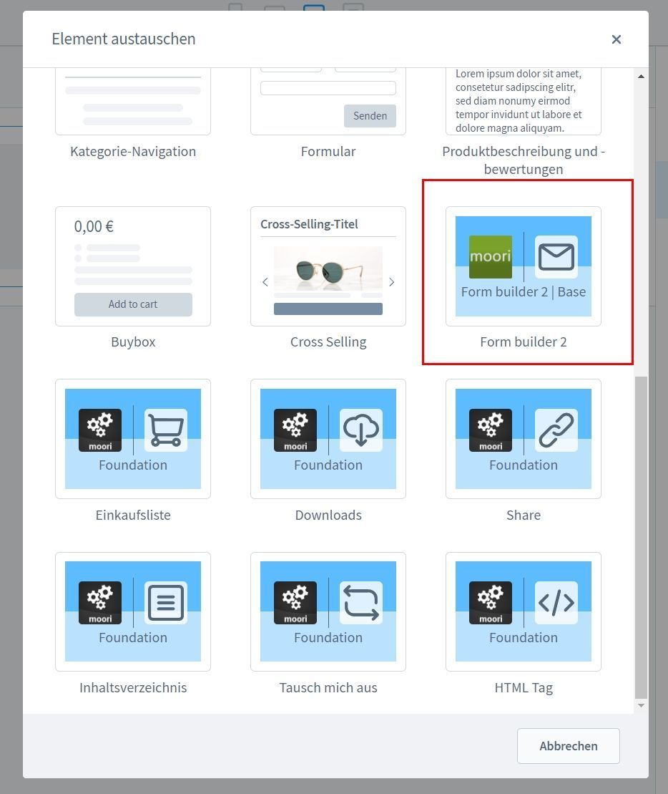

## Ausgabe im Storefront

### Formularvalidierung

Das Beispielformular ist vom Typ "Test" die clientseitige Validierung ist deaktiviert. 
Der Formular Baukasten 2 unterstützt eine rekursive serverseitige Validierung der Eingabefelder!

Die clientseitige Valididierung ist wieder aktiv. Nun wird das Formular doppelt validiert.

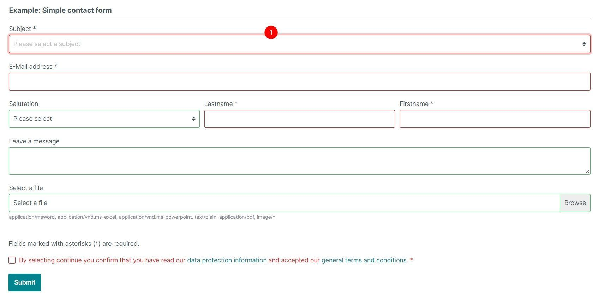

### E-Mail Versand

In diesem Beispiel zeige ich dir, wie die E-Mail im Standard ausgegeben wird.

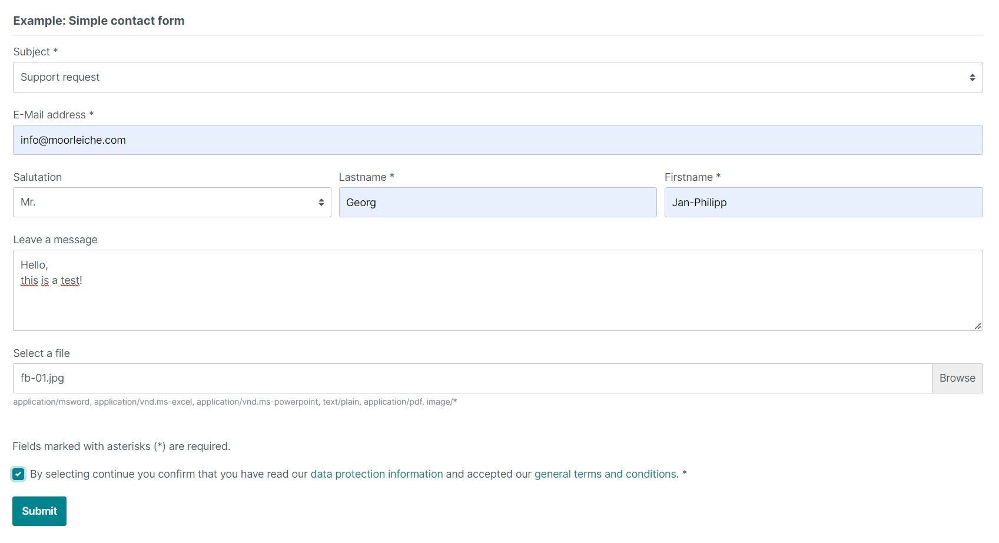

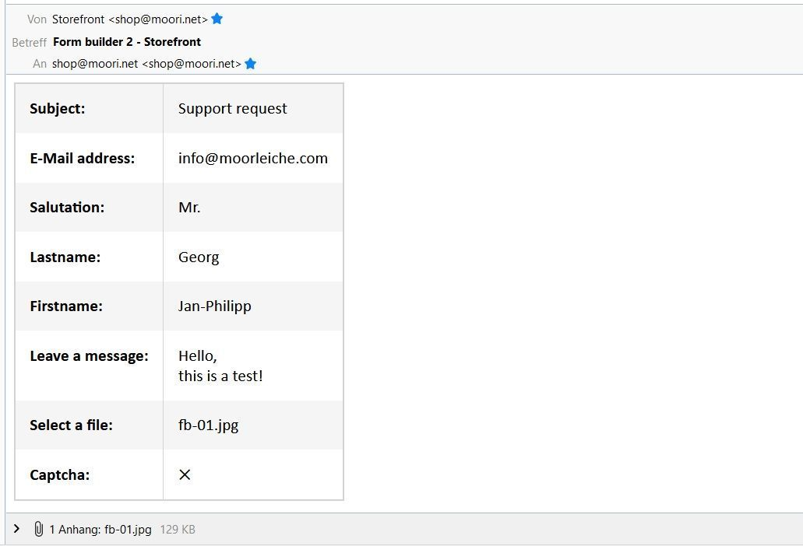

## Sicherheit

- Es werden HTML Tags maskiert um schädliche Scripts zu unterbinden.
