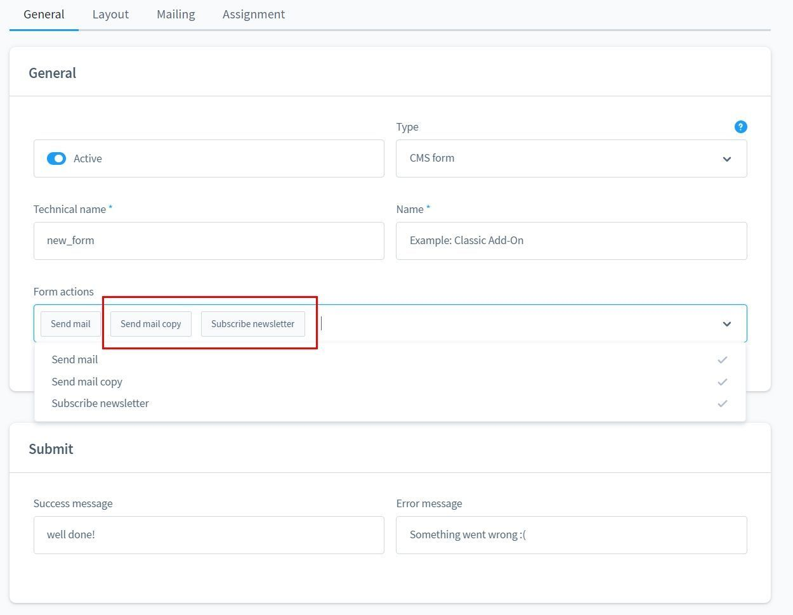
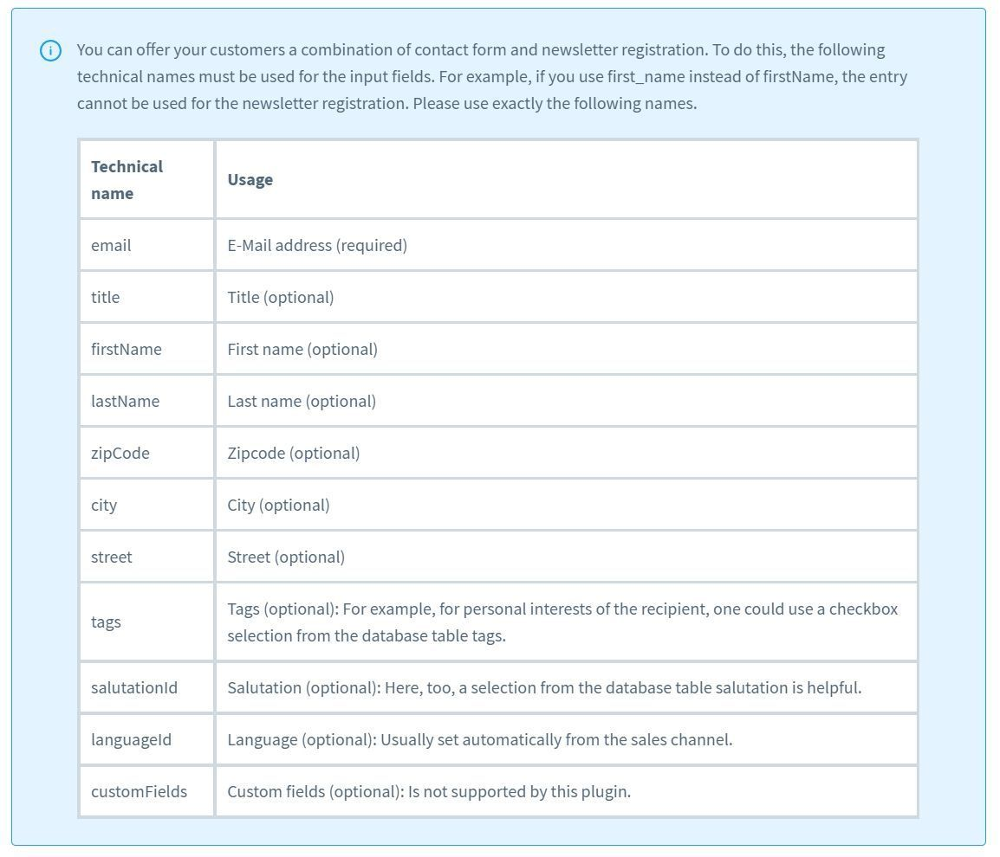
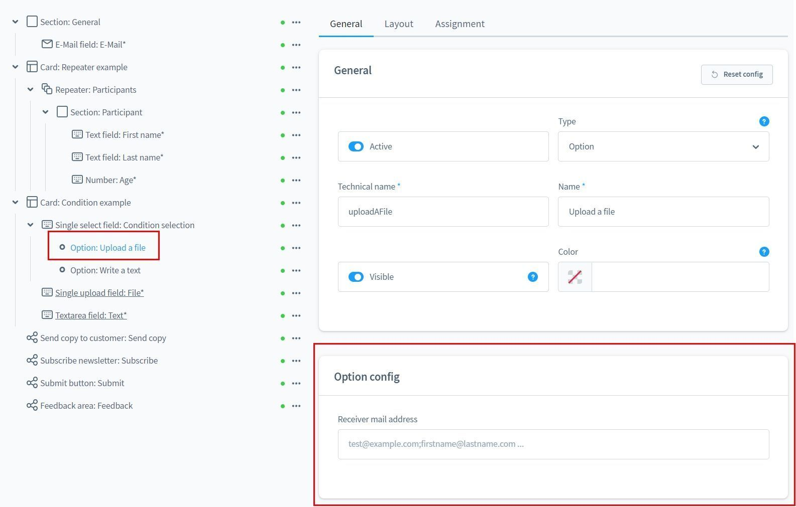
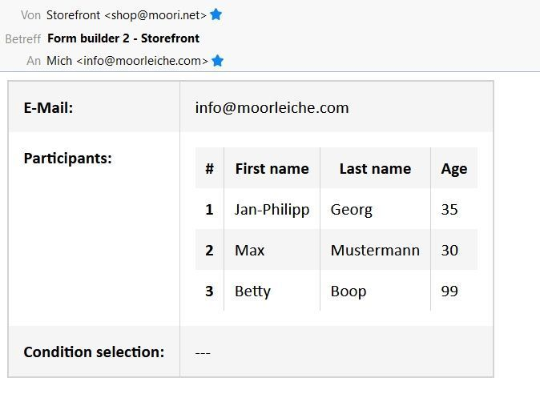

# Form Builder 2 | Classic Add-On

With this add-on for [Form Builder 2](../MoorlForms/index.md), you have new
new possibilities at your disposal.

##Note for all customers who already own the Form Builder

This plugin has a fundamentally different structure and does not offer the possibility to migrate the previous forms.
migrate the previous forms.

Unfortunately, it is also not possible to duplicate/transfer the subscriptions after consultation with Shopware.

As I do not want to create a disadvantage for my existing customers, the form construction kit will continue to be
will continue to be provided with updates. But no new functions will be developed.

For all interested parties with active subscriptions I offer a 50% discount for Basis and Add-Ons.
The migration of the forms will also be taken care of on request.
However, there may be differences in appearance, I will not match these.

##New elements

1. element of the type "repeater
2. elements that are only shown under certain conditions
3. send copy to customer
4. offer newsletter registration

##Form Actions

- Send a copy to the customer
- Offer newsletter subscription

Note: If the actions are selected, the corresponding element must also be inserted in the structure area!
must be inserted!

## Example forms for download

- [Classic Add-On](examples/classic-add-on.json)

###Newsletter registration

Note on the technical names of the elements when the newsletter subscription is activated.

###Send copy

"Send copy to customer" can be offered in different variations.

###Conditions

Build conditions to show or hide an element.

###Extension for elements of the type "Option

By means of a selected option, the recipient's e-mail address can be influenced.
This way, depending on the request type, the mails end up in the right mailbox!

###Configuration for "Repeater" elements

The repeater element can have a min and a max property. In addition, the buttons can be
buttons can be individually labelled.

##Example of the output of an e-mail with a repeater element

