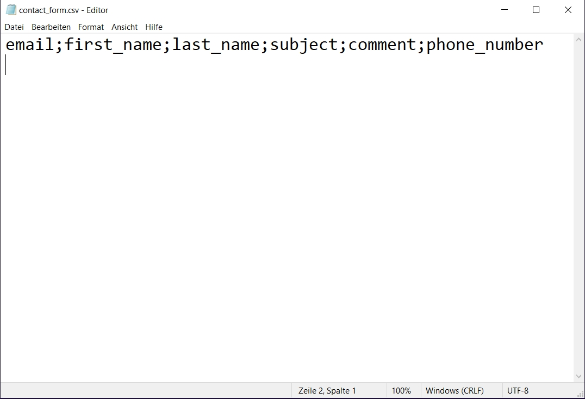
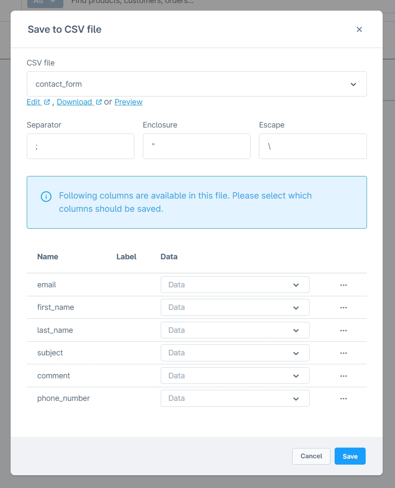

# Flow Builder Action | Write CSV

This extension is compatible with [Form Builder 2](../MoorlForms/index.md)

## Installation

!!! note

      If you have problems with the plugin, please note the following [hints](../) in the FAQ section.

1. install [Foundation](../MoorlFoundation/index.md)
2. install this extension in the Plugin Manager

## Setup

### Enable the CSV file extension

By default, you cannot upload CSV files in the Media Manager. Grant a release via the basic settings in the Foundation Plugin.


### Create a CSV with header line

Before you can use a CSV file, you need to prepare it. It is important that you create your header line and a subsequent empty line. The character encoding is in UTF-8.



An example for the contact form:

```text
email;first_name;last_name;subject;comment;phone_number

```

### Upload the file to the media manager

Once you have created the file, you can upload it to the Shopware Media Manager.


### Create a new action in the flow builder

Go to a flow of your choice and create a new action. In the following example, an action is created for the contact form.


You can now see all CSV files from the Media Manager in the "CSV file" selection field. Select the desired file.



If the CSV file is faulty, you will receive this error message, in this case please check [this step](#create-a-csv-with-header) again.


Now assign the available fields. These fields are Twig variables, you can also use fixed values or [Twig functions](https://twig.symfony.com/doc/3.x/functions/index.html)!


You can now save the Flow-Builder action.

## Test

For testing purposes, the contact form is filled out and sent twice.


In the configuration of the Flow Builder action, you can open a preview of the CSV file to ensure that the form data has been saved.


To analyse the CSV file, you can download it in the Media Manager or directly in the Flow Builder action and open it with e.g. Microsoft Office Excel or OpenOffice Calc. Please remember to read the file in UTF-8 encoding!

