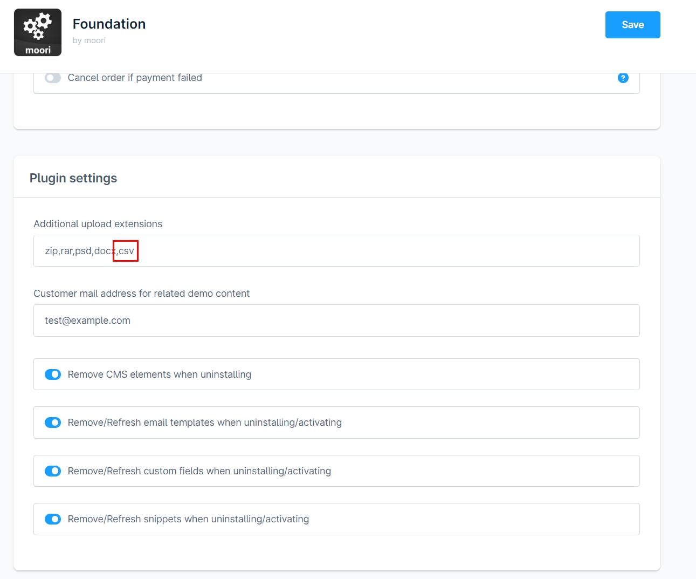
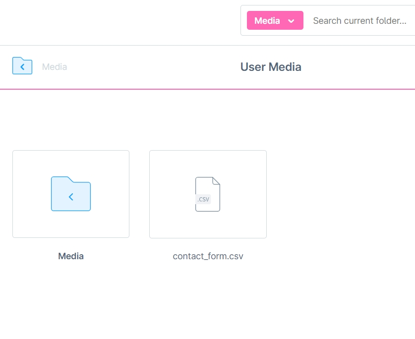
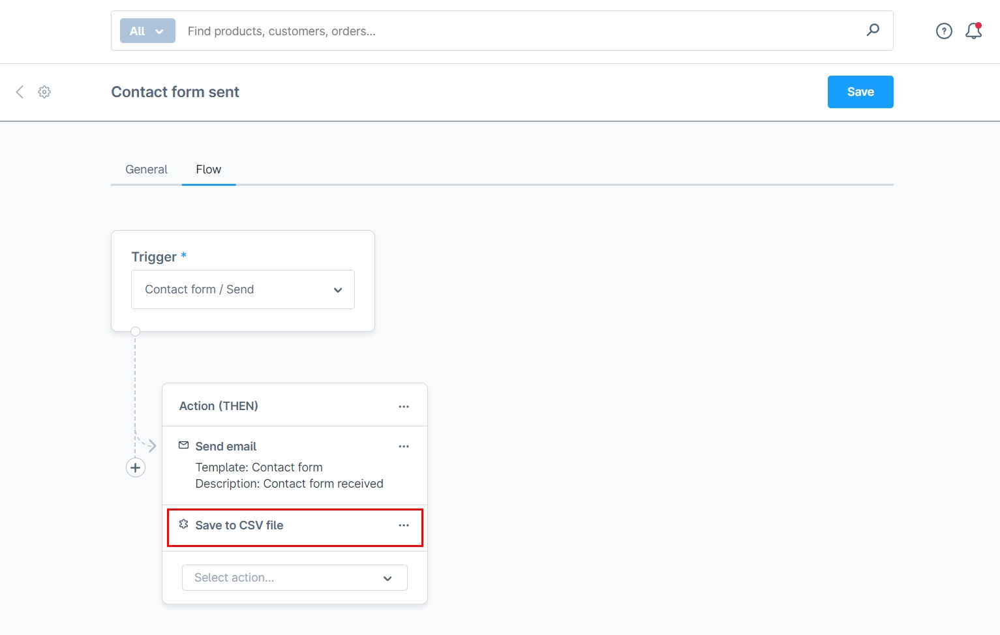
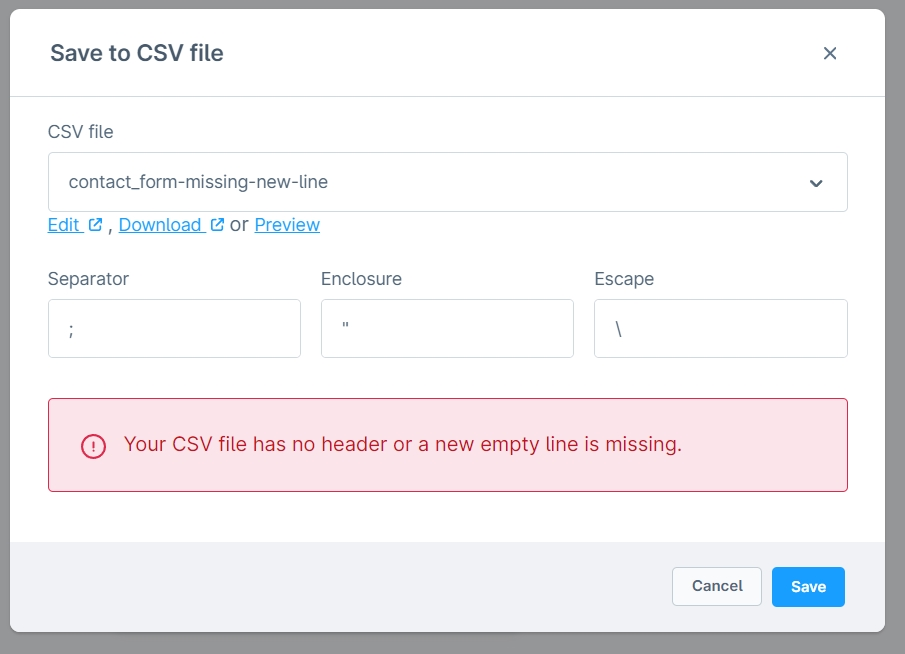
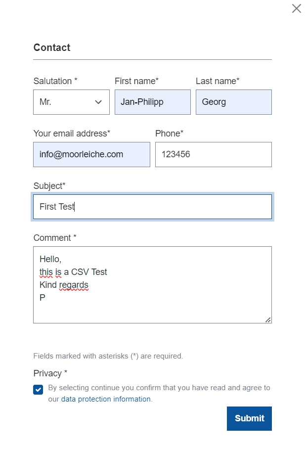
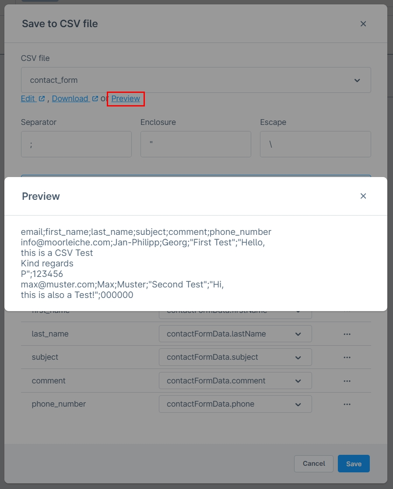

# Flow Builder Aktion | CSV Schreiben

Diese Erweiterung ist mit [Formular Baukasten 2](../MoorlForms/index.md) kompatibel

## Installation

!!! note

      Falls du Probleme mit dem Plugin hast, bitte beachte folgende [Hinweise](../) im FAQ Bereich.

1. Installiere [Foundation](../MoorlFoundation/index.md)
2. Installiere diese Erweiterung im Plugin Manager

## Einrichtung

### Freigabe der Dateierweiterung CSV

Im Standard kannst du keine CSV Dateien im Medien-Manager hochladen. Erteile eine Freigabe über die Grundeinstellungen im Foundation Plugin.



### Erstelle eine CSV mit Kopfzeile

Bevor du eine CSV Datei verwenden kannst, musst du diese vorbereiten. Wichtig ist hierbei, dass du deine Kopfzeile und eine darauffolgende leere Zeile erstellst. Die Zeichenkodierung ist in UTF-8.


Ein Beispiel für das Kontaktformular:

```text
email;first_name;last_name;subject;comment;phone_number

```

### Datei in den Medien-Manager hochladen

Nachdem du die Datei erstellt hast, kannst du diese in den Shopware Medien-Manager hochladen.



### Eine neue Aktion im Flow-Builder erstellen

Gehe in einen Flow deiner Wahl und erstelle eine neue Aktion. Im folgenden Beispiel wird eine Aktion für das Kontaktformular erstellt.



Im Auswahlfeld "CSV Datei" kannst du nun alle CSV Dateien aus dem Medien-Manager sehen. Wähle die gewünschte Datei aus.


Sollte die CSV Datei fehlerhaft sein, erhältst du diese Fehlermeldung, prüfe in diesem Fall bitte nochmal [diesen Schritt](#erstelle-eine-csv-mit-kopfzeile).



Weise nun die verfügbaren Felder zu. Diese Felder sind Twig-Variablen, du kannst auch feste Werte oder [Twig Funktionen](https://twig.symfony.com/doc/3.x/functions/index.html) verwenden!


Du kannst die Flow-Builder Aktion nun speichern.

## Test

Zum Testen wird das Kontakt formular zweimal ausgefüllt und abgeschickt.



In der Konfiguration der Flow-Builder Aktion kannst du eine Vorschau der CSV Datei öffnen, um sicherzustellen, dass die Formulardaten gespeichert wurden.



Um die CSV Datei auszuwerten, kannst du diese im Medien-Manager oder direkt in der Flow-Builder Aktion herunterladen und mit z.B. Microsoft Office Excel oder OpenOffice Calc öffnen. Bitte denke daran die Datei in der UTF-8 Kodierung einzulesen!


