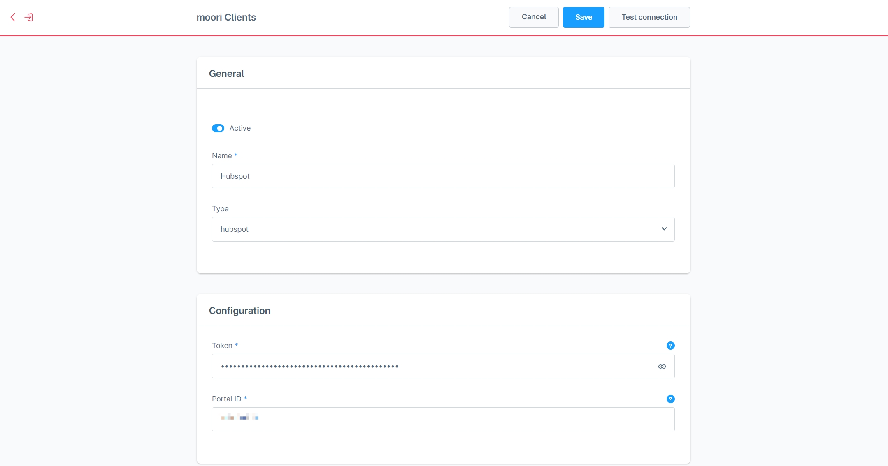
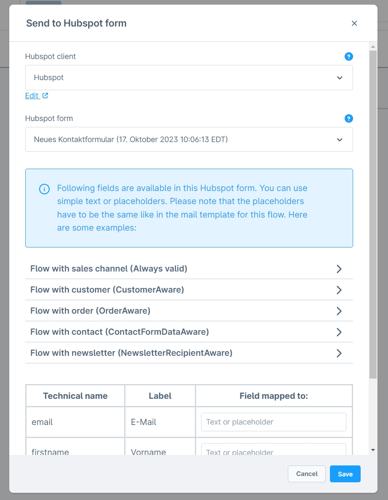
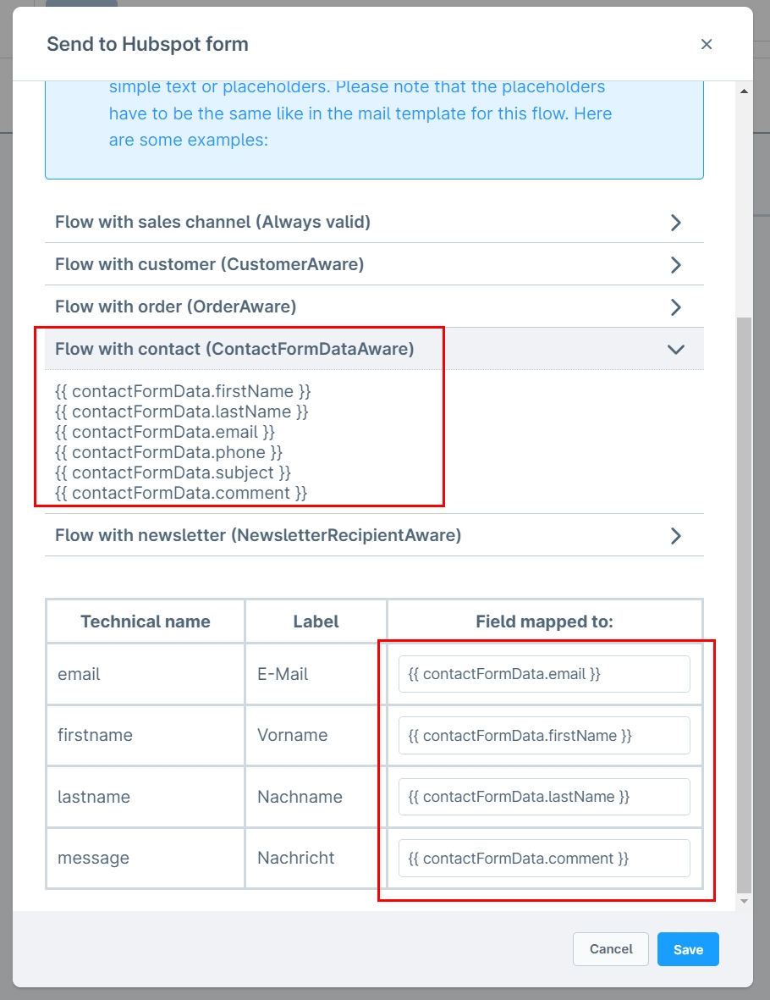
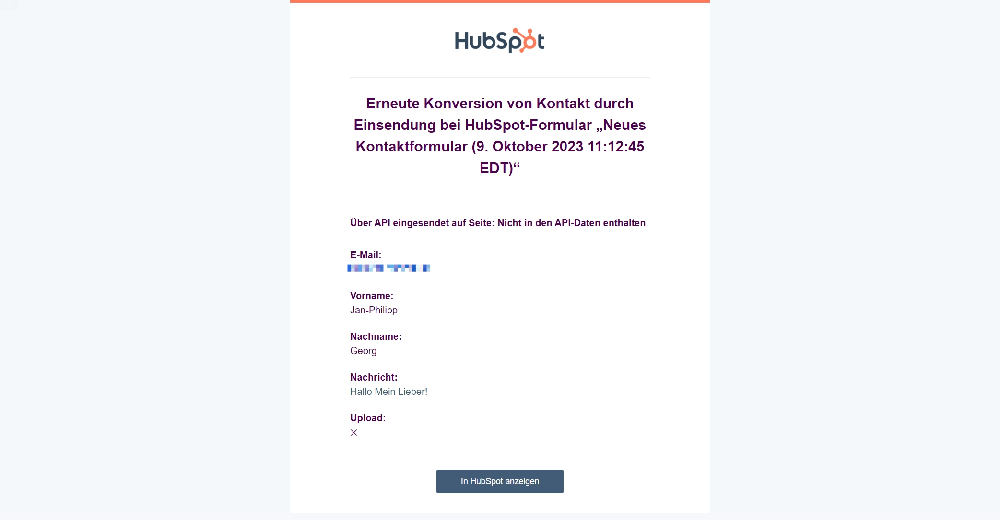

# Flow Builder Aktion | Hubspot Formular

Diese Erweiterung ist mit [Formular Baukasten 2](../MoorlForms/index.md) kompatibel

## Installation

!!! note

      Falls du Probleme mit dem Plugin hast, bitte beachte folgende [Hinweise](../) im FAQ Bereich.

1. Installiere
   [Foundation](../MoorlFoundation/index.md)
2. Installiere Hubspot Formulare Integration im Plugin Manager

## Einrichtung

Diese Erweiterung eignet sich gut für Shopbetreiber, die bereits mit Hubspot arbeiten. Es können z.B. automatisch Kontakte oder Tickets angelegt werden, sobald ein Kontaktformular im Shopware 6 Shop abgesendet wurde.

### Hubspot Account erstellen

Du kannst relativ einfach einen Hubspot Account erstellen. Nutze dazu z.B. deinen Google-Account und wähle einen kostenlosen Plan aus!

### Eine private Hubspot App erstellen

- Gehe dazu in "Profil & Einstellungen".
- In der linken Sidebar unter "Account-Setup" -> "Integration" -> "Private Apps" erstellst du eine neue App.
- Die App benötigt folgende Berechtigungen: forms-uploaded-files, forms, crm.objects.contacts.write, crm.objects.contacts.read
- Kopiere den Token und wechsle nun in den Shopware Admin

### Einen Hubspot client in Shopware anlegen

- Navigiere zu "Einstellungen" -> "Erweiterungen" -> "moori Clients"
- Erstelle einen neuen Client vom Typ "hubspot"
- Gebe den Token deiner privaten Hubspot App ein
- Die Portal-ID findest du im Account-Menü von Hubspot unter deinem Benutzernamen
- Teste den Client

### Erstelle ein Formular in Hubspot

- Navigiere vom Hauptmenü in Hubspot zu "Marketing" -> "Formulare"
- Erstelle ein neues Formular vom Typ "Eingebettet", du kannst zum Testen die Vorlage für Kontaktformulare verwenden
- Speichere das Formular, ohne Änderungen durchzuführen

Mit diesem Formular werden bereits automatisch in Hubspot Kontakte angelegt, sobald es ausgefüllt und abgesendet wird.

### Hubspot Formular mit Flow-Builder verbinden

- Navigiere zum Flow-Builder und öffne z.B. "Kontaktformular wurde verschickt"
- Gehe in den Reiter "Flow"
- Füge die Aktion "An Hubspot-Formular senden" hinzu
- Wähle deinen Hubspot Client aus
- Wähle dein in Hubspot erstelltes Formular aus
- Erstelle die Datenzuordnungen, in unserem Beispiel kann man die Platzhalter für "Flow mit Kontakt" verwenden

Wenn der Flow aufgrund von falschen Platzhaltern nicht ausgeführt wird, gibt es keine Fehlermeldung. Bitte überprüfe deine Einstellungen sorgfältig!

### Hubspot Formular mit Formular Baukasten 2 Formular verbinden

- Öffne dein Formular im Shopware Admin
- In den Basis-Einstellungen des Formulars wählst du bei "Formular Aktionen" die Option "Sende an Hubspot Formular" aus
- Wähle deinen Hubspot Client aus
- Wähle dein in Hubspot erstelltes Formular aus
- Nun erscheint eine Info-Box welche Felder in dem Hubspot Formular verfügbar sind
- Speichere das Formular
- Gehe nun in die Element-Einstellungen, z.B. das E-Mail Feld
- Hier kannst du das passende Feld aus dem Hubspot Formular zuordnen
- Ordne noch die Felder: Vorname, Nachname und Nachricht zu
- Speichere das Formular

## Test

Nachdem du das Formular abschickst, solltest du eine Mail von Hubspot erhalten.

