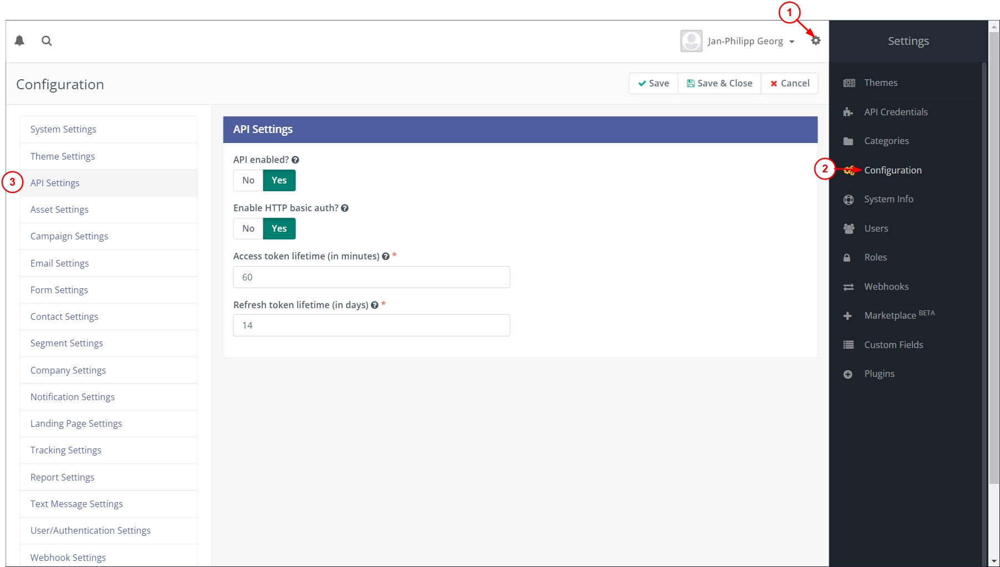
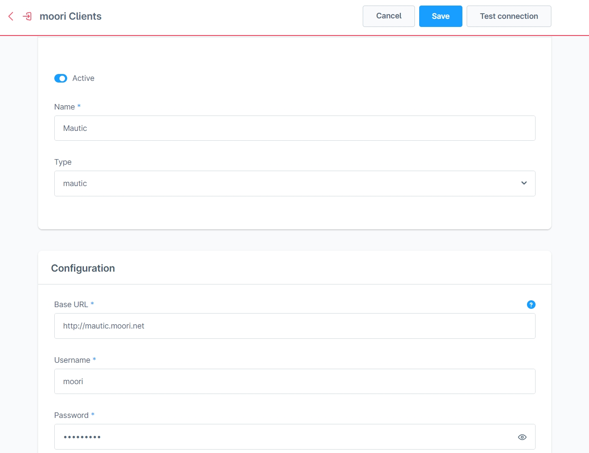
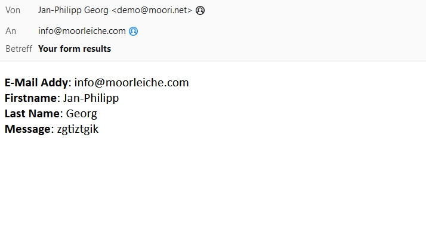

# Flow Builder Aktion | Mautic Formular

Mit diesem Add-On für [Formular Baukasten 2](../MoorlForms/index.md) Kannst du deine Formular-Daten an Mautic senden.

## Was ist Mautic?

Mautic ist eine Open-Source-Software für die Marketing-Automation. Mit Mautic lassen sich Website-Besucher tracken und mithilfe von Formularen in identifizierte Kontakte wandeln.

## Einrichtung

Diese Anleitung bezieht sich auf Mautic Version 4 und setzt voraus, dass diese Software bereits installiert wurde.

### Mautic API aktivieren

- Klicke oben rechts auf das Zahnrad
- Es öffnet sich auf der rechten Seite eine Navigation, klicke auf "Configuration"
- Klicke in der linken Navigation auf "API Settings"
- Aktivere die API und "HTTP basic auth"

Mit dieser methode kannst du dich mit deinem Benutzernamen und deinem Passwort mit der API verbinden. Ich empfehle für diesen Fall einen weiteren Admin anzulegen, der nur für die API bestimmt ist.

### Einen Mautic client in Shopware anlegen

- Navigiere zu "Einstellungen" -> "Erweiterungen" -> "moori Clients"
- Erstelle einen neuen Client vom Typ "mautic"
- Gebe die URL, Benutzernamen und Passwort ein, hinter der URL darf kein "/" stehen
- Teste den Client

### Erstelle ein Formular in Mautic

- Navigiere vom Hauptmenü in Mautic zu "Components" -> "Forms"
- Erstelle ein neues Formular vom Typ "Campaign Form"
- Gebe die Basisdaten ein und erstelle die Eingabefelder
- z.B. E-Mail, Vorname und Nachname
- Bei den Eingabefeldern kannst du im Reiter "Contact Field" eine Zuweisung machen z.B. "Email"

Mit diesem Formular werden bereits automatisch in Mautic Kontakte angelegt, sobald es ausgefüllt und abgesendet wird.

### Mautic Formular mit Formular Baukasten 2 Formular verbinden

- Öffne dein Formular im Shopware Admin
- In den Basis-Einstellungen des Formulars wählst du bei "Formular Aktionen" die Option "Sende an Mautic Formular" aus
- Wähle deinen Mautic Client aus
- Wähle dein in Mautic erstelltes Formular aus
- Nun erscheint eine Info-Box welche Felder in dem Mautic Formular verfügbar sind
- Speichere das Formular
- Gehe nun in die Element-Einstellungen, z.B. das E-Mail Feld
- Hier kannst du das passende Feld aus dem Mautic Formular zuordnen
- Ordne noch deine weiteren Felder zu
- Speichere das Formular

## Test

Nachdem du das Formular abschickst, solltest du eine Mail von Mautic erhalten und es wird ein neuer Kontakt angelegt.

