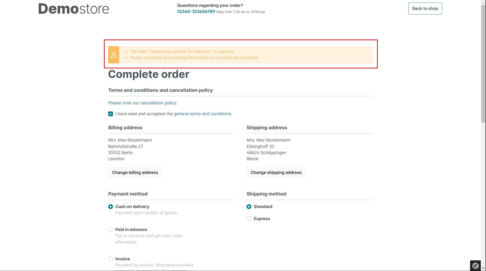

# Form Builder 2 | Order Add-On

With this Add-On for [Form Builder 2](../MoorlForms/index.md) you have the possibility to extend the orders depending on the products in the shopping cart.

## Example forms for download

- [Order Add-On](examples/order-add-on.json)

## New form of type "Extended orders".

With this form you are much more equipped for B2B or personalised customers. You can enter any customer data in the checkout and process it further. You can completely determine when and which data is collected.

## Settings

Create a new form. Select the type "Extended order".

Afterwards a product assignment is necessary. The form will only appear if there is an assigned product in the shopping basket.

The assignment is made via a dynamic product group.

Now you can insert your input fields into the form. No technical fields, such as a submit button, are necessary.

The customer's entries will be saved automatically.

1. you can specifically show or hide the input fields. For example, if the customer chooses a specific shipping method, you could store a phone number for the delivery person.
2. if you need the input for a technical processing, the assignment into predefined fields is suitable.

In the main settings of the plugin, you can determine whether the checkout should be blocked if the entries in the form are not valid.

## Output in the storefront

The form appears directly in the checkout.

The form is automatically submitted after each entry. Here the customer is informed about missing entries.

## View order details

Simply open the order in the admin. The additional details are directly above the order items.

1. use this value for your e-mail template of type "HTML"
2. use this value for your e-mail template of type "Plain"
