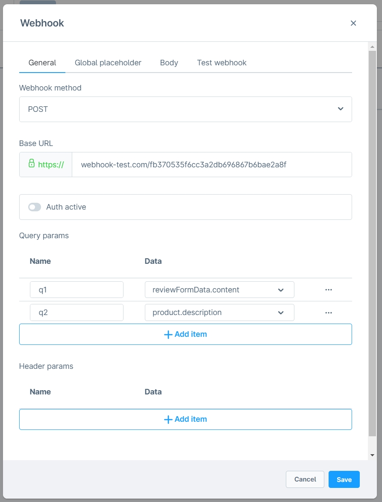
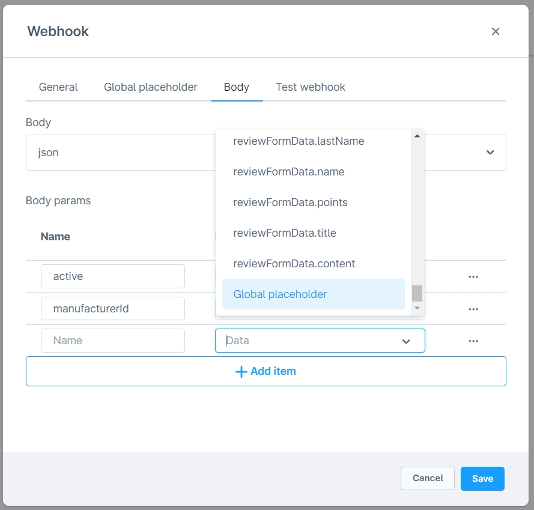

# Webhook integration

This extension is compatible with [Form Builder 2](../MoorlForms/index.md)

## Installation

!!! note

      If you have problems with the plugin, please read the following [notes](../) in the FAQ section. 1.

1. install
   [Foundation](../MoorlFoundation/index.md)
2. install Webhook Integration in the Plugin Manager

## Setup

### Create Webhook

There are countless uses for webhooks, you can test [here](https://webhook-test.com/) webhooks.

### Examples

#### Notifications to your Amazon Echo device

https://zeropointdevelopment.com/sending-notifications-to-amazon-echo-using-webhooks/

#### Send messages to your Discord channel via webhook

https://support.discord.com/hc/en-us/articles/228383668-Intro-to-Webhooks

### Set up Webhook with Flow-Builder

- Navigate to the flow builder and open e.g. "Contact form has been sent".
- Go to the "Flow" tab
- Add the action "Send Webhook
- Enter the data of your webhook
- Tip: For longer texts, you can use a global placeholder as a template.
- Test your webhook

If the flow is not executed because of wrong placeholders, there is no error message. Please check your settings carefully!

### Webhook with form builder 2 Set up form

- Open your form in the Shopware Admin
- In the basic settings of the form, select the option "Send Webhook" in the "Form Actions".
- Enter the data of your webhook
- Tip: For longer texts you can use a global placeholder as template
- Test your webhook
- Save the form

## Test

An example for a sent webhook.

