# Foundation | Premium Features

Die Premium Features sind ein fester Bestandteil des moori Foundation Plugins.

Diese Features lassen sich für einen geringen Zeitraum nutzen, sind jedoch nur für Nutzer mit Adminrechten
verfügbar und werden noch vor Shopware 6.5 Release entfernt.

Die Demopakete meiner Plugins enthalten einige vorgefertigte Features für eine bessere Darstellung im
Storefront, es wird lediglich nur nicht im Admin ohne "Foundation Premium Features" konfigurierbar sein.

## Shortcut

Die Features werden mit `ALT+M` (Linux/Windows) oder `CONTROL+M` (Mac) aktiviert/deaktiviert.

Durch eine Meldung wird bekannt gegeben, dass die Features freigeschaltet wurden.

## CMS Features

Das Plugin bietet eine Reihe an nützlichen CMS Features, hier werden diese im Detail erklärt.

### Responsive CMS Block Darstellung

Hier lassen sich die CMS Blöcke je nach Endgerät/Bildbreite anzeigen oder ausblenden.

### Zusätzliche Element Optionen

Es erscheinen zwei neue Optionen für das CMS Element

- Element speichern
- Animationen

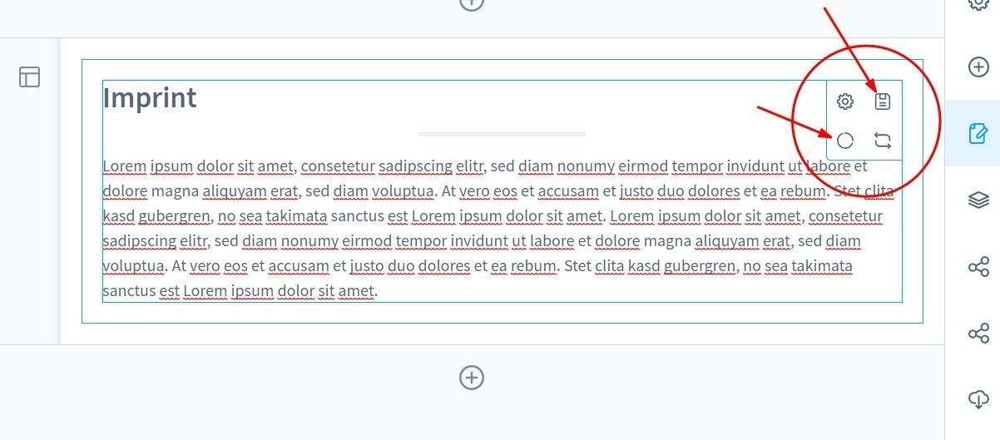

Elementkonfigurationen können gespeichert werden. So erspart man sich eine immer
wiederkehrende Konfiguration für dasselbe Element.

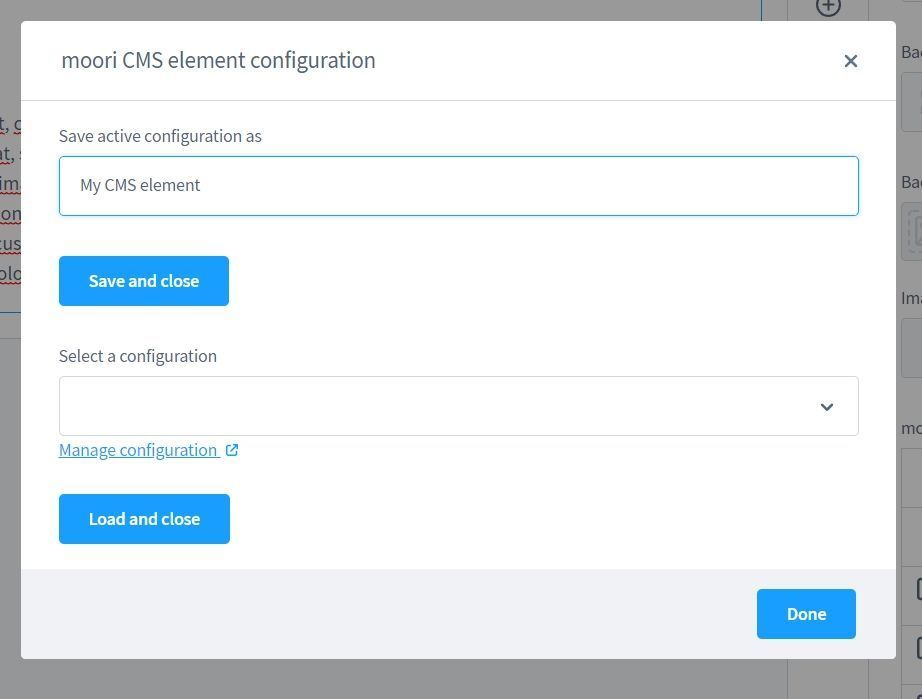

Die gespeicherte Konfiguration kann man über das Auswahlfeld bestimmen und anschließend
in das gewünschte Element übertragen.

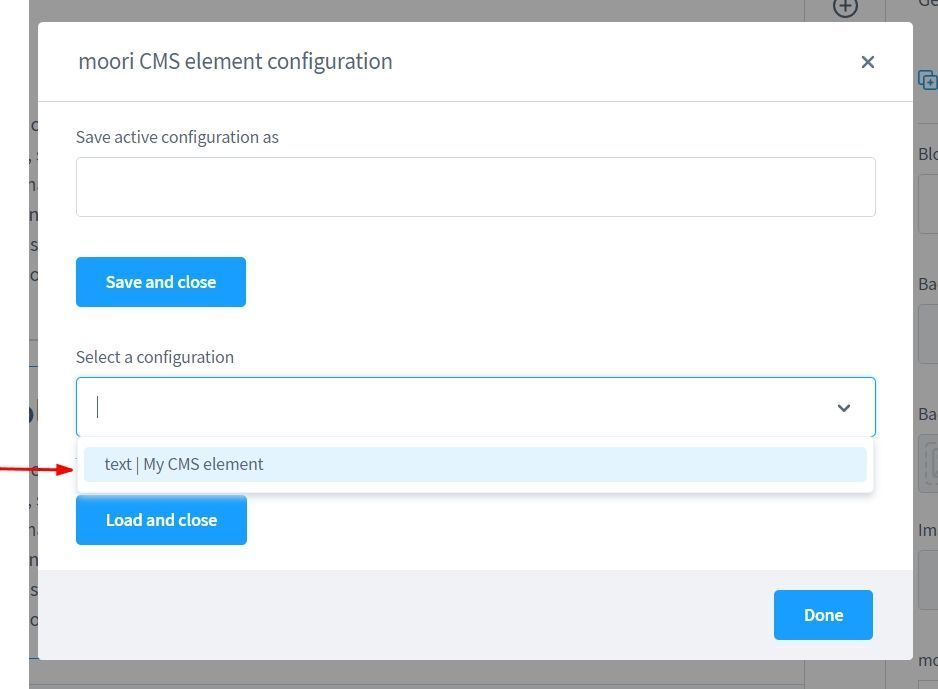

Jedes Element, welches sich in einem moori Spalten/Grid Block befindet kann mit
vielseitigen Animationen ausgestattet werden. Es gibt drei Typen für Animationen:

1. Einblendanimationen (Animate in)
2. Ausblendanimationen (Animate out)
3. Effekte

Diese können mit ebenfalls drei verschiedenen Auslösern gestartet werden:

1. Element ist teilweise sichtbar
1. Element ist ganz sichtbar
1. Maus befindet sich über dem Element

### Zusätzliche Layouts/Blöcke

Es befinden sich über 30+ Blocklayouts im moori Foundation Plugin.

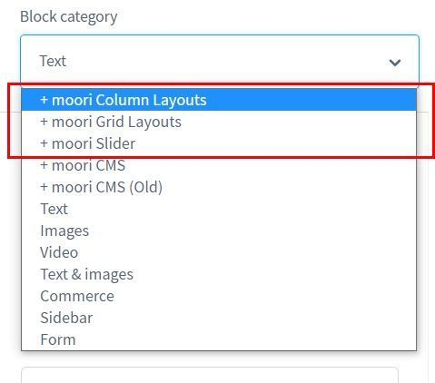

Die Spaltenlayouts

Die Gridlayouts

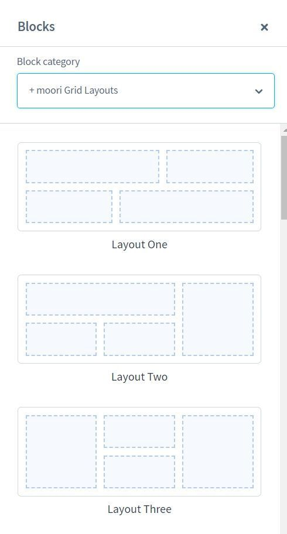

Die Slider-Layouts

_Hinweis: Der "Interaktive Slider" ersetzt die anderen Layouts, da man diesem
bis zu 20+ Slides zuweisen und frei konfigurieren kann._

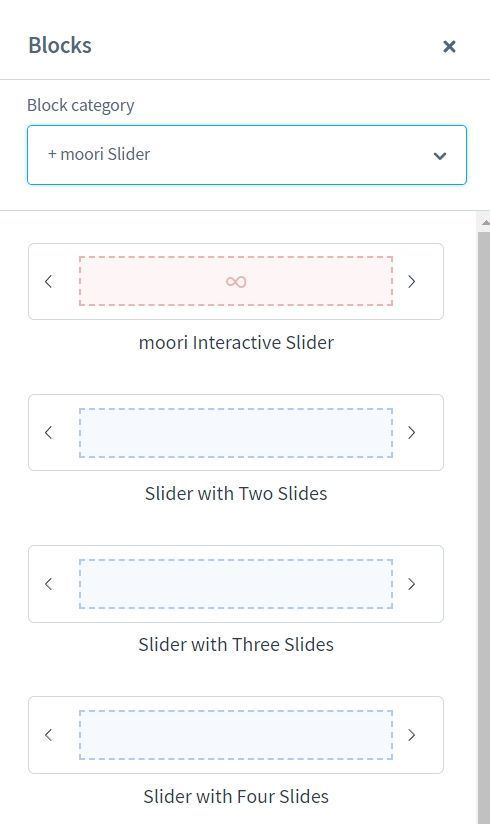

#### Der "Interaktive Slider" im Detail

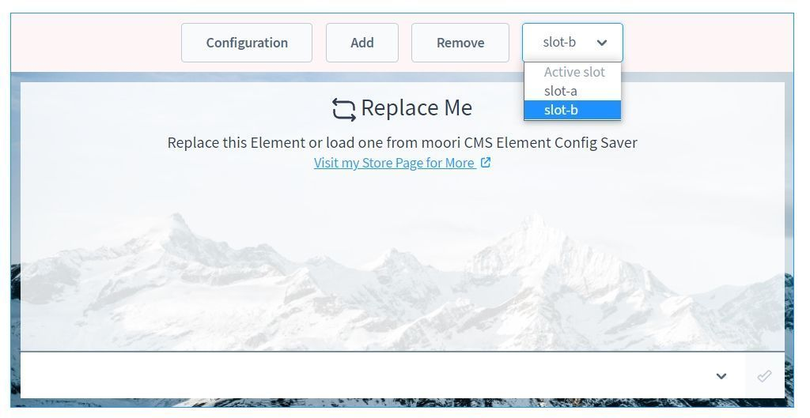

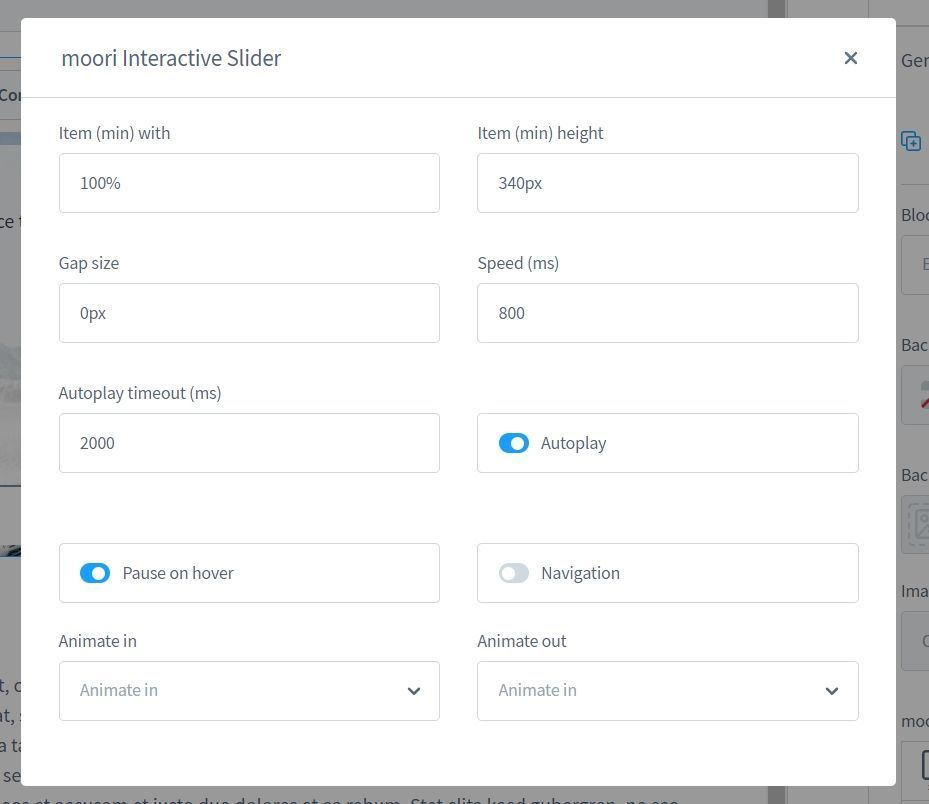

### Zusätzliche Sektionen

Aktuell gibt es eine Sektion in der man zwei bis vier Spalten bestimmen kann.

Jede Spalte hat Einstellungen:

1. Responsives Verhalten: Breite und anzeigen/ausblenden abhängig vom Endgerät.
2. Angeheftet mit einem Abstand nach oben (z.B. wenn es ein angeheftetes Hauptmenü gibt).
3. Horizontale und vertikale Anordnung der Elemente innerhalb der Spalte.

### Beispiele

Installiere das [Demo Paket](../MoorlFoundation/demo-assistant.md) um die Beispiele zu sehen.

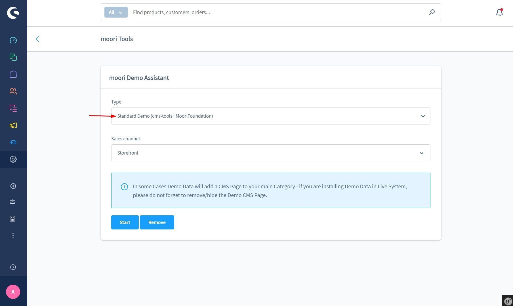

Die Beispielseite im Storefront

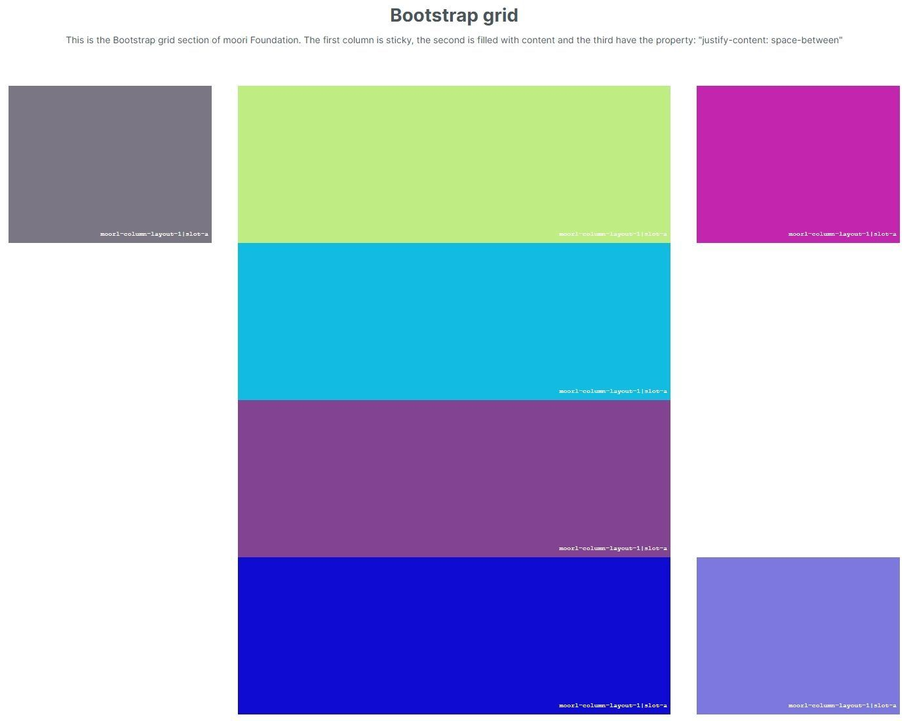

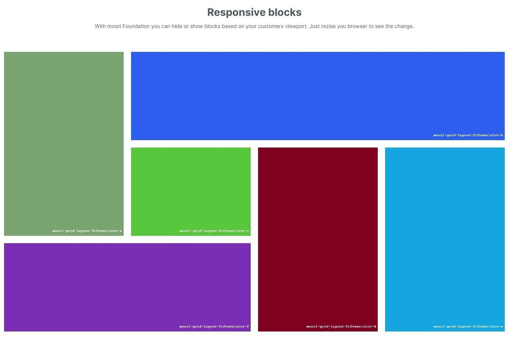
