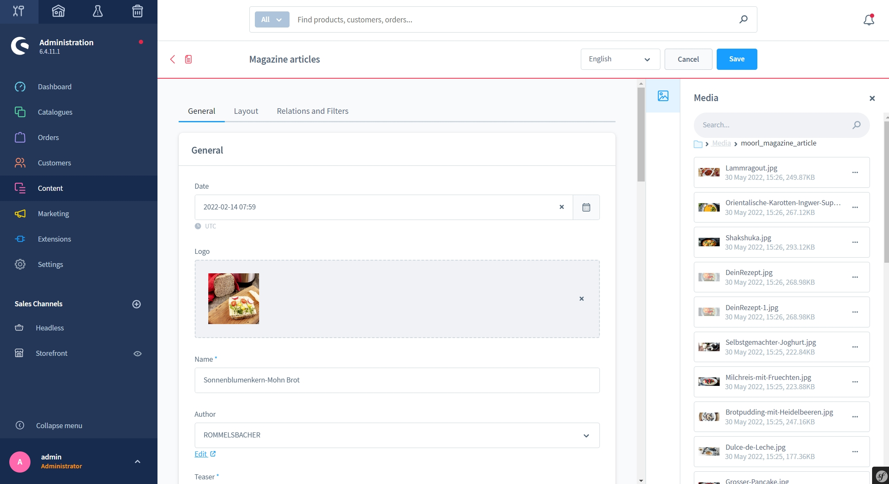
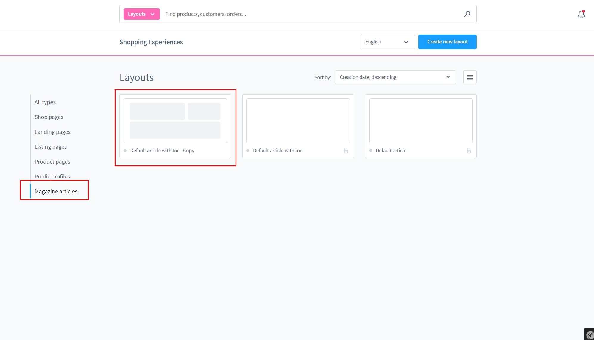
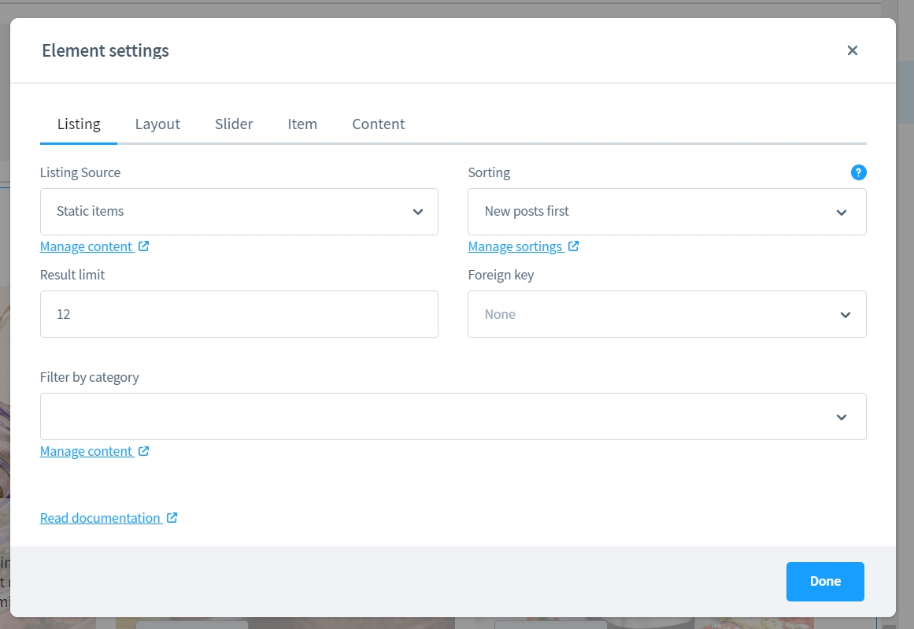
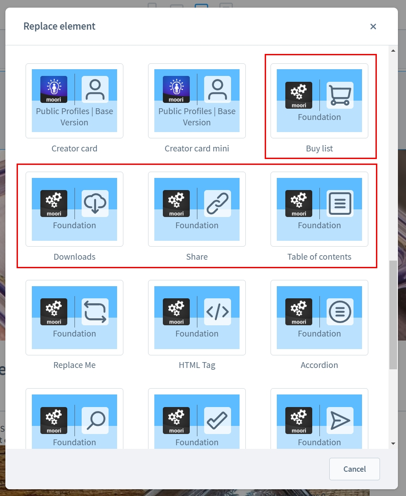
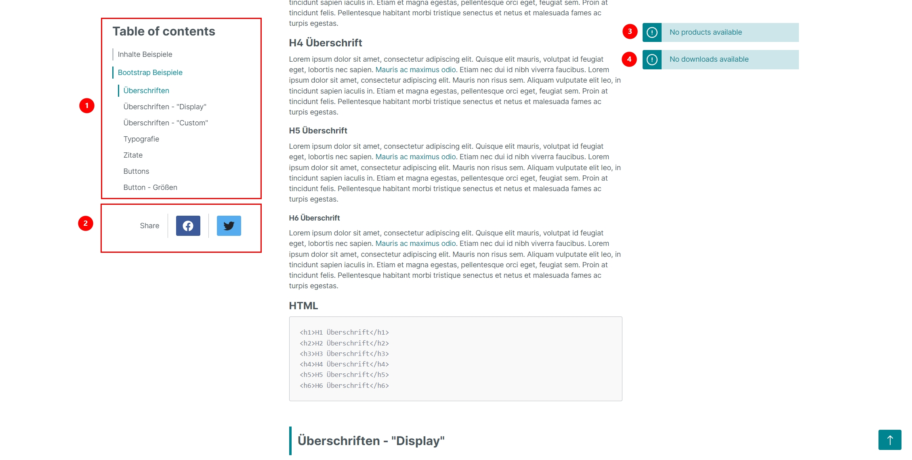

# Public Profiles | Magazine Add-On

This add-on for [Public Profiles](../MoorlCreator/index.md) is a powerful tool for individual blog creation and content marketing.

[Click here for the demo](https://demo.moori.net/Magazine-Demo/)

## What is this plugin good for?

This plugin is suitable for shop owners who want to provide their customers with regular news. But also to achieve a better visibility on the web and a better ranking in search engines. SEO and content are essential for a successful online business at this time.

With the Magazine Add-On you have the possibility to present your content in a structured form in your online shop. A wide range of CMS elements and features are available for optimal presentation.

The WordPress import ensures a problem-free migration of blog posts from your WordPress system. You can also import your content from several blogs - automatically!

## Installation

!!! note

      If you have problems with the plugin, please read the following [notes](../) in the FAQ section.

1. install [Foundation](../MoorlFoundation/index.md)
2. install [Public Profiles](../MoorlCreator/index.md)
3. install the Magazine Add-On
4. optional: In this app there is a [Demo Package](../MoorlFoundation/demo-assistant.md) included.
5. go to: Contents | Magazine

Here you can now create a new article.

## Settings

### Basic configuration

In the basic configuration of the add-on you can make general settings.

- Main page for all posts: This allows your customer to navigate back to the overview in a blog post.
- Show date/author: Displays additional metadata in the overview and in search

Activates the advanced search for your blog posts.

Here you can customise the layout of the blog entries in the search.

Comments can be activated/deactivated individually for each post. Here you can also disable them in general. Alternatively, simply remove the CMS element for comments.

You can configure your WordPress feeds here. The content from the WordPress blog is automatically imported and synchronised in the background.

### Create blog post

You can create categories and posts manually.

Click on "New" in the list at the top right to create a new post.

Here you will find the configuration for your post. Each post needs a title, an introduction and content.

Optionally you can assign an author from the plugin "Public profiles".

In the sidebar for media, you can generate ready-made IMG tags for your content area.

Determine the visibility of your post. You have the option of pinning your posts so that they are always listed first.

If you use the add-on for different contents, for example recipes and general news, you can separate these from each other using the Shopware category.

If you have multiple sales channels, you can display articles only for certain channels.

The add-on offers you the option of displaying products or downloads from your shop directly in the article.

### CMS page layout for blog posts

For each post, you can specify a CMS page for the layout. It is also possible to use a CMS page for the content, but I advise against this as it may have a negative effect on search engine optimisation.

The add-on installs two standard layouts. Copy them for your individual adjustments.

If you have already created or imported posts, the content will be transferred to the CMS page. It is quite possible that the display is slightly incorrect. This usually depends on the quality of the WordPress posts.

The [Listing/Slider element](../MoorlFoundation/listing.md) allows you to suggest further posts.

You can use the following elements (marked red) on your post CMS page.

- Listing/Slider element
- Meta information about the post: date, author, tags, categories
- comments
- Back/Forward Navigation

- Product/shopping list
- downloads
- Share buttons
- Table of contents

### Listing page for all posts

Of course, an overview page for all posts should not be missing. The add-on is strongly oriented towards the product listing from Shopware.

Here you can use a sidebar section, on the left you place the CMS element "Product Filter". In the main area the [Listing/Slider element](../MoorlFoundation/listing.md).

### Other settings

With the add-on you can adjust the templates for the SEO urls.

!!! note

      The setting resets itself as soon as you deactivate and reactivate the plugin. In this case the SEO-Url setting has to be done again!

## WordPress Sync

With the WordPress import you can automatically keep the blog posts of your shop up to date!

For this you need the link to your WordPress API. If your posts are well structured, you can activate the creation for the table of contents and assign the CMS page with table of contents!

All posts, categories and comments are now automatically transferred to your shop via the scheduled task!

You need a sufficient PHP configuration for the automatic import. The value 'max_execution_time' in PHP should be 600 seconds.

!!! note

      The import is compatible with the API interface "V2" of WordPress. Blog posts with page builders (e.g. Elementor) are not supported - not even in the future.

Alternatively, you can deactivate the scheduled task and let the import run via CLI or cronjob, which is worthwhile e.g. if you have a lot of posts and want to transfer them initially.

Use the command `bin/console moorl-magazine:snyc`.

## Storefront view

### Example blog post

Here a standard layout of the add-on is used.

1. meta information
2. banner
3. 3-column section for table of contents, content and other elements

1. table of contents
2. share buttons
3. downloads (empty)
4. shopping list (empty)

Shopping list and downloads filled.

1. author information
2. comment section

1. forward/back navigation
2. further posts

### Example blog author

The slider for blog posts can also be integrated for the author. Here, only the posts by this author are displayed.

### Example overview

The overview with all posts, the corresponding filters, sorting and pagination.

### Example Search for posts

Quick search

Normal search