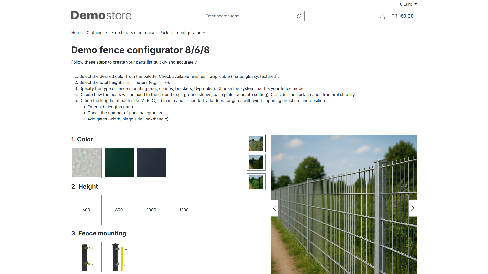

# Parts List (BOM) Configurator

The Parts List (BOM) Configurator allows you to create simple configurators based on compatibility rules, which compile a parts list using predefined criteria.

---

## Plugin Demo

A storefront demo is available for testing this plugin. The plugin can be tested at the following link:

- [https://demo-sw67.moori.net/MoorlPartsListConfigurator](https://demo-sw67.moori.net/MoorlPartsListConfigurator)

## Purchase the Plugin

The plugin can be purchased from the following stores. If you already have a Shopware account, please **always use** the link to the **Shopware Community Store** first, as alternative stores may cause licensing issues. If a plugin is **not** available in the Shopware Community Store, it is offered exclusively in one of the alternative stores.

- [Shopware Community Store](https://store.shopware.com/en/search?search=MoorlPartsListConfigurator) *(recommended)*
- [moori Plugin Store](https://moori-plugin-store.com/MoorlPartsListConfigurator)
- [Shopelfen Store](https://www.shopelfen.de/) *(under construction)*

**Important note:** You need the Foundation Plugin, which is available free of charge: [moori Foundation](../MoorlFoundation/index.md)

## Quickstart

A **demo package** is available for testing this plugin.

Go to **“Settings → [Demo Assistant](../MoorlFoundation/demo-assistant.md)”** and select **“MoorlPartsListConfigurator”**.

**Note:** In some cases, new categories and pages will be added to your shop. Please note that the demo data is provided for testing purposes only. The images included may be protected by copyright and must not be made publicly available.

