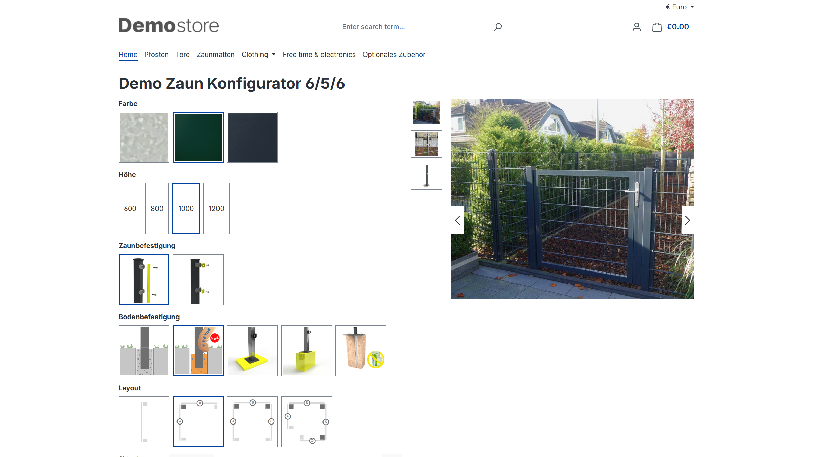

# Stücklisten Konfigurator

Mit dem Stücklisten Konfigurator lassen sich basierend auf Kompatibilitätsregeln einfache Konfiguratoren erstellen, die anhand vordefinierten Kriterien eine Stückliste zusammen stellt.

---

## Plugin Demo

Zu diesem Plugin steht eine Storefront-Demo zum Testen bereit. Unter folgenden Link kann das Plugin getestet werden:

- [https://demo-sw67.moori.net/MoorlPartsListConfigurator](https://demo-sw67.moori.net/MoorlPartsListConfigurator)

## Plugin erwerben

Das Plugin kann in den folgenden Stores erworben werden. Wenn Sie bereits einen Shopware-Account besitzen, nutzen Sie bitte **immer zuerst** den Link zum **Shopware Community Store**, da es bei alternativen Stores zu Problemen mit der Lizenzierung kommen kann. Ist ein Plugin **nicht** im Shopware Community Store verfügbar, wird es exklusiv in einem der alternativen Stores angeboten.

- [Shopware Community Store](https://store.shopware.com/de/search?search=MoorlPartsListConfigurator) *(empfohlen)*
- [moori Plugin Store](https://moori-plugin-store.com/MoorlPartsListConfigurator)
- [Shopelfen Store](https://www.shopelfen.de/) *(im Aufbau)*

**Wichtiger Hinweis:** Sie benötigen das Foundation Plugin, welches Ihnen kostenlos zur Verfügung steht: [moori Foundation](../MoorlFoundation/index.md)

## Quickstart

Für dieses Plugin steht ein **Demo-Paket** zum Testen bereit.

Gehen Sie zu **„Einstellungen → [Demo Assistent](../MoorlFoundation/demo-assistant.md)“** und wählen Sie dort **„MoorlPartsListConfigurator“** aus.

**Hinweis:** In einigen Fällen werden neue Kategorien und Seiten zu Ihrem Shop hinzugefügt. Bitte beachten Sie, dass die Demo-Daten ausschließlich zu Testzwecken dienen. Die darin enthaltenen Bilder können urheberrechtlich geschützt sein und dürfen nicht der Öffentlichkeit zugänglich gemacht werden.

