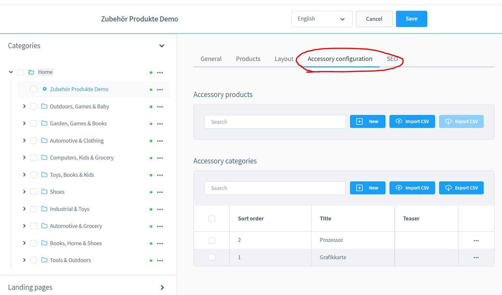

# Product add-ons & accessories

This plugin for Shopware 6 offers you the possibility to create product and accessory bundles. Within bundles, you can set individual prices for the accessories.

---

## Plugin Demo

A storefront demo is available for testing this plugin. The plugin can be tested at the following link:

- [https://demo-sw67.moori.net/MoorlProductAccessories](https://demo-sw67.moori.net/MoorlProductAccessories)

## Purchase the Plugin

The plugin can be purchased from the following stores. If you already have a Shopware account, please **always use** the link to the **Shopware Community Store** first, as alternative stores may cause licensing issues. If a plugin is **not** available in the Shopware Community Store, it is offered exclusively in one of the alternative stores.

- [Shopware Community Store](https://store.shopware.com/en/search?search=MoorlProductAccessories) *(recommended)*
- [moori Plugin Store](https://moori-plugin-store.com/MoorlProductAccessories)
- [Shopelfen Store](https://www.shopelfen.de/) *(under construction)*

**Important note:** You need the Foundation Plugin, which is available free of charge: [moori Foundation](../MoorlFoundation/index.md)

## Quickstart

A **demo package** is available for testing this plugin.

Go to **“Settings → [Demo Assistant](../MoorlFoundation/demo-assistant.md)”** and select **“MoorlProductAccessories”**.

For some packages, the product variants may need to be generated manually.

To do so, navigate to **“Catalog → Products → Demo Product → Variants → Generate Variants”**.

**Note:** In some cases, new categories and pages will be added to your shop. Please note that the demo data is provided for testing purposes only. The images included may be protected by copyright and must not be made publicly available.

## Configuration

You can generally find the configuration under the product or category details.

If you want to group your product add-ons, you should first create categories.

Enter a name and a sort order, the other fields are currently not relevant.

From a technical point of view, the add-ons are not pseudo-products but __real__ products,
when purchasing, the stock levels are updated.

Here you can configure the add-ons/accessory products. You have the following options regarding
the pricing:

- Adjusted price: Yes = price can be defined by yourself, No = standard price of the product.
- Is standard: This option is preselected
- Add-on: The product that can be selected as an add-on
- Category (optional): In this category the selection is categorised

### Product level

Here you can access the configuration on product level.

The following options can be configured on the product level:

- Hide Add to Cart button in listing: Prevents the product from being added to the shopping cart individually without configuration.
- Show Badge: Displays a badge in the listing
- Exclude configurations from category levels: Ignores the configurations from the selected category levels.

Example:

### Category level

If the configurations are repeated several times, it is worthwhile to create the configurations at category level.
category level. All products associated with this category are taken into account.
are taken into account.

## Plugin configuration

- Create bundle products: Yes = The product including the add-ons will be added to the shopping cart, No = All products will be added to the shopping cart individually
- Display stock: Yes = Will be displayed, No = Will not be displayed.

## Storefront

This is what the configurator looks like on the product detail page:

And like this in the shopping cart:

