# Produkt Add-Ons & Zubehör

Dieses Plugin für Shopware 6 bietet dir die Möglichkeit, Produkt- und Zubehör-Bundles zu erstellen. Innerhalb von Bundles, kannst du individuelle Preise für das Zubehör bestimmen.

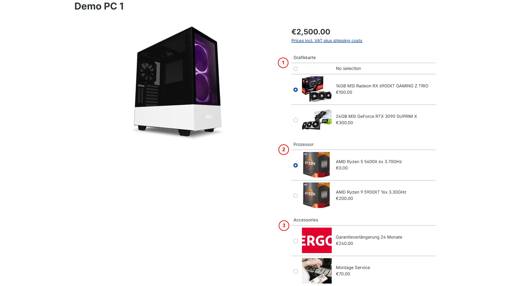

---

## Plugin Demo

Zu diesem Plugin steht eine Storefront-Demo zum Testen bereit. Unter folgenden Link kann das Plugin getestet werden:

- [https://demo-sw67.moori.net/MoorlProductAccessories](https://demo-sw67.moori.net/MoorlProductAccessories)

## Plugin erwerben

Dieses Plugin kann im offiziellen **Shopware Community Store** erworben werden.

- [Shopware Community Store](https://store.shopware.com/de/search?search=MoorlProductAccessories)

**Wichtiger Hinweis:** Sie benötigen das Foundation Plugin, welches Ihnen kostenlos zur Verfügung steht: [moori Foundation](../MoorlFoundation/index.md)

## Quickstart

Für dieses Plugin steht ein **Demo-Paket** zum Testen bereit.

Gehen Sie zu `Einstellungen` → [`Demo Assistent`](../MoorlFoundation/demo-assistant.md) und wählen Sie dort `MoorlProductAccessories` aus.

**Hinweis:** In einigen Fällen werden neue Kategorien und Seiten zu Ihrem Shop hinzugefügt. Bitte beachten Sie, dass die Demo-Daten ausschließlich zu Testzwecken dienen. Die darin enthaltenen Bilder können urheberrechtlich geschützt sein und dürfen nicht der Öffentlichkeit zugänglich gemacht werden.

---

## Ersteinrichtung

### Plugin-Konfiguration

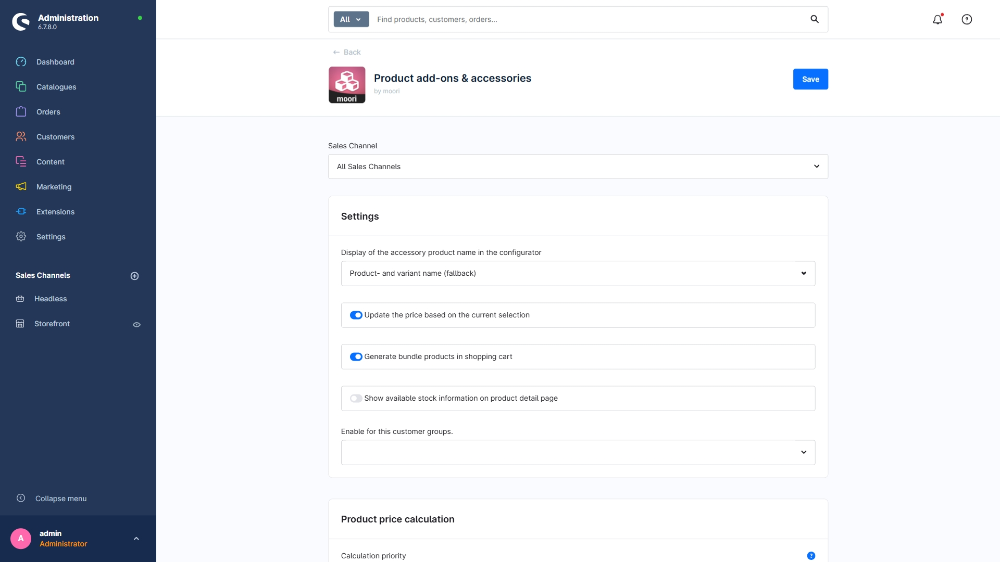
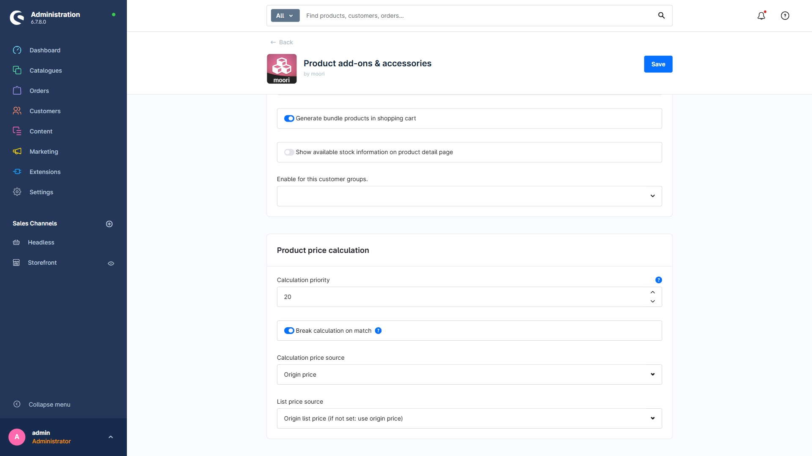

#### Einstellungen

- **Darstellung des Zubehör-Produktnamens im Konfigurator**
- **Preis anhand der aktuellen Auswahl aktualisieren**
- **Bundle-Produkte für den Warenkorb erstellen**: Diese Einstellung ist erforderlich, wenn das Zubehör individuelle Preise erhalten soll.
- **Verfügbaren Lagerbestand auf der Produktdetailseite anzeigen**
- **Für diese Kundengruppen aktivieren**: Der Konfigurator ist nur für die ausgewählten Kundengruppen verfügbar. Hinweis: Diese Einstellung wird künftig durch den Rule Builder ersetzt.

#### Preisberechnung der Produkte

- **Berechnungspriorität**: Wenn mehrere Preisberechnungen zutreffen, kann hier eine Priorität festgelegt werden.
- **Berechnung bei Treffer hier abbrechen**: Wenn ein Preis neu berechnet wird, werden alle nachfolgenden Preisberechnungen ab diesem Punkt übersprungen.
- **Quelle für die Preisberechnung**
- **Quelle für den Listenpreis**

### Allgemeine Übersicht

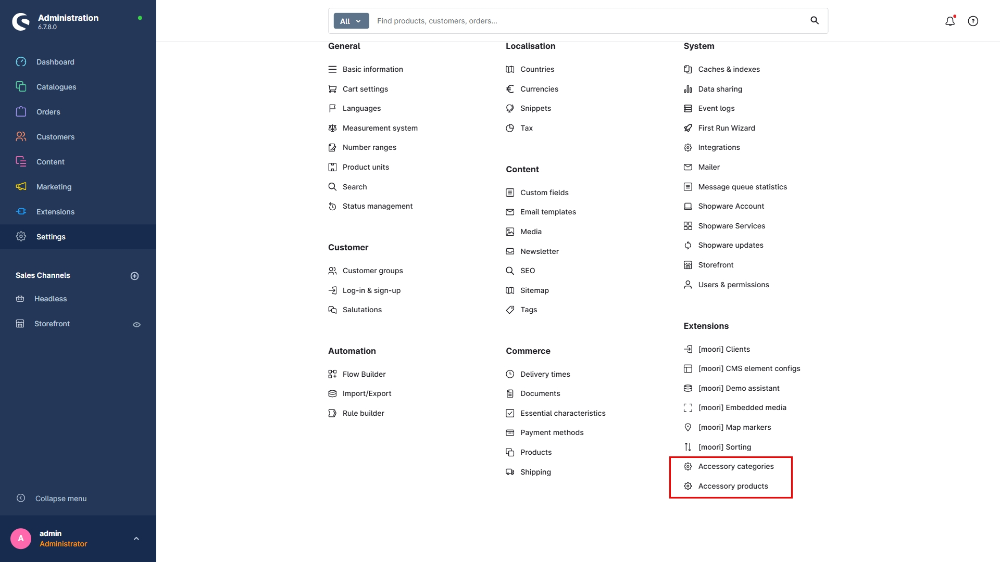

Über die Hauptnavigation im Admin unter `Einstellungen` → `Erweiterungen` → (`Zubehör Produkte` oder `Zubehör Kategorien`) erhalten Sie eine Übersicht aller angelegten Einträge.

## Zubehör-Kategorien

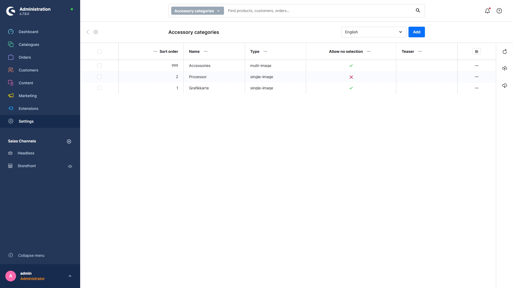
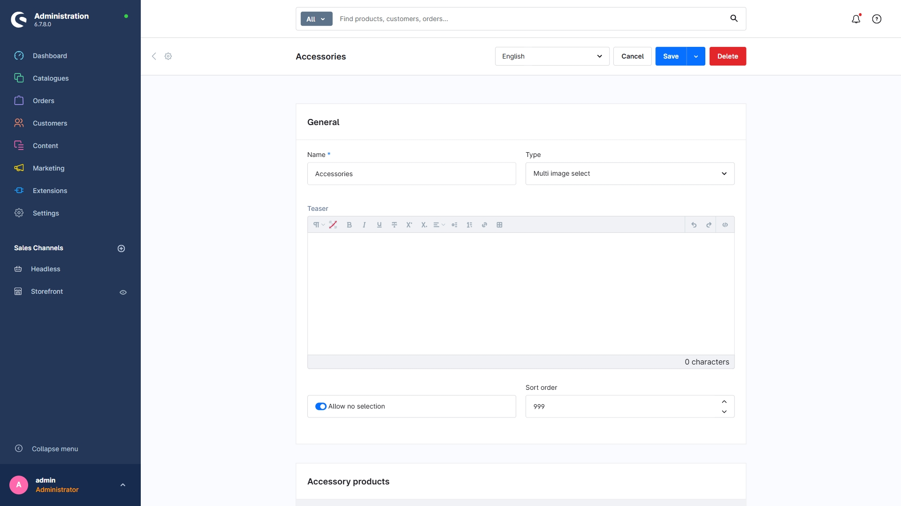
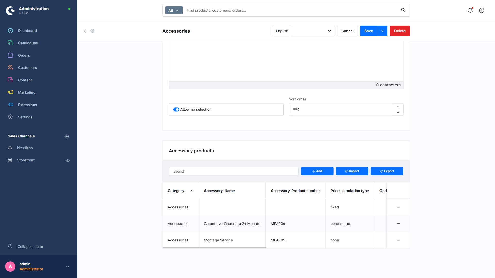

### Allgemeine Einstellungen

- **Name**
- **Typ**: Aktuell stehen vier Auswahltypen zur Verfügung: `Einfachauswahl`, `Mehrfachauswahl`, `Einfachauswahl mit Bild` und `Mehrfachauswahl mit Bild`.
- **Teaser**: Zusätzlicher Informationstext zur Kategorie
- **Keine Auswahl erlauben**: Die Auswahl im Konfigurator ist optional.
- **Sortierreihenfolge**
- **Zubehör-Produkte**: Liste aller Produkte, die der aktuellen Kategorie zugeordnet sind.

## Zubehör-Produkte

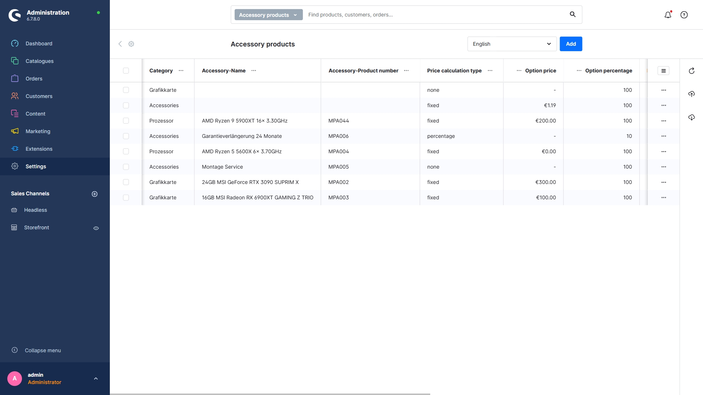
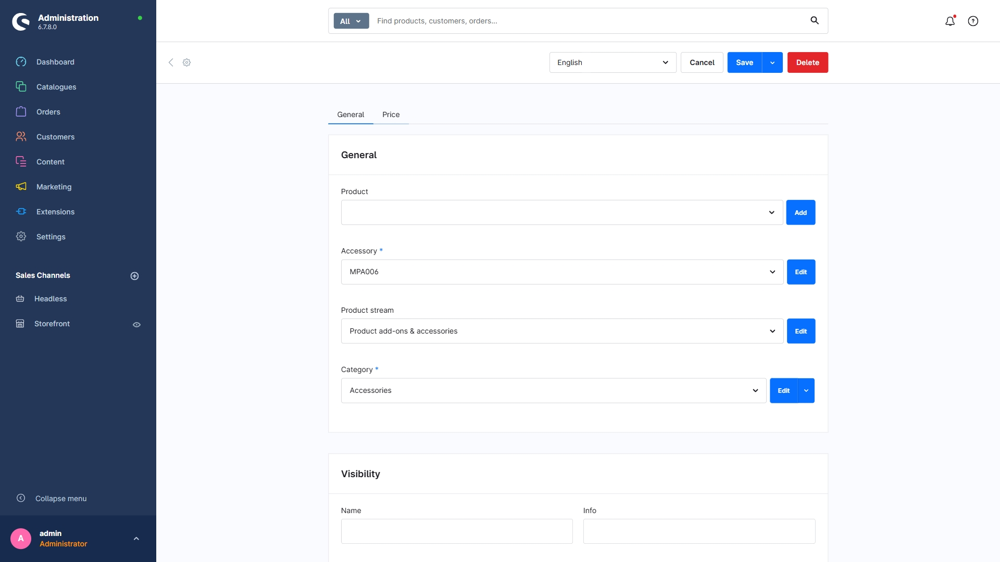

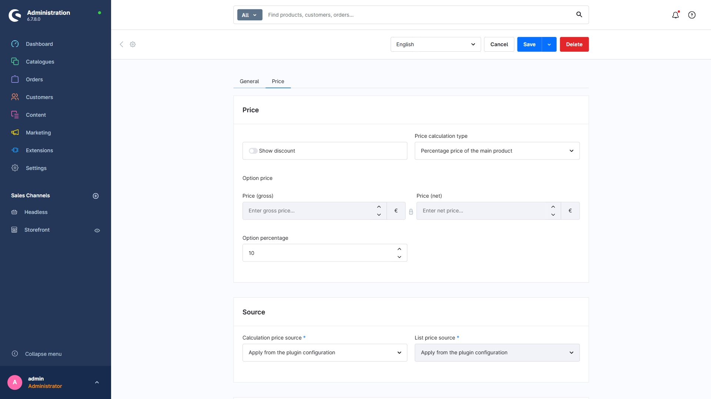

### Allgemeine Einstellungen

- **Produkt**: Dieses Zubehör gehört zum ausgewählten Produkt.
- **Zubehör**: Das Produkt, das als Zubehör angeboten wird.
- **Dynamische Produktgruppe**: Dieses Zubehör gehört zur ausgewählten Produktgruppe.
- **Kategorie**: Dieses Zubehör wird unter der gewählten Kategorie gelistet.

Hinweis: **Produkt** und **Dynamische Produktgruppe** sind optional. Es sollte jedoch nur eine dieser beiden Zuweisungen verwendet werden.

### Sichtbarkeit

- **Name**: Alternativer Name, falls das Zubehör anders bezeichnet werden soll als das Originalprodukt.
- **Info**: Interner Vermerk.
- **Priorität**: Priorität innerhalb der Auswahl.
- **Ist Standard**: Diese Auswahl ist bereits vorausgewählt.

### Preis

- **Als Rabatt anzeigen**: Wenn der neue Preis niedriger ist als der ursprüngliche Preis, kann dieser als Rabatt dargestellt werden.
- **Preisberechnungstyp**: `Originalpreis des Zubehörproduktes`, `Benutzerdefinierter Preis` oder `Prozentualer Preis des Hauptproduktes`.
- **Preis**: Wenn `Benutzerdefinierter Preis` ausgewählt ist, kann hier ein individueller Preis eingegeben werden.
- **Prozent**: Wenn `Prozentualer Preis des Hauptproduktes` ausgewählt ist, kann hier ein Prozentwert eingegeben werden. `100` entspricht 100 % des Hauptproduktpreises.
- **Quelle für die Preisberechnung**: Wird aus der Plugin-Konfiguration übernommen und kann hier optional angepasst werden.
- **Quelle für den Listenpreis**: Wird aus der Plugin-Konfiguration übernommen und kann hier optional angepasst werden.

## Hauptprodukt

Über die Hauptnavigation im Admin unter `Kataloge` → `Produkte` → `Detail` → `Zubehör` können Zubehör-Kategorien oder Zubehör-Produkte direkt zugewiesen werden.

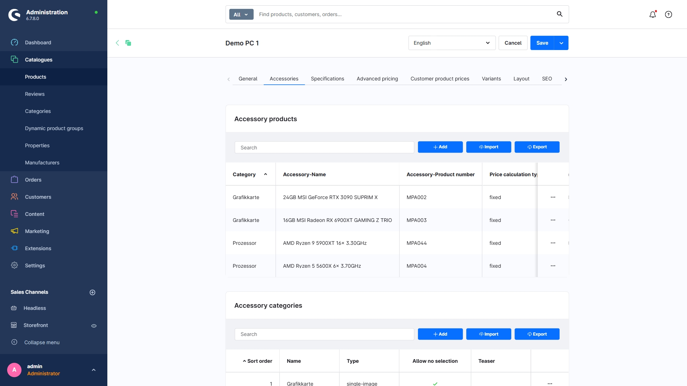

- **In den Warenkorb deaktivieren**: Das Produkt kann im Storefront-Listing nicht direkt in den Warenkorb gelegt werden.
- **Bundle-Badge anzeigen**

Hinweis: Das Zubehör kann auch direkt im Modal erstellt oder zugewiesen werden.

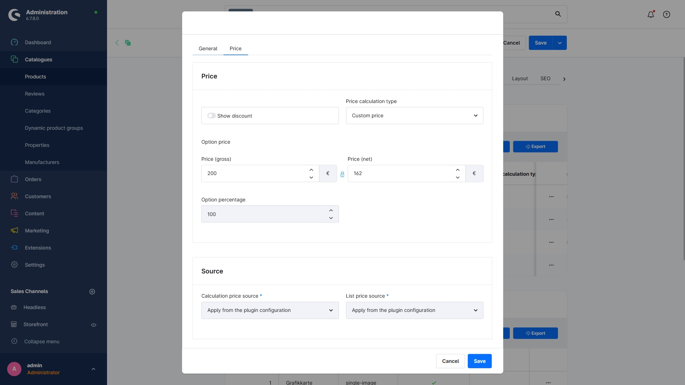

## Dynamische Produktgruppe

Über die Hauptnavigation im Admin unter `Kataloge` → `Dynamische Produktgruppen` → `Detail` können Zubehör-Kategorien oder Zubehör-Produkte direkt zugewiesen werden.

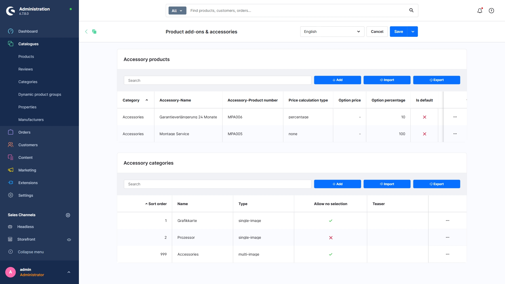

## Darstellung im Storefront

In diesem Beispiel gibt es Zubehör, das direkt zugewiesen wurde, sowie Zubehör, das über eine dynamische Produktgruppe zugewiesen ist.

1. Einfachauswahl mit Bild (optional)
2. Einfachauswahl mit Bild
3. Mehrfachauswahl mit Bild

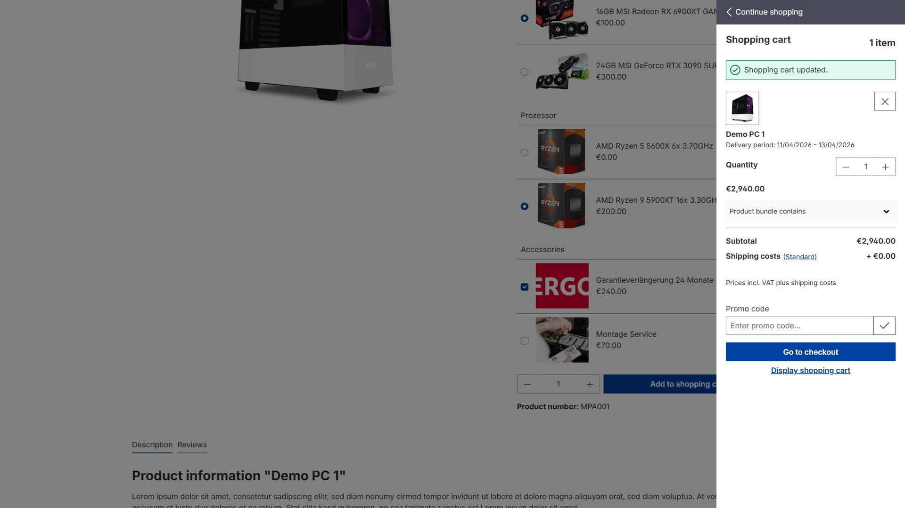

Das Produkt wird zusammen mit dem gewählten Zubehör gebündelt und anschließend in den Warenkorb gelegt.

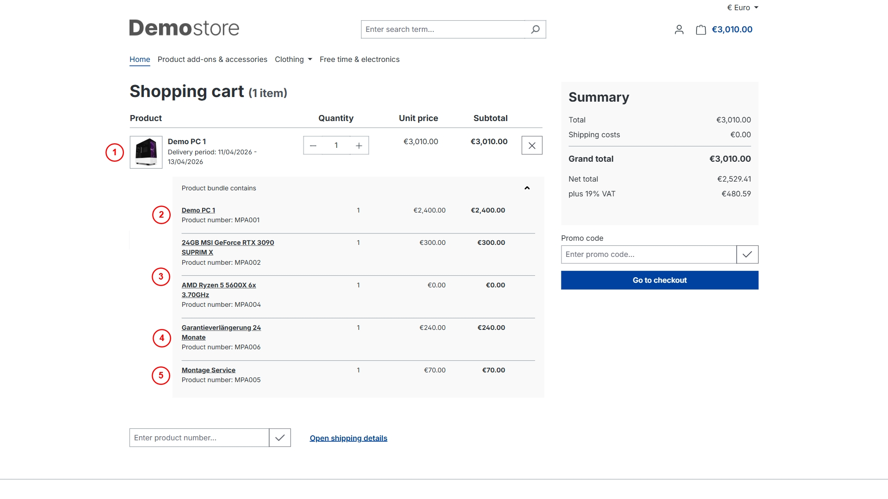

1. **Das Bundle**: Die Warenkorbposition mit der Summe aller gebündelten Produkte.
2. **Das Hauptprodukt**: An erster Position innerhalb des Bundles steht immer das Hauptprodukt mit dem Originalpreis.
3. **Zubehör mit benutzerdefiniertem Preis**
4. **Zubehör mit prozentualem Preis des Hauptproduktes**: In diesem Beispiel 10 %.
5. **Zubehör mit Originalpreis**