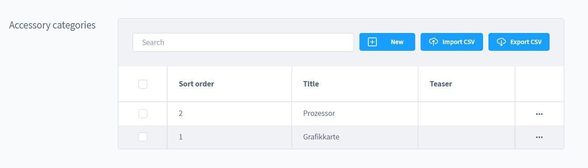
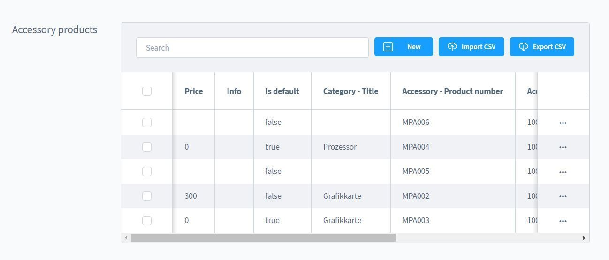
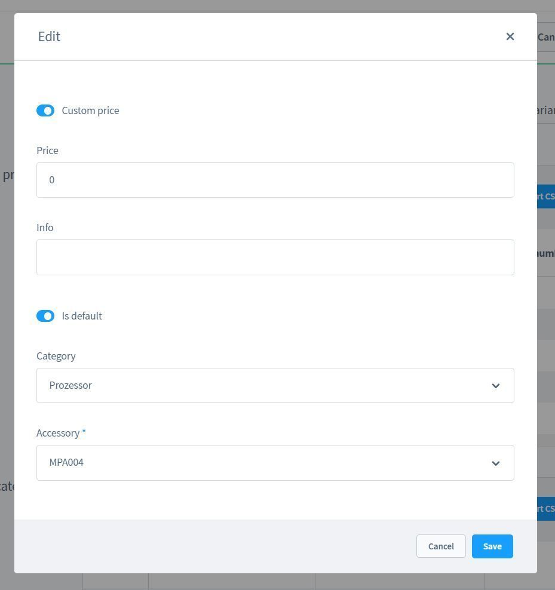
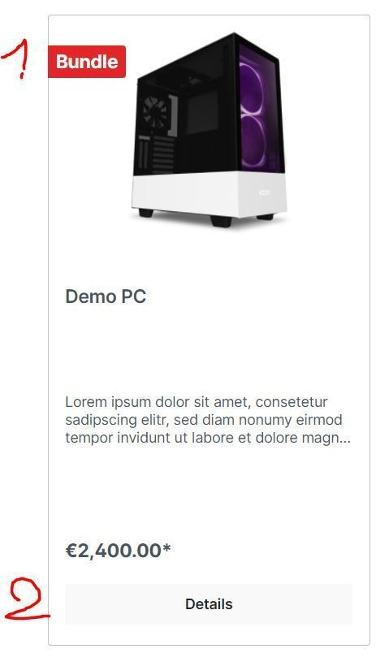

# Produkt Add-Ons & Zubehör

Dieses Plugin für Shopware 6 bietet dir die Möglichkeit, Produkt- und Zubehör-Bundles zu erstellen. Innerhalb von Bundles, kannst du individuelle Preise für das Zubehör bestimmen.

---

## Plugin Demo

Zu diesem Plugin steht eine Storefront-Demo zum Testen bereit. Unter folgenden Link kann das Plugin getestet werden:

- [https://demo-sw67.moori.net/MoorlProductAccessories](https://demo-sw67.moori.net/MoorlProductAccessories)

## Plugin erwerben

Das Plugin kann in den folgenden Stores erworben werden. Wenn Sie bereits einen Shopware-Account besitzen, nutzen Sie bitte **immer zuerst** den Link zum **Shopware Community Store**, da es bei alternativen Stores zu Problemen mit der Lizenzierung kommen kann. Ist ein Plugin **nicht** im Shopware Community Store verfügbar, wird es exklusiv in einem der alternativen Stores angeboten.

- [Shopware Community Store](https://store.shopware.com/de/search?search=MoorlProductAccessories) *(empfohlen)*
- [moori Plugin Store](https://moori-plugin-store.com/MoorlProductAccessories)
- [Shopelfen Store](https://www.shopelfen.de/) *(im Aufbau)*

**Wichtiger Hinweis:** Sie benötigen das Foundation Plugin, welches Ihnen kostenlos zur Verfügung steht: [moori Foundation](../MoorlFoundation/index.md)

## Quickstart

Für dieses Plugin steht ein **Demo-Paket** zum Testen bereit.

Gehen Sie zu **„Einstellungen → [Demo Assistent](../MoorlFoundation/demo-assistant.md)“** und wählen Sie dort **„MoorlProductAccessories“** aus.

Bei einigen Paketen müssen die Varianten der Produkte eventuell manuell generiert werden.

Gehen Sie dazu zu **„Katalog → Produkte → Demo Produkt → Varianten → Varianten generieren“**.

**Hinweis:** In einigen Fällen werden neue Kategorien und Seiten zu Ihrem Shop hinzugefügt. Bitte beachten Sie, dass die Demo-Daten ausschließlich zu Testzwecken dienen. Die darin enthaltenen Bilder können urheberrechtlich geschützt sein und dürfen nicht der Öffentlichkeit zugänglich gemacht werden.

## Konfiguration

Du findest die Konfiguration generell unter den Produkt- oder den Kategorie-Details.

Falls du deine Produkt Add-Ons gruppieren möchtest, solltest du zunächst Kategorien erstellen.

Gib einen Namen und eine Sortierung ein, die anderen Felder sind aktuell nicht relevant.

Die Add-Ons sind aus technischer Sicht keine Pseudoprodukte, sondern __reale__ Produkte, beim Einkauf werden die Lagerbestände aktualisiert.

Hier kannst du nun die Add-Ons/Zubehörprodukte konfigurieren. Du hast folgene Möglichkeiten bzgl. der Preisgestaltung:

- Angepasster Preis: Ja = Preis kann selbst definiert werden, Nein = Standardpreis des Produktes
- Ist Standard: Diese Option ist vorausgewählt
- Zubehör: Das Produkt, welches als Add-On ausgewählt werden kann
- Kategorie (optional): In dieser Kategorie wird die Auswahl kategorisiert

### Produkt-Ebene

Hier gelangst du in die Konfiguration auf Produkt-Ebene.

Folgende Optionen können auf der Produkt-Ebene konfiguriert werden:

- In den Warenkorb Button im Listing ausblenden: Verhindert, dass man das Produkt ohne Konfiguration einzeln in den Warenkorb legen kann
- Badge anzeigen: Zeigt ein Badge im Listing an
- Konfigurationen aus Kategorie-Ebenen ausschließen: Ignoriert die Konfigurationen aus den ausgewählten Kategorie-Ebenen

Beispiel:

### Kategorie-Ebene

Sofern sich die Konfigurationen mehrfach wiederholen, lohnt es sich die Konfigurationen auf Kategorie-Ebene zu erstellen. Dabei werden alle Produkte, die mit dieser Kategorie verbunden sind berücksichtigt.

## Plugin Konfiguration

- Bundle Produkte erzeugen: Ja = Das Produkt wird inklusive der Add-Ons in den Warenkorb gelegt, Nein = Alle Produkte werden einzeln in den Warenkorb gelegt
- Warenbestände anzeigen: Ja = Wird angezeigt, Nein = Wird nicht angezeigt

## Storefront

So sieht der Konfigurator auf der Produkt-Detailseite aus:

Und so im Warenkorb:

