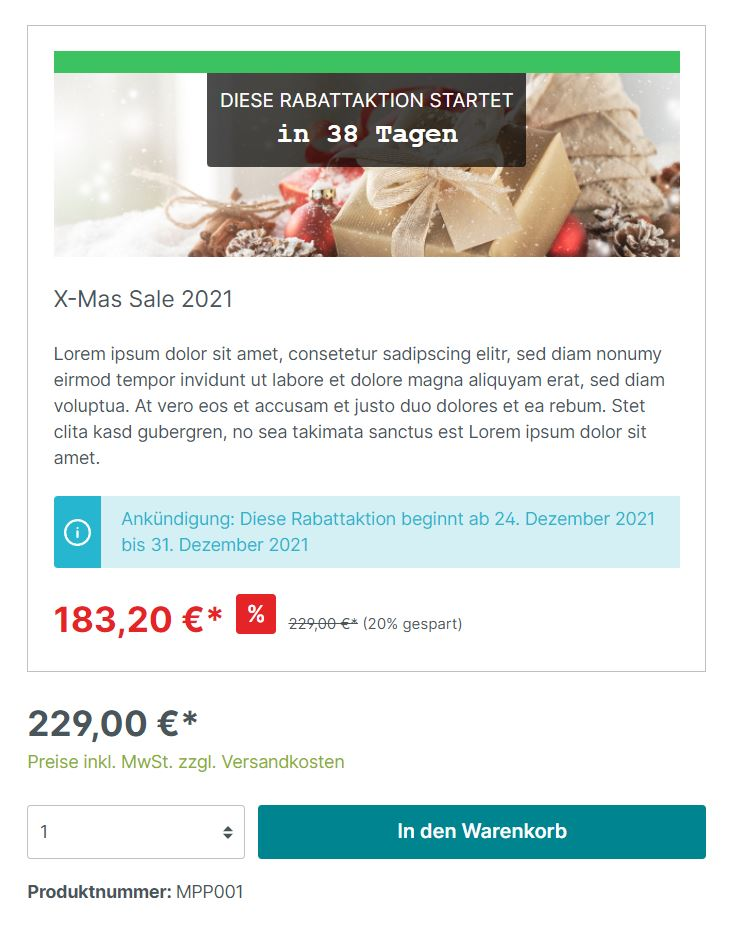

# Automatic discount promotions / live shopping / flash sales

Automate your discount promotions - Customized - with or without countdown timer - let your discount promotion end when a product has been purchased in a certain quantity

---

## Plugin Demo

A storefront demo is available for testing this plugin. The plugin can be tested at the following link:

- [https://demo-sw67.moori.net/MoorlProductPromo](https://demo-sw67.moori.net/MoorlProductPromo)

## Purchase the Plugin

This plugin can be purchased in the **Shopware Community Store**.

- [Shopware Community Store](https://store.shopware.com/en/search?search=MoorlProductPromo)

**Important note:** You need the Foundation Plugin, which is available free of charge: [moori Foundation](../MoorlFoundation/index.md)

## Quickstart

A **demo package** is available for testing this plugin.

Go to `Settings` → [`Demo Assistant`](../MoorlFoundation/demo-assistant.md) and select `MoorlProductPromo`.

**Note:** In some cases, new categories and pages will be added to your shop. Please note that the demo data is provided for testing purposes only. The images included may be protected by copyright and must not be made publicly available.

---

## Countdown promotions

Generally, all announcements are provided with a countdown. Optionally, you can also set an end time for your action and activate the countdown. The countdown can be configured as a counter or as a relative time. Even after the promotion has ended, you can leave it in the shop for a few days.

## Limited available quantity

If you select this option, an available stock is counted down in the background. This stock is already based on open orders and sales. Cancelled orders are automatically credited to the stock. You can set an individual stock level for each product. If you select a product with several variants, the stock is divided among the variants. If a product is no longer available, the promotion for this product is ended prematurely. However, you can replenish the stock manually at any time. The stock level can be visualised by a percentage or absolute progress bar!

## Configuration of discounts

Unlike with the Shopware 6 discounts & promotions, the discounts are displayed directly on the product detail page. You can set a percentage, an absolute or a fixed price discount for each product individually. However, the discounts should always be percentage-based for shops with multiple currencies. The discounted price is determined from the unit price of the product. If your product is already discounted by a list price or RRP, this will be used as the basis for the new discount. The discounted price is already displayed in the product when an announcement is made. If a promotion has already ended, the discounted price will be blurred.

## The Gambler Mode

Inspired by the Shopware 5 plugin "Liveshopping" there is also the gambler mode. Any promotion with a fixed time period and a limited available quantity can use this mode. The price is discounted daily, hourly or minutely - until the maximum discount has been reached or until the product is sold out and thus the discount promotion has ended.

## Customised discount promotions

The newest feature of the plugin is that you can decide if your promotion is only for a specific group of customers. You can limit the promotion to one or more sales channels, customer groups or customers.

## Further settings

Define a motto for your discount promotion: e.g. Black Friday Sale. You can assign a name, a description and a banner to your promotion. Don't want to overdo it? Then simply turn off the ad in the product listing or on the product detail page.
