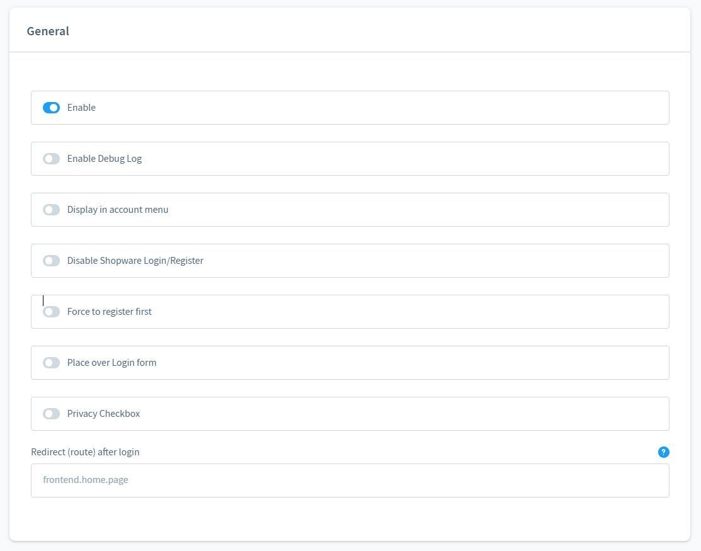
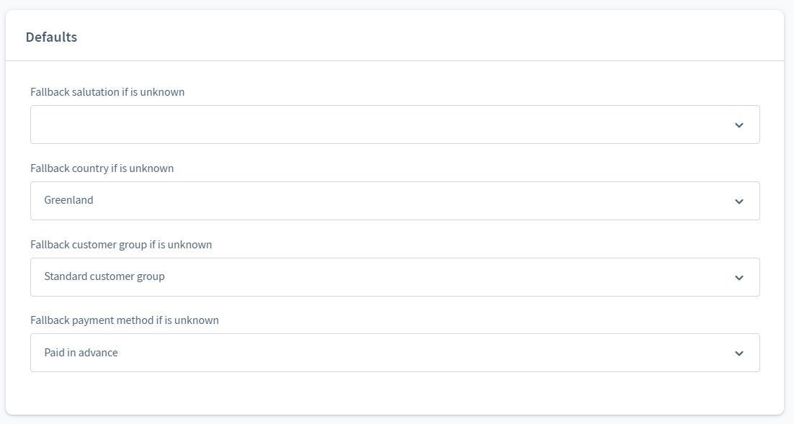
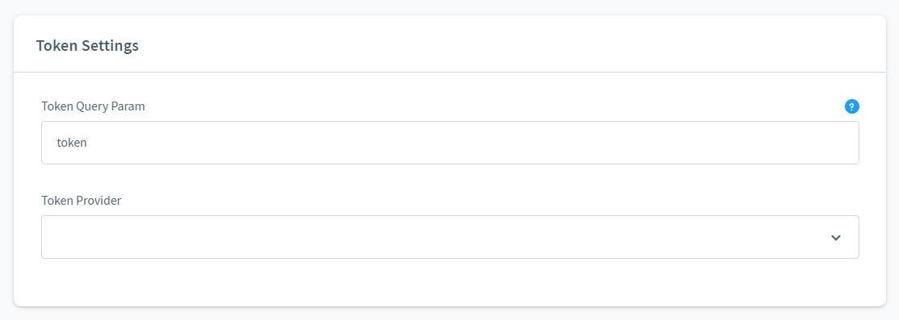
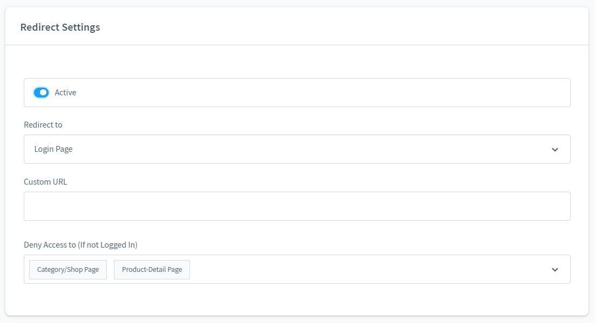
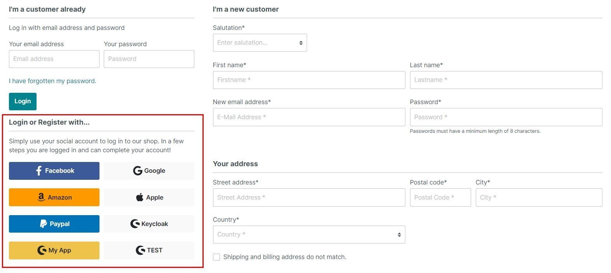

# Login with Facebook, Google, Keycloak... | OAuth 2.0

With this login plugin you can let your customers log in to your shop via OAuth 2.0. Many well-known providers such as Facebook, Google etc. are supported.

## What is this plugin good for?

Social media is omnipresent, use this to your advantage.

The goal of every shop operator is that the customer ends up at the check-out. Unfortunately, it is necessary that your customers register and log in.

You can shorten this path with this plugin by offering quick options via social media logins for registration and login!

Your customer clicks on the button "Log in with..." and is redirected to the provider's page. If they are logged in, they will immediately find out what information is requested from your shop. This is usually: e-mail and full name.

**New customers** can complete the registration process more quickly, as only missing information needs to be added to the data record. If your customer has registered via a social media platform, he or she can still log in via the usual login process using the e-mail address stored.

**Existing customers** can simply log in to your shop via Facebook and the like, as long as the email addresses used match - quick and convenient.

## What is possible with this plugin?

You can use this plugin for a variety of possible applications.

### Registration or login with XXX

Many of your customers are already registered on XXX and already use the login feature for other websites.

The big advantage is that your customers do not need a password. With the consent of your customers, the shop gains access to essential personal data (e-mail, name, address) via XXX.

Data that has not been provided can be added later by your customer. Checkout is also only possible as soon as all necessary data is available.

Returning customers can use the login via XXX...

!!! note "Note about the e-mail address"

    You can currently also create Facebook accounts without an email address. These accounts are not accepted by the plugin.

    If the customer uses e.g. the same e-mail address at Facebook and at Google, he can log in with one of the two providers. The e-mail address serves as an identifier for the customer.

### Private shop

You can make the shop inaccessible to customers without an account with a specific OAuth 2.0 provider.

It is also possible to forward the customer directly to the login of a provider.

### Share OAuth 2.0 tokens from other applications

For example, you have an app that authenticates your customers via the same provider?

Simply share the token via URL, your customers are then automatically logged in to the shop.

### The plugin supports six widely used providers

You can start directly with the providers Facebook, Google, Amazon, Paypal, Apple and Keycloak.

Is your provider not included? You have the option of setting up another individual provider with an OAuth 2.0 standard protocol.

## Configuration

The following standard settings can be made.

- Enable
- Enable debugging
- Show in dropdown menu
- Hide default registration
- Client must fill in the registration form
- Place (above/below) the login form
- Show checkbox for data protection

In most cases we get too little information from the provider, here you can define the default values for the customer.

Each provider has its own configuration. You can activate and deactivate providers individually.

Example: Facebook configuration.

!!! note "Note on setting up the providers"

    This plugin only provides the technical requirements to configure OAuth 2.0 providers.

    However, there are no instructions here on how to set up a Facebook or Google login, for example.

    The configuration for "Custom SignIn" requires a basic technical understanding of the OAuth 2.0 protocol.

    The variables "email, firstName, lastName, zipcode, street, city" serve as mapping from the provider to Shopware 6.

Here are the settings for the shared token from other apps.

Settings for private shop mode.

## Note about the setup at the provider

In most cases, the "Redirect URL" must be whitelisted. This URL is for example:

**https://myshop.de/moorl/sign-in/login**

## View in the storefront

Some buttons and icons are already available for the matching provider.

