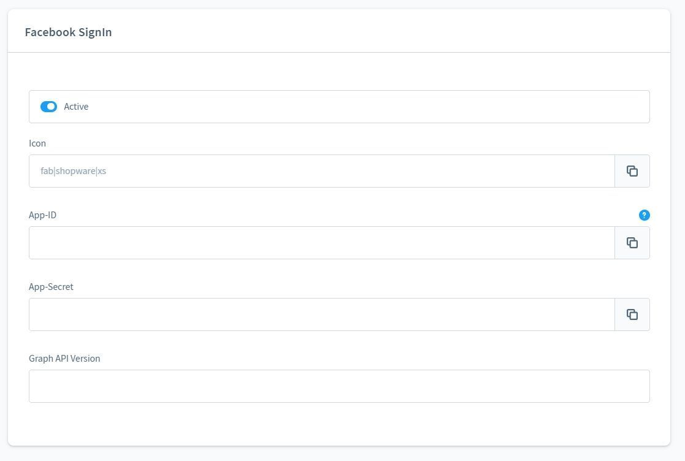

# Login mit Facebook, Google, Keycloak... | OAuth 2.0

Mit diesem Login Plugin kannst du deine Kunden via OAuth 2.0 in deinem Shop anmelden lassen. Viele bekannte Anbieter wie z.B. Facebook, Google usw. werden unterstützt.

## Was ist mit diesem Plugin möglich?

Du kannst dieses Plugin für eine Vielzahl von möglichen Anwendungsbereichen einsetzen.

### Registrierung oder Anmeldung mit XXX

Viele deiner Kunden sind bereits auf XXX angemeldet und nutzen das Login Feature auch bereits für andere Webseiten.

Der große Vorteil ist, dass deine Kunden kein Passwort benötigen. Der Shop erhält mit der Zustimmung deiner Kunden über XXX Zugriff auf essenzielle persönliche Daten (E-Mail, Name, Adresse).

Daten, die nicht zur Verfügung gestellt wurden, können nachträglich durch deinen Kunden ergänzt werden. Der Checkout ist auch erst dann möglich, sobald alle notwendigen Daten verfügbar sind.

Wiederkehrende Kunden können den Login via XXX verwenden...

!!! note "Hinweis zu der E-Mail Adresse"

    Man kann aktuell auch Facebook Konten ohne E-Mail Adresse anlegen. Diese Konten werden durch das Plugin nicht akzeptiert.

    Nutzt der Kunde z.B. bei Facebook und bei Google dieselbe E-Mail Adresse, kann dieser sich mit einer der beiden Provider anmelden. Die E-Mail Adresse dient als Identifikator für den Kunden.

### Privater Shop

Du kannst den Shop für Kunden ohne Account bei einem bestimmten OAuth 2.0 Provider unzugänglich machen. 

Es ist auch möglich den Kunden direkt zum Login eines Providers weiterzuleiten.

### OAuth 2.0 Tokens von anderen Anwendungen teilen

Du hast z.B. eine App, welche deine Kunden über denselben Provider authentifiziert?

Teile einfach den Token via URL, deine Kunden sind dann automatisch im Shop eingeloggt.

### Das Plugin unterstützt sechs weit verbreitete Provider

Du kannst direkt mit den Providern Facebook, Google, Amazon, Paypal, Apple und Keycloak loslegen.

Ist dein Provider nicht dabei? Du hast die Möglichkeit einen weiteren individuellen Provider mit einem OAuth 2.0 Standard Protokoll einzurichten.

## Konfiguration

Folgende Standard Einstellungen können durchgeführt werden.

- Aktivieren
- Debugging aktivieren
- Im Dropdown Menü anzeigen
- Standard Registrierung ausblenden
- Der Kunde muss das Anmeldeformular ausfüllen
- Platzierung (über/unter) dem Login-Formular
- Checkbox für Datenschutz anzeigen

In den meisten Fällen bekommen wir vom Provider zu wenig Informationen, hier können die Standard-Werte für den Kunden definiert werden.

Jeder Provider hat eine eigene Konfiguration. Du kannst Provider einzeln aktivieren und deaktivieren.

Beispiel: Facebook Konfiguration.

!!! note "Hinweis zu der Einrichtung der Provider"

    Dieses Plugin bietet ausschließlich die technischen Voraussetzungen um OAuth 2.0 Provider zu konfigurieren.

    Jedoch gibt es hier keine Anleitungen, wie man z.B. ein Facebook oder Google Login einrichtet.

    Die Konfiguration für "Custom SignIn" erfordert ein technisches Grundverständnis für das OAuth 2.0 Protokoll.

    Die Variablen "email, firstName, lastName, zipcode, street, city" dienen als Mapping vom Provider zu Shopware 6.

Hier sind die Einstellungen für den geteilten Token aus anderen Apps.

Einstellungen für den privaten Shop Modus.

## Ansicht im Storefront

Einige Buttons und Icons stehen bereits für den passenden Provider zur Verfügung.

