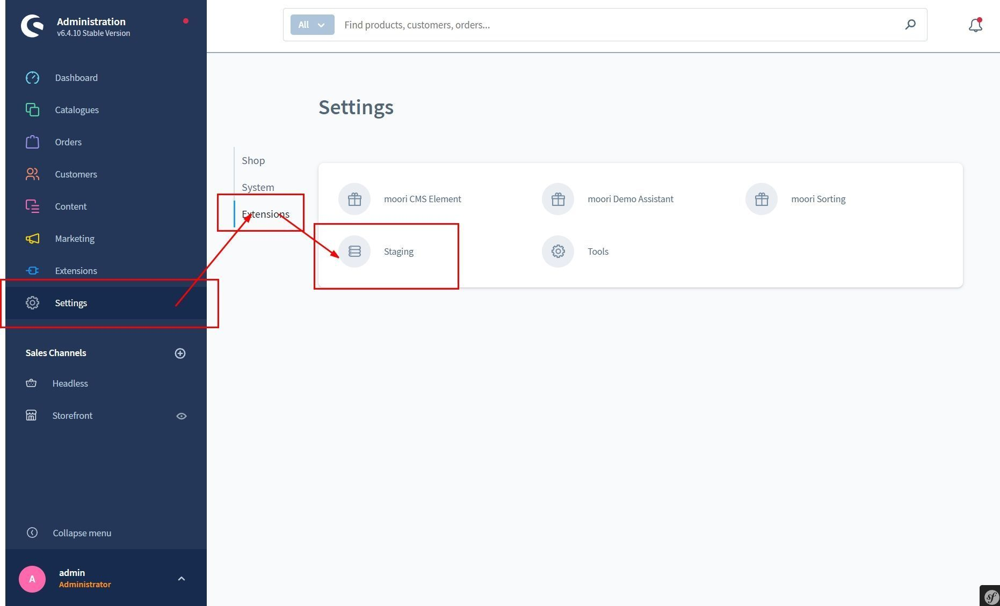
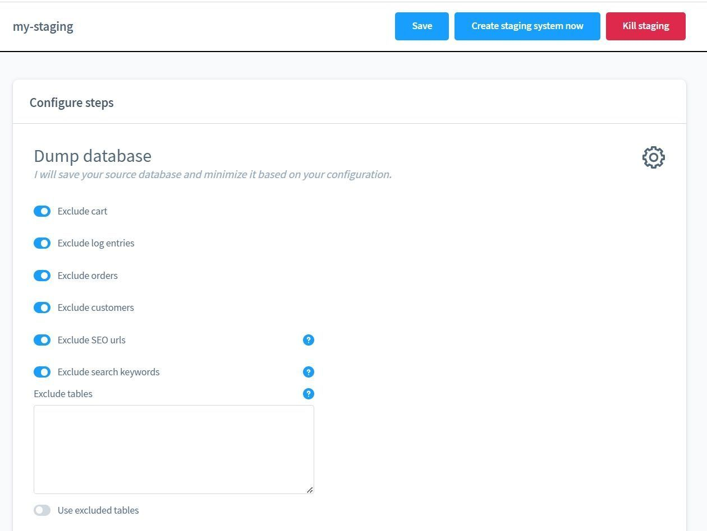
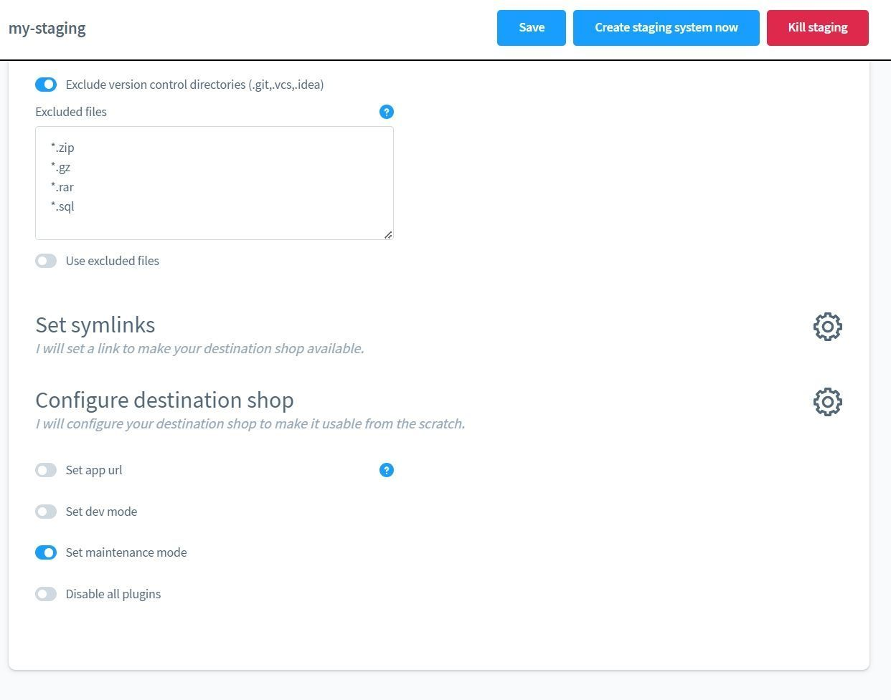
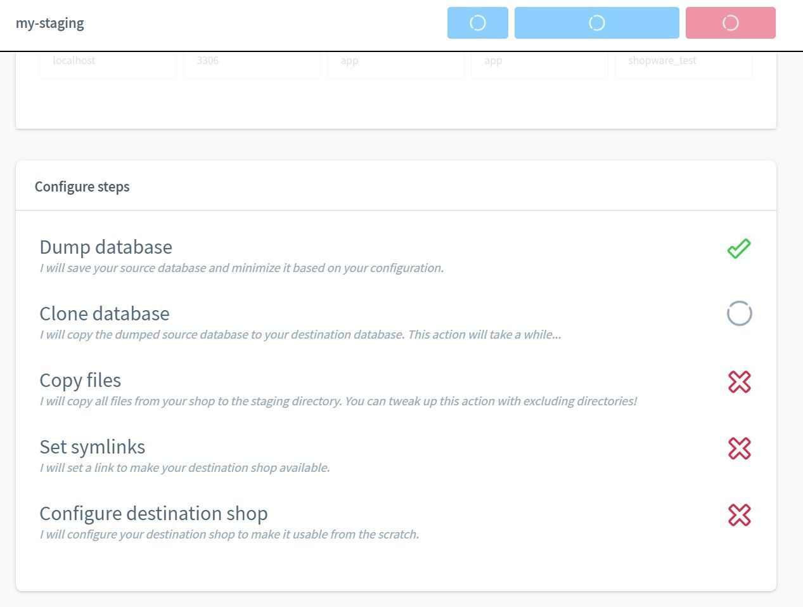

# Staging and test environments

Create and delete a staging system in Shopware 6 with just one click? This plugin makes it possible!

Thanks to high-performance processes on the shell level, this plugin is up to five times faster than other staging plugins!

A shop with 10,000 products (incl. variants) can be set up as a test environment with the recommended settings can be ready as a test environment within one minute.

You don't believe? Convince yourself.

## What is this plugin good for?

Shopware 6 is based on the PHP framework "Symfony" but the interaction of Shopware Core and many plugins unfortunately does not run as harmoniously as one should actually expect.

This can have a variety of causes; minor errors are no big deal. But what happens when suddenly the whole shop is paralysed and it is not so easy to make a backup? easy to make a backup? To avoid this scenario, new updates should be tested in a test environment. If everything runs, you can install these updates in the Live Shop without hesitation.

Setting up a test environment usually takes up to half a day. It is not time-consuming, the smallest error can lead to an enormous loss of data.

With this plugin, a fully functional test environment is ready for use in less than ten minutes and any risks are kept to a minimum.

## Installation

!!! note

      If you have problems with the plugin, please read the following [notes](../) in the FAQ section.

!!! note

      The staging systems are NOT deleted when the plug-in is uninstalled.

## Settings

### System requirements

- min. PHP v7.4
- php.ini: max_execution_time > 120 (greater than 2 minutes)
- Server must support execution of commands by PHP (a list of providers can be found at the end of this page).
  can be found at the bottom of this page)
- The APP_URL in the .env file of the live system must be configured correctly!

### Basic configuration

In the basic configuration you can activate the logger of the plugin. This way, further information about the processes is saved in a log file.

You can view this log file with the "Frosh Tools" plugin.

There is also a compatibility mode for various hosting providers. Further info on this can be found at the end of this documentation.

### Create test environment

The plugin is located under "Settings" - "Extensions" - "Staging".

Here you will find a list of your staging systems. Click on "New Staging System" in the upper right corner.

Now a short system check is executed to check if the plugin is compatible with your web server. If there is an error here, you will not be able to use the plugin and will either have to use a different or choose an alternative staging plugin.

The name of your staging system is also the subdirectory where you can reach your staging system. You can also leave the name blank, in which case a name is generated automatically.

In the next step you enter the access data to the database of your staging system. database. To be on the safe side, the plug-in checks that you do not accidentally enter the data of your live database.

If the connection to the database has been established successfully, you can now make your own settings for operations. The default settings correspond to recommendations regarding performance and data protection.

**Caution**

If you exclude the media directories, a link to the media of your live shop will be set automatically. This means that if you remove files in the media manager in the staging system, they will also be removed in the live shop. in the Staging System, these files will also be removed in the Live System.

Now you can create the staging system. The processes are run through step by step.

If there is an error, this may be because your php.ini is configured incorrectly. You can find hints at the top of this page.

Once the staging system has been created, you can access it via the links to Admin or Storefront via the links.

## Notes on hosting providers

If the server generally offers SSH access and is based on Apache, the plugin should work without any problems.

Servers based on NGINX require an additional configuration so that the test system is accessible.

### ALL-INKL.COM

If no connection to the database is possible, please allow accessibility from everywhere!

| Package | Supported | Notes |
| ----------- | ----------- | ----------- |
| ALL-INKL.COM - Private | NO | |
| ALL-INKL.COM - PrivatePlus | YES | |
| ALL-INKL.COM - Premium | YES | |
| ALL-INKL.COM - Business | YES | |

### enerSpace

| Package                      | Supported | Notes |
|----------------------------|-------------| ----------- |
| Shopware 6 SSD Hosting     | YES | |
| Managed-SSD - Basic        | YES | |
| Managed-SSD - Medium       | YES | |
| Managed-SSD - Professional | YES | |
| Managed-SSD - Premium      | YES | |

### Profihost

In the plug-in settings, set Hosting compatibility mode to Profihost (MariaDB) or Profihost (MySQL). It is important that the staging environment uses the same type of database (MySQL or MariaDB) as the live shop!

| Package | Supported | Notes |
| ----------- | ----------- | ----------- |
| Managed Hosting | YES | Apache server must be restarted |
| Managed Shop-Hosting | YES | Apache server must be restarted |
| Managed Server (FlexServer) | YES | Apache server must be restarted |

### Hosteurope

Poor performance was observed when cloning the database. Nevertheless, staging systems could be created on Hosteurope without any problems.

| Package | Supported | Notes |
| ----------- | ----------- | ----------- |
| WebHosting - Basic | YES | |
| WebHosting - Medium | YES | |
| WebHosting - Premium | YES | |
| WebHosting - Supreme | YES | |
| WebServer - Basic SSD | YES | |
| WebServer - Medium SSD | YES | |
| WebServer - Premium SSD | YES | |
| WebServer - Supreme SSD | YES | |

### Mittwald

Unfortunately, this provider does not offer the technical basis, various options are missing.

- Binary "rsync" is not enabled
- PHP shell_exec() has no permission to execute binaries which write to the file system, e.g. mysqldump
- PHP SSH extension must be enabled, but you can only use the SSH root user to execute binaries
- SSH operations are not executed synchronously, it does not wait until one operation is executed, instead the next one starts and causes errors
