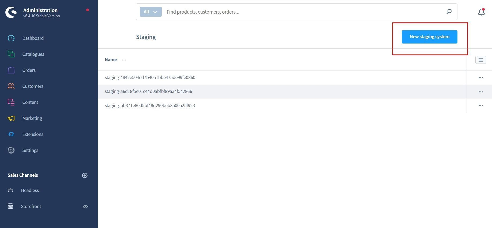
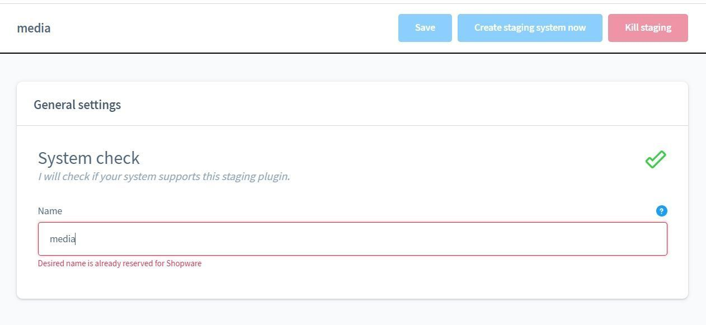
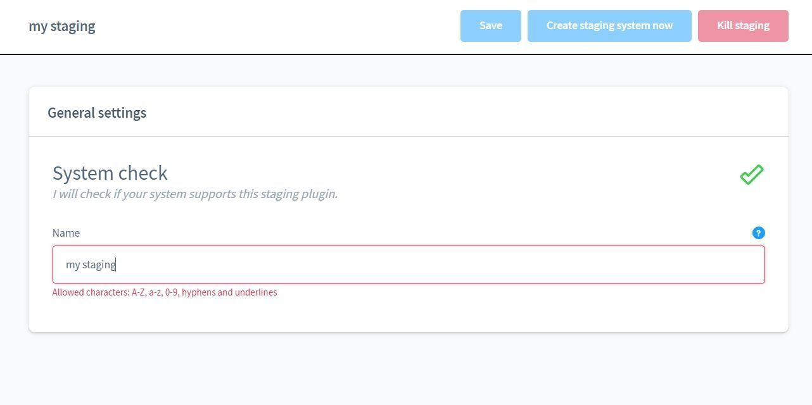
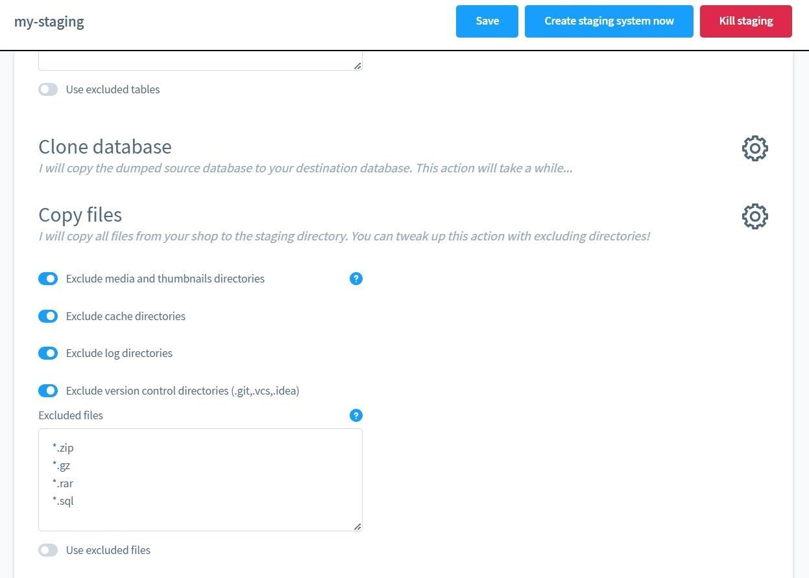
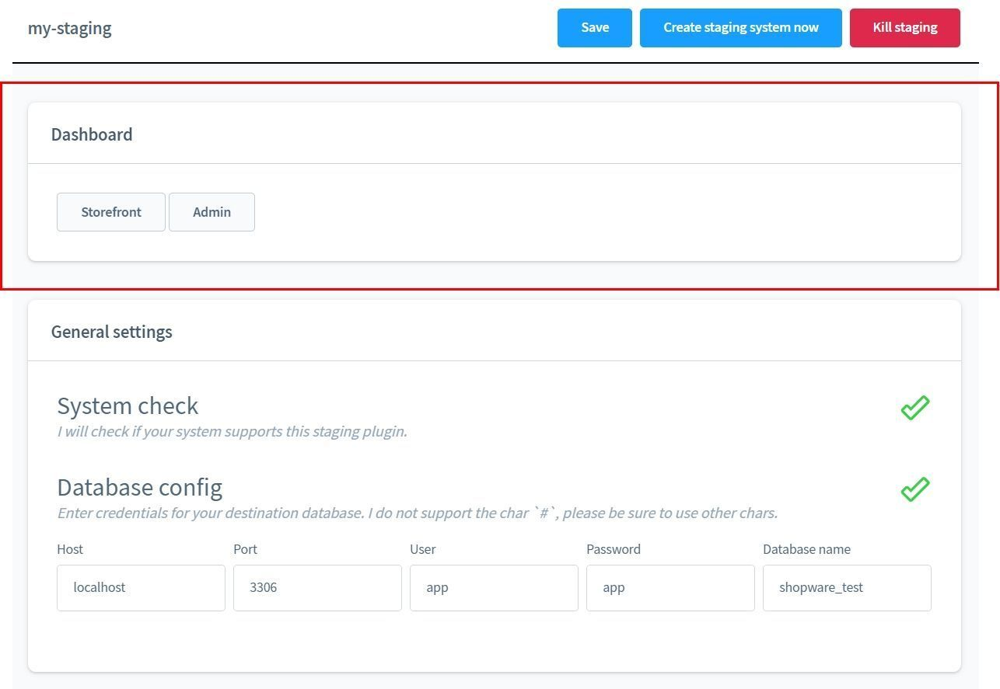

# Staging und Testumgebungen

Ein Staging System für Shopware 6 mit nur einem Klick erstellen und wieder löschen? Dieses Plugin macht es möglich!

Dank performanter Prozesse auf Shell-Ebene, ist dieses Plugin bis zu fünfmal schneller als andere Staging Plugins!

Ein Shop mit 10.000 Produkten (inkl. Varianten) kann mit den empfohlenen Einstellungen bereits innerhalb einer Minute als Testumgebung bereitstehen. 

Du glaubst nicht? Überzeug dich selbst.

## Wofür ist dieses Plugin gut?

Shopware 6 basiert auf dem PHP Framework "Symfony" jedoch läuft das Zusammenspiel aus Shopware Core und vielen Plugins leider nicht so harmonisch ab, wie man es eigentlich erwarten sollte.

Das kann verschiedenste Ursachen haben, kleinere Fehler sind nicht weiter tragisch. Aber was passiert, wenn plötzlich der ganze Shop lahm liegt und es auch nicht so einfach ist ein Backup einzuspielen? Um dieses Szenario zu vermeiden, sollte man neue Updates auf einer Testumgebung unter die Lupe nehmen. Wenn alles läuft, kann man ohne Bedenken diese Updates auch im Live Shop installieren.

Eine Testumgebung einzurichten dauert meist bis zu einem halben Tag. Es ist nicht nur sehr Zeitintensiv, der kleinste Fehler kann zu einem enormen Datenverlust führen.

Mit diesem Plugin ist eine voll funktionstüchtige Testumgebung in unter zehn Minuten einsatzbereit und jegliche Risiken sind auf einem Minimum beschränkt.

## Installation

!!! note

      Falls du Probleme mit dem Plugin hast, bitte beachte folgende [Hinweise](../) im FAQ Bereich.

!!! note

      Die Staging Systeme werden bei Deinstallation des Plugins NICHT gelöscht.

## Einstellungen

### Systemanforderungen

- min. PHP v7.4
- php.ini: max_execution_time > 120 (größer als 2 Minuten)
- Server muss das Ausführen von Befehlen durch PHP unterstützen (Eine Liste an Anbietern
  befindet sich am Ende dieser Seite)
- Die APP_URL in der .env-Datei des Live-Systems muss richtig konfiguriert sein!

### Basiskonfiguration

In der Basiskonfiguration kannst du den Logger des Plugins aktivieren. So werden weitere Informationen zu den Prozessen in einer Logdatei gespeichert.

Du kannst diese Logdatei mit dem "Frosh Tools" Plugin einsehen.

Zudem gibt es einen Kompatibilitätsmodus für diverse Hosting Anbieter. Weitere Informationen findest du am Ende dieser Dokumentation.

### Testumgebung erstellen

Das Plugin befindet sich unter "Einstellungen" - "Erweiterungen" - "Staging".

Hier findest du eine Liste mit deinen Staging Systemen. Klicke oben rechts auf "Neues Staging System".

Nun wird ein kurzer Systemcheck ausgeführt um zu prüfen, ob das Plugin mit deinem Webserver kompatibel ist. Sollte es hier einen Fehler geben, kannst du das Plugin leider nicht nutzen und musst entweder einen anderen Webserver nehmen oder dich für ein alternatives Staging Plugin entscheiden.

Der Name deines Staging-Systems ist auch zugleich das Unterverzeichnis wo du dein Staging System erreichst. Du kannst den Namen auch leer lassen, dann wird automatisch ein Name generiert.

Im nächsten Schritt gibst du die Zugangsdaten zu der Datenbank deines Staging Systems ein. Zur Sicherheit überprüft das Plugin, ob du nicht versehentlich die Daten deiner Live Datenbank eingibst.

Wurde die Verbindung zur Datenbank erfolgreich hergestellt, kannst du nun eigene Einstellungen für Vorgänge vornehmen. Die Voreinstellungen entsprechen Empfehlungen bezüglich Performance und Datenschutz.

**Achtung**

Solltest du die Medien Verzeichnisse ausschließen, wird automatisch eine Verlinkung zu den Medien deines Live-Shops gesetzt. Das heißt, wenn du im Medien-Manager im Staging System Dateien entfernst, werden diese auch im Live-System entfernt.

Nun kannst du das Staging System erstellen. Die Vorgänge werden Schritt für Schritt durchlaufen.

Falls es einen Fehler gibt, kann das möglicherweise daran liegen, dass deine php.ini falsch konfiguriert ist. Hinweise dazu findest du am Anfang dieser Seite.

Sobald das Staging System erstellt wurde, kannst du über die Links auf Admin oder Storefront zugreifen.

## Hinweise zu Hosting Anbietern

Sofern der Server generell einen SSH Zugang anbietet und auf Apache basiert, sollte das Plugin problemlos funktionieren.

Server auf NGINX-Basis benötigen eine zusätzliche Konfiguration damit das Testsystem erreichbar ist.

### ALL-INKL.COM

| Paket | Unterstützt | Hinweise |
| ----------- | ----------- | ----------- |
| ALL-INKL.COM - Privat | NEIN | |
| ALL-INKL.COM - PrivatPlus | JA | |
| ALL-INKL.COM - Premium | JA | |
| ALL-INKL.COM - Business | JA | |

### Profihost

In den Plugin Einstellungen Hosting Kompatibilitätsmodus auf Profihost (MariaDB) oder Profihost (MySQL) stellen. Wichtig dabei ist, dass die Staging Umgebung dieselbe Datenbank-Art (MySQL oder MariaDB) wie der Live-Shop nutzt!

| Paket | Unterstützt | Hinweise |
| ----------- | ----------- | ----------- |
| Managed Hosting | Ja | Apache Server muss neu gestartet werden |
| Managed Shop-Hosting | Ja | Apache Server muss neu gestartet werden |
| Managed Server (FlexServer) | JA | Apache Server muss neu gestartet werden |

### Hosteurope

Es wurde eine schlechte Performance beim Klonen der Datenbank beobachtet. Trotzdem ließen sich auf Hosteurope problemlos Staging Systeme erstellen.

| Paket | Unterstützt | Hinweise |
| ----------- | ----------- | ----------- |
| WebHosting - Basic | JA | |
| WebHosting - Medium | JA | |
| WebHosting - Premium | JA | |
| WebHosting - Supreme | JA | |
| WebServer - Basic SSD | JA | |
| WebServer - Medium SSD | JA | |
| WebServer - Premium SSD | JA | |
| WebServer - Supreme SSD | JA | |
