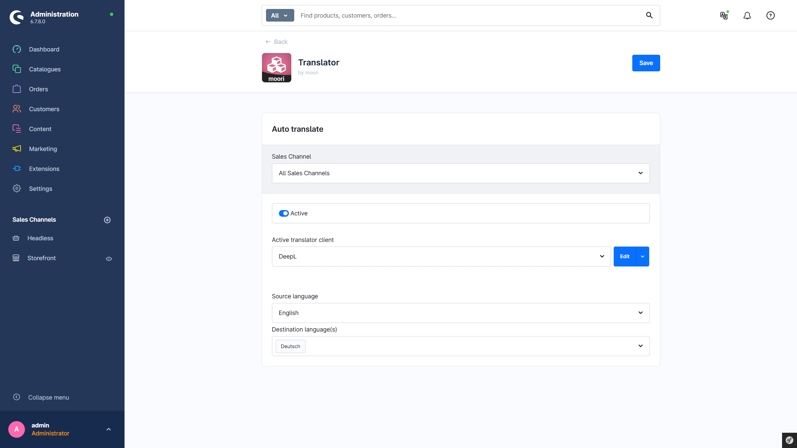
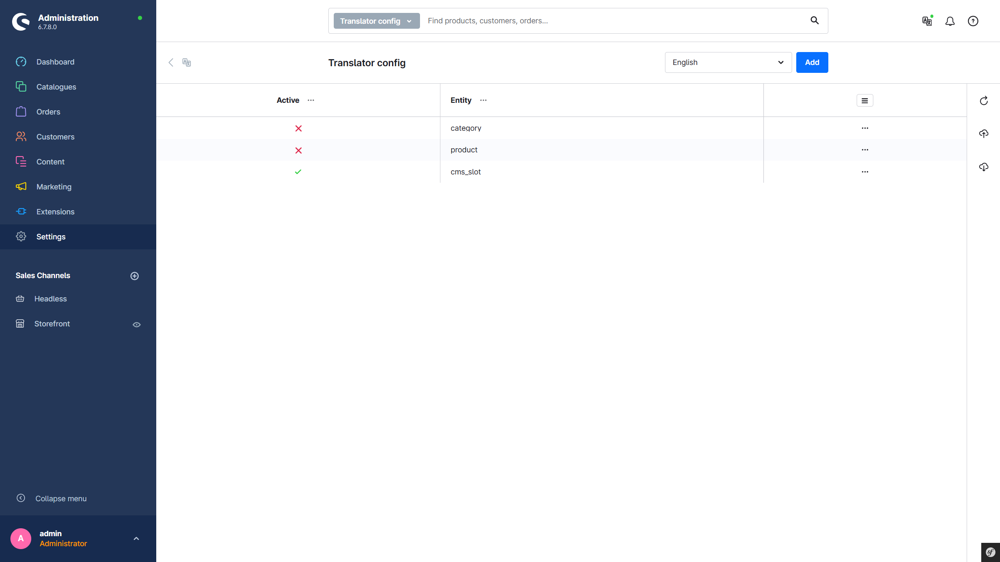
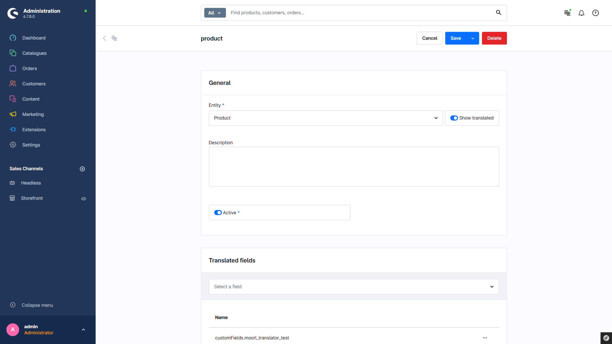
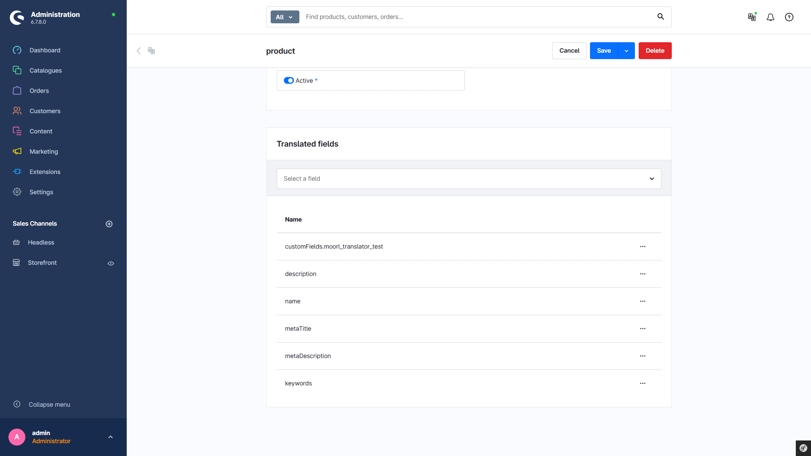
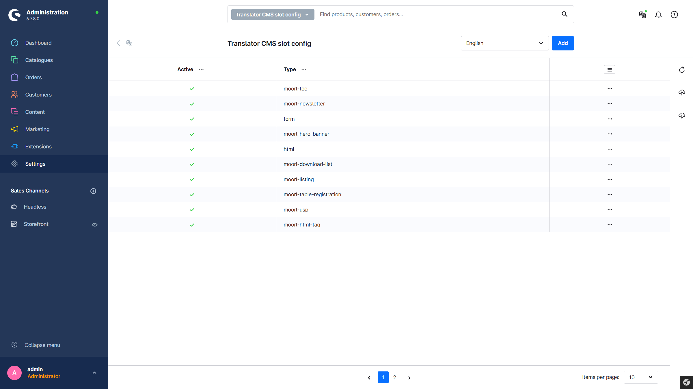
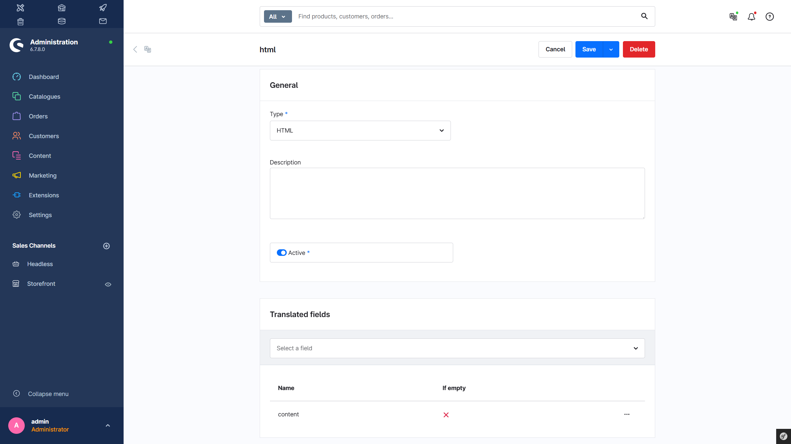
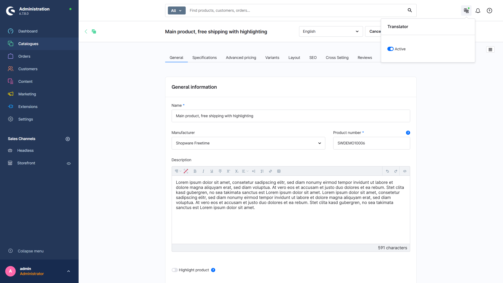

# Translator

Simple plugin that translates all translatable fields and properties in the background using the DeepL plugin. Ideal for online shops with international sales.

---

## Purchase the Plugin

This plugin can be purchased in the **Shopware Community Store**.

- [Shopware Community Store](https://store.shopware.com/en/search?search=MoorlTranslator)

**Important note:** You need the Foundation Plugin, which is available free of charge: [moori Foundation](../MoorlFoundation/index.md)

---

## Initial Setup

### Plugin Configuration

- **Active**: The plugin is active. This can also optionally be toggled via the service icon in the top right.
- **Translator Client**: The API client that provides the translation service. The technical name of the client always starts with `translator-`. By default, `translator-deepl` is selected.
- **Source Language**: The language used as the source language for translation. By default, the system language is selected.
- **Target Languages**: The languages into which the source language is translated.

### Entity Configuration (Products, Categories, etc.)

In the main navigation of the admin under `Settings` → `Translator Configuration`, there is an overview of all created entries. Here, new entries can be created and existing entries can be duplicated or deleted.

#### Add a New Entity

Click `Add`.

#### Input Form for an Entity

**General:**

- **Entity**: Selection of the desired entity. Entities without translatable fields are not listed.
- **Description**: An internal description for the configuration.
- **Active**: This configuration is active.

**Translatable Fields:**

- A list of fields that are translated automatically. Custom fields can also be translated. The `slotConfig` field is currently not yet supported.

### CMS Element Configuration

In the main navigation of the admin under `Settings` → `Translator CMS Slot Configuration`, there is an overview of all created entries. Here, new entries can be created and existing entries can be duplicated or deleted.

#### Add a New CMS Element

Click `Add`.

#### Input Form for a CMS Element

**General:**

- **Type**: The type/name of the CMS element.
- **Description**: An internal description for the configuration.
- **Active**: This configuration is active.

**Translatable Fields:**

- A list of fields that are translated automatically.

### Service Icon

The automatic translation can be activated or deactivated via the service icon. The green dot above the icon indicates the current status.
