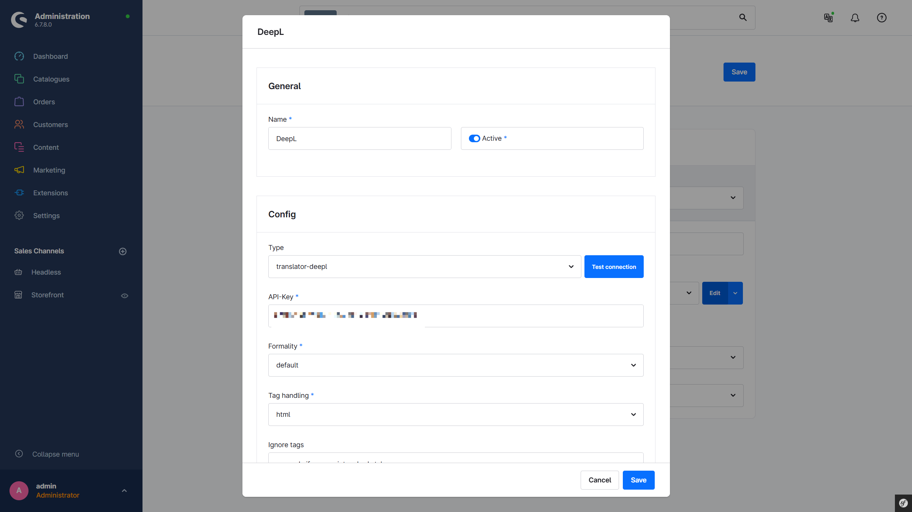

# Übersetzer

Übersetzt mit Hilfe von DeepL pluginübergreifend alle übersetzbaren Felder und Eigenschaften im Hintergrund. Ideal für Onlineshops im internationalen Vertrieb.

---

## Plugin erwerben

Dieses Plugin kann im offiziellen **Shopware Community Store** erworben werden.

- [Shopware Community Store](https://store.shopware.com/de/search?search=MoorlTranslator)

**Wichtiger Hinweis:** Sie benötigen das Foundation Plugin, welches Ihnen kostenlos zur Verfügung steht: [moori Foundation](../MoorlFoundation/index.md)

---

## Ersteinrichtung

### Plugin-Konfiguration

- **Aktiv**: Das Plugin ist aktiv. Dies kann optional auch über das Service-Icon oben rechts umgeschaltet werden.
- **Übersetzer-Client**: Der API-Client, der den Dienst für die Übersetzung bereitstellt. Der technische Name des Clients beginnt immer mit `translator-`. Standardmäßig ist `translator-deepl` ausgewählt.
- **Quellsprache**: Die Sprache, die als Ausgangssprache für die Übersetzung dient. Standardmäßig ist die Systemsprache ausgewählt.
- **Zielsprachen**: Die Sprachen, in die die Quellsprache übersetzt wird.

### Konfiguration der Entitäten (Produkte, Kategorien usw.)

Über die Hauptnavigation im Admin unter `Einstellungen` → `Übersetzer Konfiguration` gibt es eine Übersicht über alle angelegten Einträge. Hier können neue Einträge angelegt sowie bestehende Einträge dupliziert oder gelöscht werden.

#### Neue Entität hinzufügen

Klicken Sie auf `Hinzufügen`.

#### Eingabemaske für eine Entität

**Allgemein:**

- **Entität**: Auswahl der gewünschten Entität. Entitäten ohne übersetzbare Felder werden nicht gelistet.
- **Beschreibung**: Eine interne Beschreibung für die Konfiguration.
- **Aktiv**: Diese Konfiguration ist aktiv.

**Übersetzbare Felder:**

- Eine Liste mit Feldern, die automatisch übersetzt werden. Benutzerdefinierte Felder können ebenfalls übersetzt werden. Das Feld `slotConfig` wird derzeit noch nicht unterstützt.
- `Wenn leer` steht dafür, dass das Feld nur übersetzt wird, wenn in der Zielsprache kein Wert vorhanden ist.

### Konfiguration der CMS-Elemente

Über die Hauptnavigation im Admin unter `Einstellungen` → `Übersetzer CMS-Slot-Konfiguration` gibt es eine Übersicht über alle angelegten Einträge. Hier können neue Einträge angelegt sowie bestehende Einträge dupliziert oder gelöscht werden.

#### Neues CMS-Element hinzufügen

Klicken Sie auf `Hinzufügen`.

#### Eingabemaske für ein CMS-Element

**Allgemein:**

- **Typ**: Der Typ/Name des CMS-Elements.
- **Beschreibung**: Eine interne Beschreibung für die Konfiguration.
- **Aktiv**: Diese Konfiguration ist aktiv.

**Übersetzbare Felder:**

- Eine Liste mit Feldern, die automatisch übersetzt werden.

### Service-Icon

Über das Service-Icon kann die automatische Übersetzung aktiviert oder deaktiviert werden. Der grüne Punkt über dem Icon signalisiert den aktuellen Status.
